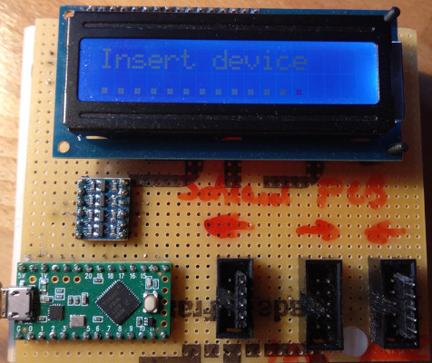

# FLipMouse MPRLS Pressure Sensor Board

**Fabrication Note v1.0, AsTeRICS Foundation**

# Scope

The FLipMouse uses a pressure sensor to detect any sip and puff input on the mouthpiece.

Version 2 uses a MPXV7007GP pressure sensor, which provides an analog value, exactly half of the supply voltage when idle.

From 2022 onwards, this sensor is getting VERY expensive (~11$ 2021; ~35$ 2022) and hard to buy (~52 weeks lead time).

Version 3 of the mouse supports 2 different types of sensors:

* MPXV7007GP (same sensor as in FMv2)
* MPRLS0025PA00001A

There are major differences between these two:

* MPRLS uses I2C
* MPRLS is an absolute pressure sensor, needs calibration on FM startup
* MPRLS is not hand-solder friendly

Because this sensor is basically impossible to solder with a solder iron. We still want to ship this sensor with assembled devices as well as construction kits, therefore we designed a small adapter PCB which needs to be __reflow soldered__ before further use.

# Preparation

## Material

| Nr.  | Description              | Source                                 | Image |
| ---- | ------------------------ | -------------------------------------- | ----- |
| 1    | MPRLS adapter PCB        | <TBA: check in PCB to repo & add link> |       |
| 2    | 3 parts as stated in BOM | <TBA: check in PCB to repo & add link> |       |

__Note: Material will be referenced in square brackets: []__

## Tools

| Nr.  | Description                       | Source                                                       | Image                                             |
| ---- | --------------------------------- | ------------------------------------------------------------ | ------------------------------------------------- |
| 1    | Reflow solder equipment           | Fablab, or university. You need a reflow oven, a stencil, solder paste, tweezers |                                                   |
| 2    | Testbench for MPRLS               | <TBA: add repository link to test firmware & HW>             |  |
| 3    | Permanent marker (red/blue/green) | DYI store, paper store (possibly any store)                  |                                                   |

__Note: Tools will be referenced in curly brackets: {}__

# Procedure

__Prepare PCB:__

1. Mount the stencil on your holder _{1}_
1. Apply solder paste on PCB(s) _[1]_

__Place parts: (note: guaranteed information is available in the KiCAD project, this is for reference only)__

1. Place the MPRLS sensor, pin one has a small triangle _{2}_
2. Place both capacitors (1nF / 100nF) _{2}_

__Solder:__

1. Follow the instructions for your reflow solder equipment to solder the PCBs

__Testing:__

1. This sensor can be prone to solder errors, especially if you are not experienced in reflow soldering & paste application
2. Follow the test procedure for __EVERY__ soldered sensor PCB

# Testing

Sensor testing is done via the testbench for sensors, which is based on a Teensy.

1. Attach the testbench to a USB port (micro USB cable)
2. Wait for finished initialisation, `Insert device` should be shown on the display
3. Attach each sensor under test on the left pin header (4pins): 
4. Hold down the sensor for the test to provide sufficient contact without soldering
5. The display should show `Found dev @0x18`, `MPRLS pressure`. __If not:__ This sensor is broken
6. Wait for the tester to run a test cycle
7. The display should show now: `Fin, avg.: xxx`, the actual value depends on your ambient pressure, but should be in the __range of 400-600__. __If not:__ this sensor is broken.
8. Every character on the __second line__ should be a __`+` symbol__. __If not:__ Either there was a bad contact (press the sensor against the pins and re-run the test) or this sensor is broken (if you tried it more than once).
9. If the test finished successfully, __mark this sensor__ with a permanent marker _{3}_.
10. Repeat the procedure with another sensor from __step 3__.

## Documentation

For each produced batch, fill out one document __template_MPRLS_production.ots__ and save it as: `mprls_<date>.ods`(e.g.: mprls_20221118.ods)
