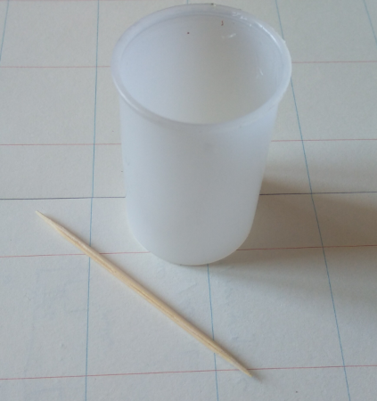

# FLipMouse - Mouthpiece

**Fabrication Note v1.0, AsTeRICS Foundation**

# Scope

The FLipMouse needs a stick in front to be actuated via finger or lip movements. From 2022 on, the AsTeRICS Foundation produces the mouthpieces in-house.

Basic components of the mouthpiece are:

1. Acryllic pipe, variable length
2. Male Luer Lock adapter to M6
3. Filter

The acryllic pipe (Ø10/6mm) is glued to the Luer Lock adapter with epoxy resin.

# Preparation

## Material

| Nr.  | Description                                                  | Source                                                       | Image                                                        |
| ---- | ------------------------------------------------------------ | ------------------------------------------------------------ | ------------------------------------------------------------ |
| 1    | Male Luer Lock to M6 adapter                                 | https://www.droh.de/produkt/2836-luer-lock-adapter-mit-m6-gewinde-mannlich |  |
| 2    | Female Luer Lock to pipe adapter. __Note:__ this part is either already in the holder OR it can be taken from the FLipMouse construction kit. | https://www.droh.de/produkt/1752-luer-lock-adapter-mit-m6-gewinde-fur-schlauche-mit-3-mm-id-und-zur-geratemontage-weiblich |  |
| 3    | Acryllic pipe (Ø10/6mm)                                      | https://acrylhaus.com/Acrylglasrohr-rund-XT-transparent-R-10-6mm-Aussen-Innen-1000mm |  |
| 4    | Cigarette filters, 6mm diameter                              | Local tobacco store                                          |                     |
| 5    | Epoxy resin, UHU 300 or equivalent                           | DIY-store                                                    |                                 |

__Note: Material will be referenced in square brackets: []__

## Tools

| Nr.  | Description            | Source                                 | Image                                                        |
| ---- | ---------------------- | -------------------------------------- | ------------------------------------------------------------ |
| 1    | Mixing pan & toothpick | Included in the epoxy kit or DIY-store |   |
| 2    | Miter saw              | DIY-store                              |                              |
| 3    | Heat gun               | DIY-store                              |  |
| 4    | Mouthpiece holder      | 3D printed, "tools" subfolder.         |  |
| 5    | Sand paper, 240grit    | DIY-store                              |                                                              |

__Note: Tools will be referenced in curly brackets: {}__

# Procedure

__Cut the acryllic pipe:__

1. Adjust the mitre saw _{2}_ to the necessary length: 50, 100, 120 or 150mm
2. Cut as many pipes _[3]_ as you want to produce
3. Use the heat gun _{3}_ at **500°C** and heat up both ends for ~**5s** (removing the burr)

__Prepare holder and epoxy resin:__

1. Place as many female luer lock adapters _[2]_ in the holder _{4}_ as you want to produce. Take care that both hex nuts are in the holder.
2. Attach a male luer lock adapter _[1]_ on each female adapter by pushing and turning 180°.
3. Mix epoxy resin 50:50 in the mixing pan (TBA: give here a weight for a full holder)

__Glueing:__

1. Use the toothpick to apply epoxy resin on the male luer lock's _[1]_ M6 thread. __Note:__ do NOT apply too much and start applying directly on the thread.
2. Push the acryllic pipe _[3]_ on the luer lock adapter _[1]_. __Note:__ make sure you have clean hands.
3. Repeat for all luer lock adapters
4. Use paper or a tissue to remove any surplus epoxy.

`Wait for 12h`

__Finalize:__

1. Us the sand paper _{5}_ to make a 45° / 1mm chamfer on the outside of the mouthpiece; remove any burr inside the acryllic pipe (either with sand paper, a big drill with ~10mm or a countersunk head)
1. Use the heat gun _{3}_ at ~500°C and heat up the top for ~5 to have rounded edges
2. Put a filter _[4]_ into the acryllic pipe
3. TBA: how to mark the mouthpieces with a chargenumber?
4. Unscrew the luer locks, the female luer lock can be put into the construction kit.

# Testing

## Tools

<TBA, use a strain gauge setup>

## Procedure

<TBA, use a strain gauge setup>

## Documentation

For each produced batch, fill out one document __template_mouthpiece_production.ots__ and save it as: `mouthpiece_production_<date>.ods`(e.g.: mouthpiece_production_20221118.ods)