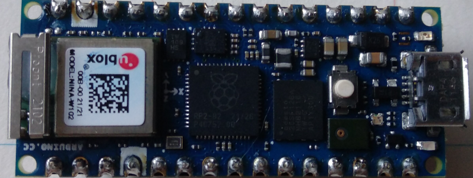

# FLipMouse V3 - Arduino Nano RP2040 Connect Initialisation

**Fabrication Note v1.0, AsTeRICS Foundation**

# Scope

The FLipMouse Version 3 uses an __Arduino Nano RP2040 Connect__ platform. (Maybe in the future there will be also FlipPad/FABI versions using the Arduino Nano RP2040 Connect).

This controller has much more RAM & ROM and already contains the ESP32, which is used for the Bluetooth connectivity.

To fully use the update procedures from the WebGUI, the Arduino Nano RP2040 Connect needs to be programmed initially:

* __esp32_addon_bootloader:__ Bootloader Code to update the ESP32 BLE Mouse/Keyboard firmware without esptool.py
* __esp32_mouse_keyboard:__ Program the BLE HID over GATT firmware
* __FLipMouse/FLipPad firmware:__ Program the RP2040 with the current FLipMouse / FLipPad Firmware 

# Preparation

## Material

| Nr.  | Description                        | Source                                                       | Image                                                        |
| ---- | ---------------------------------- | ------------------------------------------------------------ | ------------------------------------------------------------ |
| 1    | Arduino Nano RP2040 Connect        | https://store.arduino.cc/products/arduino-nano-rp2040-connect |  |

## Tools / Requirements

| Nr.  | Description                       | Source                                                       |
| ---- | --------------------------------- | ------------------------------------------------------------ |
| 1    | Python3                           | Open an command shell window and check your python/python3 version: `python3 --version'. The recommended version is python3.8 or newer! Install python according to your OS   |
| 2    | PySerial library                  | Install via pip: `pip3 install pyserial` |
| 3    | esptool utility software          | Install via pip: `pip3 install esptool` (if it cannot be executed from a terminal, run this command as root) |
| 4    | this script (rp2040_preparation)  | located in this folder, linux and windows versions available. |

# Running the script (if working under Linux)

1. Attach the Arduino Nano RP2040 Connect to the computer
2. Open a shell window 
3. Call the script: `python3 rp2040_preparation.py -d <FM/FP/FB> -s <serial port> [-o<step number>]`

_-d <FM/FP/FB>_ Select the device firmware to be flashed. Use FM for FLipMouse. (FP for FlipPad and FB for FABI are not finished yet)

_-s <serial port>_ Select a serial port where the Arduino Nano 2040 microcontroller is connected (/dev/ttyACM0 or /dev/ttyUSB0)

_-o <stepNumber>_ (optional) Start with given stepNumber (2-7): this omits the initial steps and starts with the given step

# Running the script (if working under Windows)

1. Open a shell window (press Windows key and type `cmd<enter>`, then use cd to change to the folder where the script is located)
2. Call the script: `python3 rp2040_preparation_win.py -d <FM/FP>`
_-d_ Select the firmware to be flashed. Use FM for FLipMouse. (FP for FlipPad and FB for FABI are not finished yet)
Note that no serial COM Port name needs to be specified, the determines the COM port during the process.
3. Attach the Arduino Nano RP2040 Connect to the computer. The process should finish after 7 steps. If the scrpit fails or hangs, Press Ctrl+C, unplug the Arduino and restart the script.
  

# Testing

If everything worked, the __Blue LED should blink__ indicating a running Bluetooth firmware

## Updating the firmware files

If new firmware (.bin, .uf2) files exist in the repositories of FlipMouse3 and/or ESP32_mouse_keyboard:

1. Replace `bootloader.bin`,`esp32_addon_bootloader.bin`, `ota_initial_data.bin` and `partition-table.bin`with a current build from: _esp32_addon_bootloader/build/esp32_addon_bootloader.bin_
2. Replace `mousekeyboard.bin` with a current build from: _esp32_mouse_keyboard/build/esp32_mouse_keyboard.bin_
3. Replace `FM.uf2`, `FP.uf2`, `FB.uf2` with current builds from the FLipWare/FabiWare repositories (build with Arduino and select _Sketch->Export compiled binary_)
4. Replace `serialflasher1.uf2` with a new build from the serialflasher1.ino sketch from this directory (build with Arduino and select _Sketch->Export compiled binary_)
5. Replace `serialflasher2.uf2` with a new build from the serialflasher2.ino sketch from this directory (build with Arduino and select _Sketch->Export compiled binary_)
7. __Write down the current GIT tags (releases) or commit numbers for the builds to _VERSIONS.md_ __

## Background and operation of this tool

This tool performs following steps:

1. Flashing the serialflasher1.uf2 firmware calling `uf2conv.py`tool
2. Flashing the esp32_addon_bootloader firmware with `esptool.py`
3. Flashing the serialflasher2.uf2 firmware calling `uf2conv.py` tool
4. Flash the esp32_mouse_keyboard_firmware (included in rp2040_prepare.py)
5. Reset the Arduino to UF2 download mode by opening the given serial port with 1200Baud and closing it
6. Flashing the FM/FB/FP.uf2 firmware calling `uf2conv.py`tool
7. Verifying that everything worked by sending "AT BC $ID" to the serial port, which returns the version of the BLE module. This is printed on the command line.
8. Start over (wait until serial port is removed and a new one is detected)

