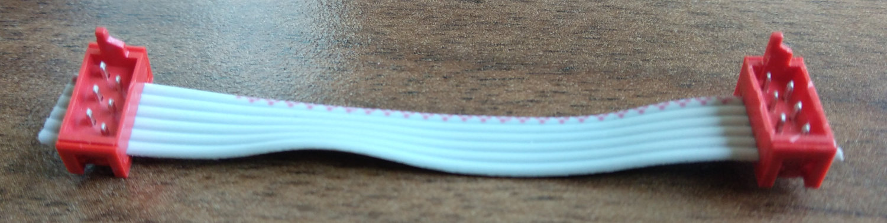

# FLipMouse - IPC/ribbon cable

**Fabrication Note v1.0, AsTeRICS Foundation**

# Scope

In the construction kit, a flat ribbon cable is included. This cable already has a connector mounted, which is of the Würth WR-MM series.
Because this crimping connector can be attached wrong, we already mount it before including the cable in the construction kit.
The insulation of the ribbon cable is also removed and the cable is tinned.

# Preparation

## Material

| Nr.  | Description                                     | Source                 | Image |
| ---- | ----------------------------------------------- | ---------------------- | ----- |
| 1    | __80mm__ 6pin flat ribbon cable, 1.27mm spacing | Electronic distributor | TBD.  |
| 2    | 6pin WR-MM Connector (690157000672)             | Electronic distributor | TBD.  |

__Note: Material will be referenced in square brackets: []__

## Tools

| Nr.  | Description           | Source                                                       | Image |
| ---- | --------------------- | ------------------------------------------------------------ | ----- |
| 1    | Wirestripper          | 3D printed, in folder "tools"                                | TBD.  |
| 2    | Solderpot             | Electronic tool distributor                                  | TBD.  |
| 3    | Crimping tool or vise | DIY store. A 3D printed insert for tools is available in the folder "tools" | TBD.  |

__Note: Tools will be referenced in curly brackets: {}__

# Procedure

1. Remove the insulation of one side of the IDC cable _[1]_ by inserting it into the wirestripper _{1}_, pressing and pulling.
2. Apply solder on the wires with the solderpot or a solder iron _{2}_
3. Crimp the Würth connector _[2]_ with either a vise or a crimping tool _{3}_. __Note:__ take care of the orientation, like shown in this picture! (red wire is marked pin one of the connector)

# Testing

## Tools

None

## Procedure

1. Visually check the connector if the clips are in locked position
2. Visually check if all 6 cable ends are tinned and there is no short-circuit.

## Documentation

TODO: do we need documentation for this step? If yes, copy a template from a different fabrication manual.
