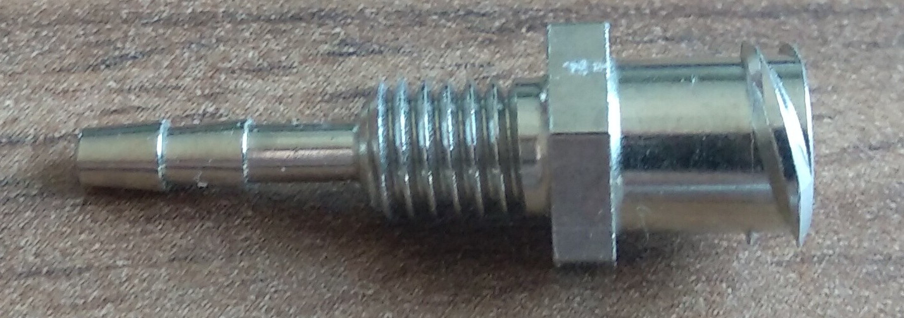
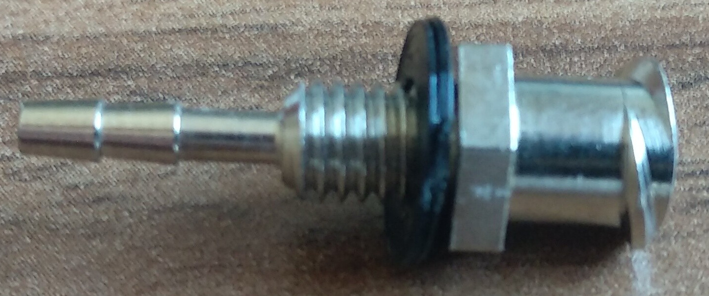
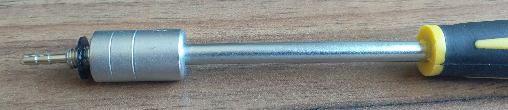
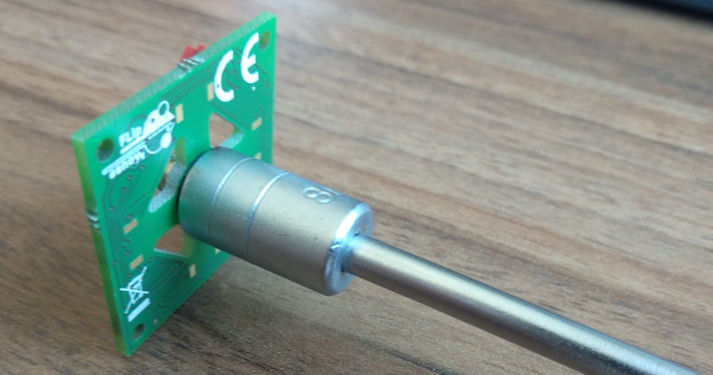
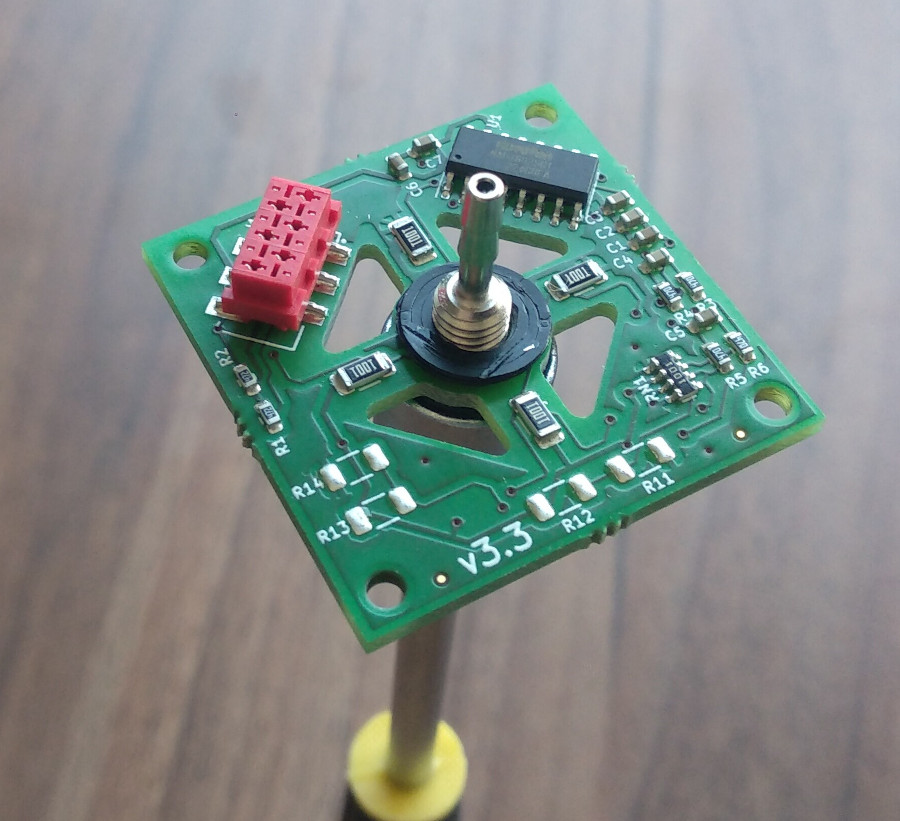
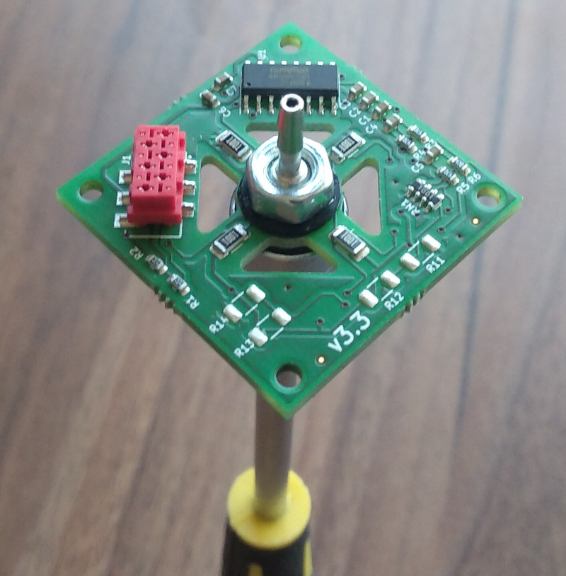
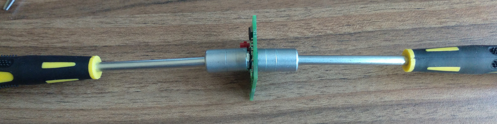

# FLipMouse - Sensorboard - Luer Lock Mounting

**Fabrication Note v1.0, AsTeRICS Foundation**

# Scope

The mouthpiece on the FLipMouse is mounted via a standard Luer lock connector. The female Luer with a M5 thread is mounted in the sensorboard PCB with 2 washers.

# Preparation

## Material

| Nr.  | Description                               | Source                                                       |
| ---- | ----------------------------------------- | ------------------------------------------------------------ |
| 1    | Fully assembled sensorboard PCB           | Aisler.net / any other PCB manufacturer                      |
| 2    | 2x Washers, 3D printed (must be plastic!) | Print it yourself, source: FLipmouse/Hardware/case-design/FM3_LuerSpacer.stl |
| 3    | Female Luer Lock, metal with M5 thread    | Droh.de, VBM-CHLLF05                                         |

__Note: Material will be referenced in square brackets: []__

## Tools

| Nr.  | Description                                                  | Source    |
| ---- | ------------------------------------------------------------ | --------- |
| 1    | 2x 8mm hex nut driver (manual tool, not in an electric drill!) | DIY store |
| 2    | Super glue                                                   | DIY store |

__Note: Tools will be referenced in curly brackets: {}__

# Procedure

1. Remove the M5 hex nut from the Luer Lock _[3]_

   

2. Place one plastic washer _[2]_ on the Luer Lock 

   

3. Use the hex nut driver _{1}_ to screw the Luer Lock into the sensorboard PCB _[1]_

   

   

4. Place the second washer on the opposite side

   

5. Place the hex nut on the Luer Lock

   

6. Use both hex nut drivers to tighten the screws

   

7. Put super glue _{2}_ on both sides of the PCB.

# Testing

## Tools

None

## Procedure

1. Try 3 times to screw / unscrew a mouthpiece.

## Documentation

TODO: do we need documentation for this step? If yes, copy a template from a different fabrication manual.
