# FLipMouse - Finger & Lip Mouse

#### Alternative Computer Input Device

# User Manual v3.1

#### AsTeRICS Foundation

____

# Preface

The FLipMouse is an open source Assistive Technology module which is developed at the University of Applied Sciences, Technikum Wien and delivered as a DIY-construction kit by the AsTeRICS Foundation. The FLipMouse allows people who cannot use standard computer input devices to control a computer mouse cursor or a joystick as well as typing desired keyboard keys or using infrared remote controls. The FLipMouse device can be actuated with minimal finger- or lip-movements and/or sip & puff activities via a dedicated mouthpiece.

The FLipMouse can be configured via a web-based configuration application which is called from now on configuration manager. It can be found on [flipmouse.asterics.eu](https://flipmouse.asterics.eu/index_fm.htm) and is intended for use in conjunction with the FLipMouse device. This user manual includes a description of this configuration manager which allows the configuration of the different functions of the FLipMouse – as well as explanations how to use those features. A configured FLipMouse module can be used on any computer without installation of special software, because the FLipMouse module behaves exactly like a standard mouse, joystick or keyboard which is plugged into the computer. 

Furthermore, this manual covers important guidelines for using the FLipMouse, in particular cleaning procedures and hygienic precautions.

All design files for electronics and enclosure - as well as the software source code are available as open source and are distributed via the AsTeRICS Foundation website and via GitHub. The construction kit with detailed instructions for building the FLipMouse can be purchased from [Hackerspaceshop.com](https://hackerspaceshop.com/).

The AsTeRICS Foundation
[www.asterics-foundation.org](https://asterics-foundation.org/)

# Hardware overview

The FLipMouse is available with a 3d-printed enclosure. Design files for the 3d-printed case are available in the [Github repository](https://github.com/asterics/FLipMouse/tree/master/Hardware/case-design/3D_printer). The primary method for using the FLipMouse is the transparent stick (“Hygienic Stick” or “mouthpiece”) which is attached to the front of the FLipMouse. Additionally, two external momentary switches can be attached to extend interaction capabilities:
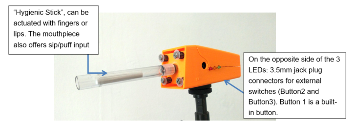

*Figure 1*: FLipMouse 3D-printed

The *Hygienic Stick* is made by the company *QuadJoy*.  Replacement sticks can be ordered via the homepage: [www.quadjoy.com](http://www.quadjoy.com). We want to thank Bill and Debra Street of *QuadJoy* for letting us use their mouthpiece for our FLipMouse construction kit! 
Please note the cleaning instructions in the dedicated section of this manual.

**Users can interact with the FLipMouse in several ways:**

1. by touching the mouthpiece with the lips or fingers and applying small forces in vertical or horizontal direction
2. by increasing or reducing pressure in the mouthpiece (puffing or sipping)
3. by actuating (up to) 3 momentary switches / pushbuttons
4. if desired, a longer plastic tube can be attached to the pressure sensor so that the joystick can be used with a finger and a separate mouthpiece allows sip/puff control.

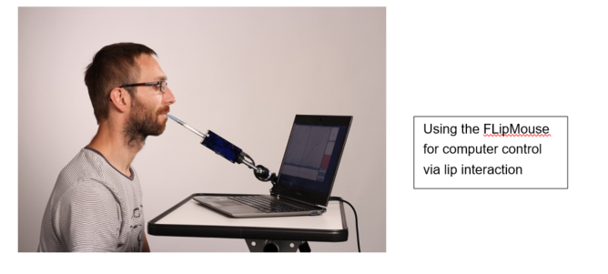

*Figure 2*: FLipMouse via lip interaction

**The hardware features of the FLipMouse:**

1. “Zero-way”-joystick / mouthpiece: 
   very low forces are sufficient to create up/down/left/right movement
   o    The zero-way-joystick can be used with fingers or toes etc. 
   o    It can also be used as a mouthpiece (actuated by lips / mouth movements) 
   o    If desired, sip / puff activities into the mouthpiece can trigger additional functions

2. One built-in switch (“Button 1 / B1”) on the device, e.g. to change the active configuration (functions)

3. Two 3.5mm jack plug sockets for attaching external switches to trigger additional functions (“Button 2 / B2” and “Button 3 / B3”)

4. 3 Indicator Light Emitting Diodes (LEDs) for showing the active configuration, calibration procedure etc.

5. Universal infrared remote control receiver and transmitter

6. “Hot Shoe” Adapter for mounting to a Manfrotto Magic Arm or similar mounting system

7. Firmware upgrade via FLipMouse web application on [flipmouse.asterics.eu](flipmouse.asterics.eu)

8. Optional add-on board for Bluetooth (e.g. to control smartphones or iOS devices)

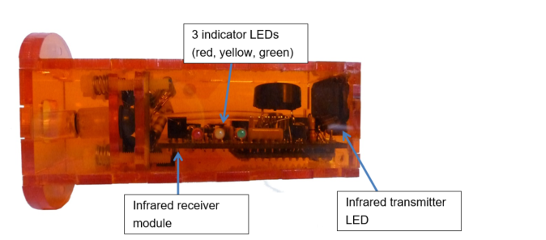

*Figure 3*: FLipMouse right side

On one side of the FLipMouse enclosure, 3 LEDs indicate the current mode of operation (which can be changed to activate different speed settings or functional options). Furthermore, the Infrared (IR-) receiver and transmitter modules are accessible. These modules can be used for recording and replay of arbitrary infrared remote control commands (for example to change volume or channel settings of a TV-set).

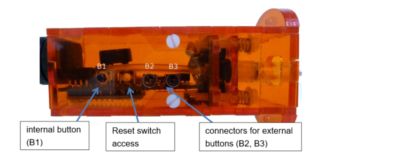

*Figure 4*: FLipMouse left side

The opposite side of the FLipMouse gives access to a button (B1) which offers a configurable function (for example changing the operational mode). Next to this button is a hole which enables to press the reset-button of the built-in microcontroller – this is necessary when you want to update the software of the FLipMouse to a newer version. 
Two 3,5mm Jack Plugs marked (B2) and (B3) allow the connection of external momentary switches.

## 3D-Printed Housing

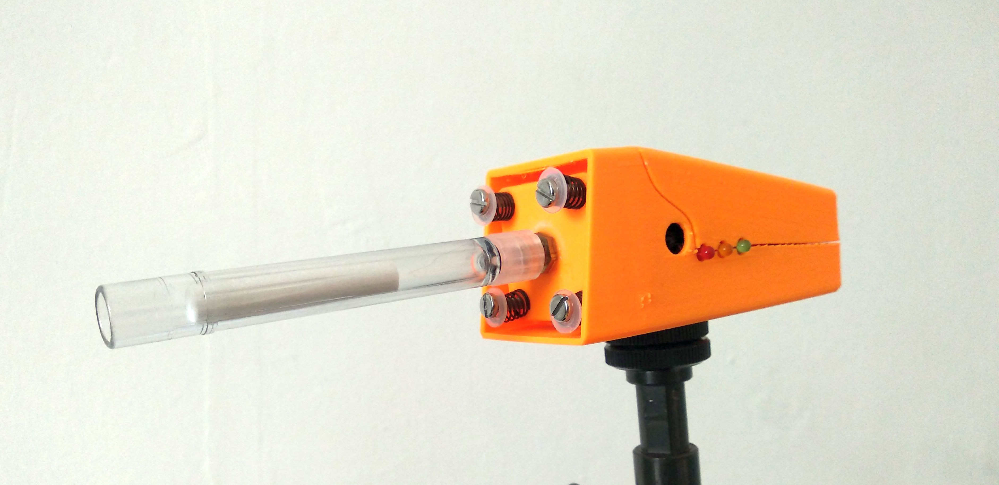

*Figure 5*: FLipMouse 3D-Printed

Different alternatives for the FLipMouse housing were available, there also existed an acrylic version, but now just 3d printed enclosures are merchandised. The design files for the 3d-printed enclosures can be downloaded from the [Github repository](https://github.com/asterics/FLipMouse/tree/master/Hardware/case-design/3D_printer). The electronic components and PCB are the same as for the former acrylic housing variant – and the devices offer exactly the same functionality. The construction manual for the 3d-printed variant can be found [here](https://github.com/asterics/FLipMouse/blob/master/ConstructionKit/ConstructionManual.pdf).

An advantage of the 3d-printed case is the better availability of 3d-printers compared to laser cutters so that the 3d-printed case is easier to manufacture than the former acrylic version. The DIY-Kit can be ordered from [Hackerspaceshop.com](https://hackerspaceshop.com/collections/flipmouse). 

## Bluetooth – Add-On Module

The optional BlueTooth add-on module allows connection of the FLipMouse as a Bluetooth mouse/keyboard to various devices (smartphones, tablets, IOs devices). If this module is not contained in the DIY-Kit, it can be ordered individually from the AsTeRICS Foundation or built from the hardware design files available on Github (parts must be ordered individually). If you are interested in this feature, have a look at the [FLipMouse Wiki](https://github.com/asterics/FLipMouse/wiki) where construction is explained.
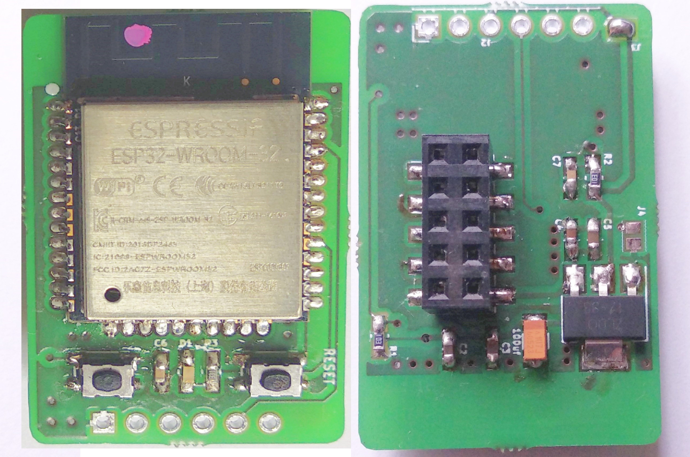

*Figure 6*: Bluetooth Add-on Module

# Instructions for proper mounting and use

**1. Attach the "hygienic stick**

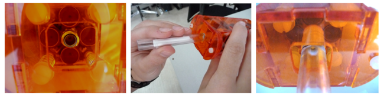

*Figure 7*: Attaching the hygienic stick

Use a clean “hygienic stick” and attach it to the front connector, turn clockwise (not too hard):

**2. Mount the FLipMouse device appropriately for the user**
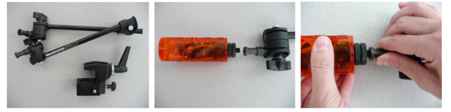

*Figure 8*: Mounting the FlipMouse

The picture shows a “Manfrotto Gelenkarm” + ”SuperClamp” mount combination. You could also use the [Manfrotto Magic Arm](http://www.manfrotto.com/magic-arm-kit) or any other kind of mounting solution which fits to the HotShoe-Adapter of the FLipMouse. Be careful when attaching the mount to the 3/8” screw of the HotShoe-Adapter: hard forces might break the enclosure of the device. 

*Figure 9*: Using the FLipMouse with Mouth/Lips

Ensure that the head of the user rests comfortably. The mouthpiece should barely touch the lips. It is not useful to insert the mouthpiece into the mouth! (This could result in uncomfortable feelings and make it harder to control the lateral movement)

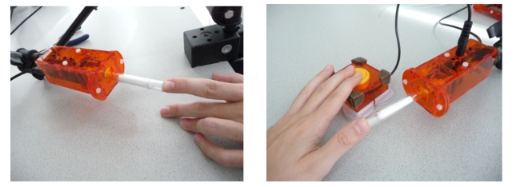

*Figure 10*: Using the FLipMouse with fingers

If the user desires to actuate the FLipMouse with a finger or the thumb, mount the system appropriately so that the hand is in a resting position and the finger can touch the joystick without stress. Attach one or two additional external switches if desired, and mount the switches at suitable locations (for example at the legs/toes/shoulder etc.).

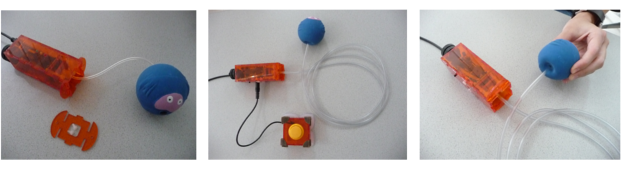

*Figure 11*: Using the FLipMouse as a ball-switch interface

If a soft button interaction method is desired, a plastic tube can be attached to the front connector of the FLipMouse using a *Luer Lock* adapter. This plastic tube can be connected to a soft ball (the picture above shows a cheap “dog toy” from a pet store). This solution could be used as a soft head-switch or shoulder-switch and can be combined with other external switches. Please note that in this case no direct control of cursor or joystick is possible.

**3. Attaching the FLipMouse to a Computer, Tablet or Smart Phone**

When you plug in the FLipMouse via the provided Micro USB cable, do not touch the mouthpiece as long as the LEDs are blinking (the initial blinking indicates the zero point calibration phase). Wait until the device is recognized by the computer, then move the joystick / mouthpiece to check correct operation.

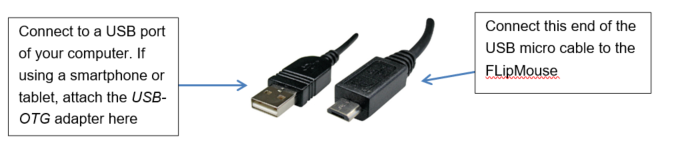

*Figure 12*: Connecting the FLipMouse with the computer

**Please note** that every time you apply power to the FLipMouse device (respectively when you plug it in) the **zero-calibration is performed which is indicated by blinking all 3 LEDs**. It is important that you do not touch the joystick / mouthpiece until the LEDs stopped blinking. 

## Using the FLipMouse with Android Smart Phones or Tablets

The FLipMouse should work with any operating system which supports USB HID (Mouse/Keyboard/Joystick) devices, such as Windows, Linux or MacOS. Several Android devices provide an USB port with USB-OTG (“on-the-go”) functionality. If your device supports “OTG” you can attach the FLipMouse using an USB-OTG-adapter (see picture below) and it will work as a normal mouse (you will get a mouse cursor) or keyboard. You can test if your Android phone or tablet features the USB-OTG function with the “OTG checker” app.

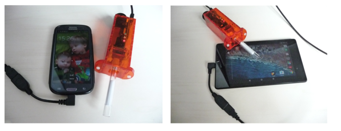

*Figure 13*

## Using the FLipMouse via Bluetooth – for example with an iOS device (iPhone or iPad)

The Bluetooth – add-on-module for the FLipMouse allows wireless mouse/keyboard control of computers, tablets and smart phones. Furthermore, iPhones or iPads can be used via VoiceOver & switch support. If attached to PC, users may switch to Bluetooth-operation of a second device and back on demand. For pairing the Bluetooth module with a new device, press the internal Button (B1) for 5 seconds until you hear a long tone. Use the FLipMouse web application to activate Bluetooth operation (see section General Settings).

# The FLipMouse Configuration Manager

The [FLipMouse Configuration Manager](flipmouse.asterics.eu) offers a Graphical User Interface (GUI) to change and store settings of the FLipMouse device so that all features and functions can be adapted to personal preferences and needs. It is only possible with the Google Chrome (or Chromium-based) Browser. The Configuration Manager is accessible by entering the following website: **flipmouse.asterics.eu**. The FLipMouse Configuration Manager sends and receives information from/to the FLipMouse. This information transfer occurs through a communication port (COM port). 
Please note that the old FLipMouse Settings Manager was a configuration system that was not web-based and was only available for Windows. If you still want to use it, the **Manual of the FLipMouse Settings Manager** can be found [here](https://github.com/asterics/FLipMouse/blob/master/UserManualFlipMouse.pdf).

To use the new *FLipMouse Configuration Manager*, enter the following website: **flipmouse.asterics.eu**. In figure 1 you see the welcome page. If you click on the button CONNECT TO FLIPMOUSE CONNECTED VIA USB, there won’t be a communication port (COM Port) selectable in the selection box as long as the FLipMouse is not connected to the computer via USB micro cable. 

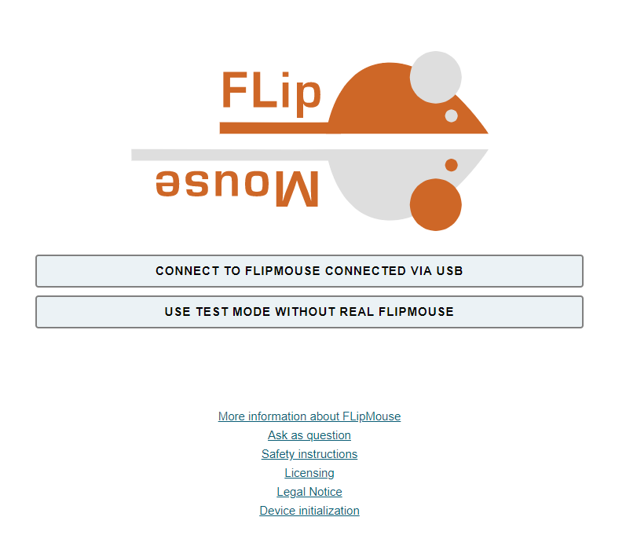

*Figure 14: Welcome page of the FLipMouse Configuration Manager*

**Operational modes – “memory slots”**
The *FLipMouse Configuration Manager* allows adjustment of all important settings (operational modes). The settings are stored in individual **memory slots** (for example one slot for fast mouse operation, one slot for slow mouse operation, one slot for keyboard key generation etc.). All settings can be stored to (or loaded from) the FLipMouse after it has been connected to the USB port of the computer. The settings can also be saved to (or loaded from) a file on your computer. 
Settings which were stored into the FLipMouse memory slots stay valid also when the power supply / USB cable is removed. When the FLipMouse is plugged in the next time, the settings will be available – also if you use another computer or operating system!

### Connecting the FLipMouse Device

In order to be able to use the configuration settings on the FLipMouse device, the FLipMouse must be connected to the application. To connect the device, follow these steps:

1. Make sure your device is connected to your computer via an USB port (see page "Instructions for proper mounting and use"). 
2. Select the appropriate COM port (communication port) in the selection box after clicking CONNECT TO FLIPMOUSE CONNECTED VIA USB. If the selection box appears empty, it means that no port has been detected. In this case, please reconnect the device and wait for the COM ports to be updated.
3. Once the COM port is selected, click the “Connect” button at the bottom of the selection box. 
4. After successful connection of the COM port, you will have a window like below (Figure 15) and you should see live feedback of stick movement. The port status at the top right corner of the window will be “connected”.

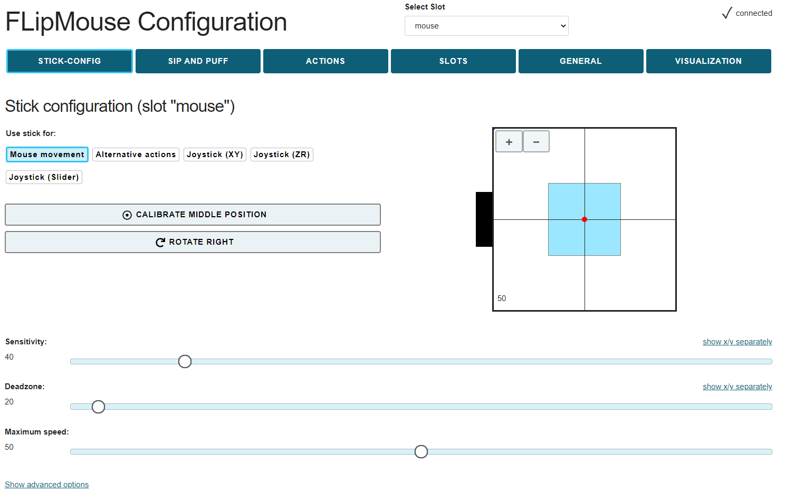

*Figure 15: FLipMouse Configuration Manager*

## Changing Settings and Features

### Stick Configuration (Tab STICK-CONFIG)

After you are connected with the communication port of the microcontroller, you see the *FLipMouse Configuration Manager* as in Figure 15.
The STICK-CONFIG tab is the first tab of the *FLipMouse Configuration Manager* user interface. On this tab, you will be able to change the Sensitivity, Deadzone and MaximumSpeed of the FLipMouse stick. Furthermore, you can change Acceleration, Drift compensation range and Drift compensation gain under *“Show advanced options”*. You may also Calibrate the middle position of the stick if necessary and you can change the orientation. 

#### Define stick usage (“Use stick for”)

On the top of the STICK-CONFIG tab, the usage of the stick can be chosen by default, the FLipMouse stick is creating mouse cursor movements. However, the stick can also be used for alternative actions (such as pressing the key ‘A’ when the stick is pushed up), which can be specified in the tab ACTIONS (see section *Assignment of different actions*). Furthermore, the stick can also replace a joystick (see *section Using the stick for Joystick movement*). 

#### Calibration of the stick’s middle position

When using the stick for cursor movement, the cursor should stay in place when the stick is not touched. Sometimes the resting position of the stick may become inaccurate and causes unwanted cursor movements, even if the stick is not used. If this happens, you can either increase the deadzone values or initiate a calibration. When the Configuration Manager is active, a calibration can be initiated by pressing the “*Calibrate Middle Position*” button. Once you click this button, do not move the FLipMouse stick, otherwise the calibration will be done incorrectly. The LEDs on the device will flash and the speaker will emit a low tone, indicating the start of the calibration. This will last for about 1 second - then the calibration sequence is accomplished. Calibration can also be assigned as an action in response to button pressing, sip/puff actions, or alternative FLipMouse stick actions, so that it can be performed on demand, while using the FLipMouse device.

#### Stick Orientation (Change with click on “ROTATE RIGHT”)

The FLipMouse is mounted using a HotShoe 3/8” mounting screw which is located on the side of the FLipMouse case. The orientation can be changed according to the user’s preferences. If the FLipMouse is mounted e.g. upside-down, the stick orientation can be selected accordingly so that the up/down/left/right movements are still interpreted correctly. A click on “ROTATE RIGHT” changes the orientation by 90°. Orientation settings for 0 / 90 / 180 and 270 degrees are possible, so that any mounting orientation is possible.

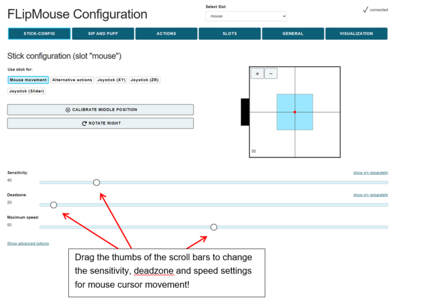

*Figure 16: FLipMouse Configuration Manager: Tab STICK-CONFIG, Scroll bars*

The visible scroll bars allow changing the movement behavior of the mouse cursor according to the preferences of the user. The behavior of the following characteristics can be changed: 

#### Sensitivity

When using the stick for cursor movement, the sensitivity of the stick can be adjusted via the *Sensitivity* scroll bar. A smaller value results in lower sensitivity to applied force. To change the value, click and drag the scroll bar knob or click the bar next to the knob. 

#### Deadzone

The *deadzone* setting defines a passive zone for the stick movements: when the deadzone value is low, very slight stick movements will already cause cursor movement (or execute the assigned alternative function in case different actions are selected – see chapter about tab ACTIONS). If the deadzone setting is too low, the cursor starts unintended drifting especially if a stronger force has been applied. In this case, increase the deadzone value so that cursor drifting does not occur under normal operating conditions for a given user.

#### Split axis control for sensitivity and deadzone

Moving the cursor on the computer is possible both horizontally (left or right movements, also known as x axis) or vertically (up or down movements, also known as y axis). If desired, the sensitivity- and deadzone-values for horizontal or vertical movements can be changed individually. In order to do that, select “*show x/y separately*”, as shown below: 

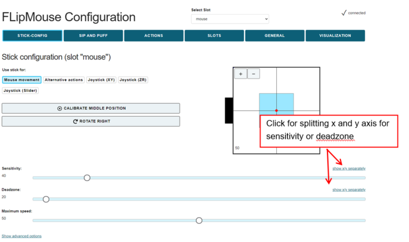

*Figure 17: FLipMouse Configuration Manager: Tab STICK-CONFIG, splitting x/y*

If you decide that splitting the horizontal and vertical movements is not necessary, simply click “*hide separate x/y*”, and the sensitivity and deadzone scroll bars will go back to the default state. 

#### Maximum Speed

Turning the maximum speed setting to a low level is useful if a user desires to limit the cursor speed.

**“Show advanced options”**:

#### Acceleration

This setting can only be seen after clicking on *"Show advanced options"*. The acceleration setting allows influencing the acceleration behavior of the mouse cursor: if acceleration is set to a low level, even a strong deflection of the stick will start a slow (but progressing) cursor movement which makes it easier to reach near target precisely.

#### Drift compensation range + Drift compensation gain

These advanced settings also can only be seen in this “STICK-CONFIG” Tab after clicking *“Show advanced options”*.
Due to mechanical reasons, the force sensors of the FLipMouse show small inaccuracies which can result in mouse cursor drifting. This effect is critical if using very small deadzone settings (very sensitive mouse control): if you move the mouthpiece/joystick to one direction and then release it, the mouse cursor continues to slightly “drift” in this direction because the sensor values do not settle at the calibrated middle position. Since Version 2.9, the FLipMouse offers a “drift compensation” feature, where the software tries to calculate the expected drift caused by the last interaction and corrects the bias, so that the performance for small deadzones is improved. 

The “drift compensation gain” value represents a gain value (level) for the correction, whereas the “compensation range” value represents the amount of force which is taken into account for the calculation. 
Each of these values has a corresponding slider. It is also possible to set different values for the x-axis und the y-axis after clicking “*show x/y separately*” (see Figure 18).

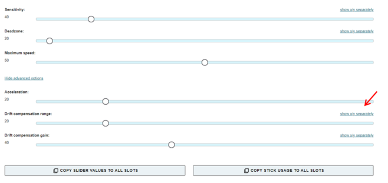

*Figure 18: FLipMouse Configuration Manager: Tab STICK-CONFIG, separate x/y*

The best values for a particular FLipMouse can be determined by experimentation.
For example: 

1. If you push the mouthpiece upwards and after release the mouse cursor continues to drift upwards, try to increase the vertical compensation value
2. If you push the mouthpiece to the left and after release the mouse cursor drifts to the right, try to decrease the horizontal compensation value. 

### Using the Stick for Joystick Movement

In the first tab STICK-CONFIG, you can choose that moving the FLipMouse stick up / down / left / right will result in joystick activities. The FLipMouse will behave like a gamepad with 6 axes (*X/Y*, *Z/Z-Turn* and *Slider1/Slider2*). As the FLipMouse stick can only deliver 2 axes of information, the desired joystick axis can be chosen (Joystick (XY), Joystick (ZR)) or it can act like a Joystick Slider.

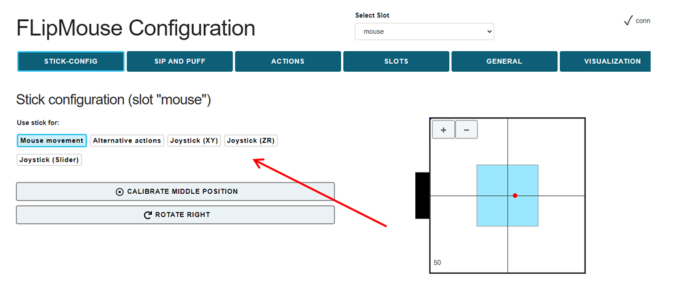

*Figure 19: Set stick configuration for joystick movement*

Please note that the joystick function must be supported by software applications running on the computer (for example computer games). Microsoft Windows offers a test software called “*joy.cpl*” – you can start this utility by entering “*joy.cpl*” into the search dialog. 

The joystick controller provided by the FLipMouse is called *“Serial+Keyboard+Mouse+Joystick”*. When you select this device in the “*joy.cpl*” utility, click on the properties to display its preferences. The live values of the joystick axis and button activities will be displayed in a window similar to the one shown here: 

*Figure 20: Joy.cpl Properties*

Desired joystick button activities can be created using sip/puff or other interaction events by choosing “*Press Joystick Button*” from the action menu as described in the section *Assignment of different actions*.

### Sip/Puff Actions and Levels (Tab SIP AND PUFF)

When using the FLipMouse stick with the mouth, the user can trigger actions by sipping or puffing through the tube. The tube is connected to a pressure sensor, which outputs a value that corresponds to the detected pressure. When the user sips, the sensor value decreases, and when the user puffs the value increases. 
You may assign actions for sipping or puffing using the tab “ACTIONS”, as will be explained in the next section. You can select the thresholds for sipping and puffing as desired, using the tab “SIP AND PUFF”. When the FLipMouse is connected, you can monitor the pressure values and the triggering of sip / puff actions in the web graphical user interface: 

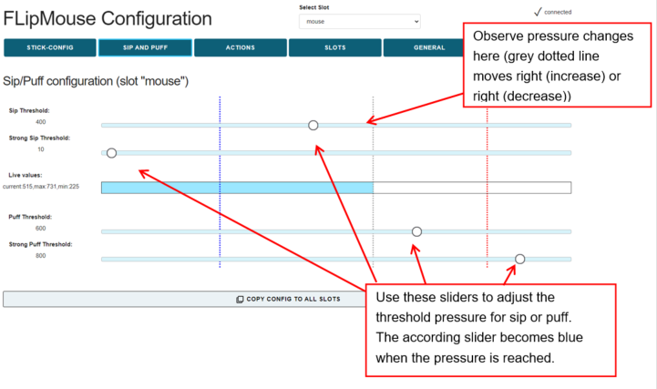

*Figure 21: Tab SIP AND PUFF*

Note that the idle pressure level (without sip or puff) is 
around 512, and the level increases when you puff 
into the mouthpiece, indicating increased pressure.
With the sliders, the threshold pressure for sip and puff can be regulated. The grey dotted line represents the actual pressure. The blue and red dotted lines represent the limits reached in this test setting.

#### StrongSip and StrongPuff

To enrich the functionality of the FLipMouse, especially for persons who cannot access external switches, the StrongSip and StrongPuff modes are available. These modes allow additional actions which can be performed via strong sip or puff activities followed by a stick movement (up / down / left / right). These actions will only be triggered once – then the mode switches back to normal. Entering StrongSip or StrongPuff mode is indicated via an acoustic signal (high tone). If the stick is moved within one second, the corresponding combined action (for example “StrongSip+Up” is triggered). If the stick is not moved within one second, the single StrongSip or StrongPuff action will be triggered. Thus, a total of 10 additional actions can be performed.

### Assignment of different actions (Tab ACTIONS)

The tab ACTIONS provides different actions which can be assigned to desired user activities – for example to buttons, stick movements or sip/puff activity. The actions can be selected via clicking right to the desired button / stick movement / sip/puff activity on the current action assigned in the actual or desired slot (see red arrow in figure 22). Then a window pops up where you can select the desired action category (here for Button 1: Device) and then the desired action (here: Load next slot), see Figure 23.

Actions can be selected for 3 buttons (button 1 is  a built-in button which is ready to use, button 2 and 3 are external buttons, which can by connected through two 3,5 mm jack plugs), for stick movements and for sip and puff. Additional actions can be performed by entering StrongSip or StrongPuff mode, which is indicated via an acoustic signal (high tone) and by executing combinations of Strong Sip / Puff and stick movements. If the stick is moved within one second, the corresponding combined action (for example “StrongSip+Up” is triggered). If the stick is not moved within one second, the single StrongSip or StrongPuff action will be triggered. Thus, a total of 10 additional actions can be performed (see SIP/PUFF actions and levels).

Button 1 is located on the FLipMouse, Button 2 and 3 are optional external buttons. 

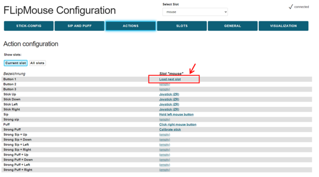

*Figure 22: Assign different actions to buttons / stick movements / sip/puff activity or combinations of those*

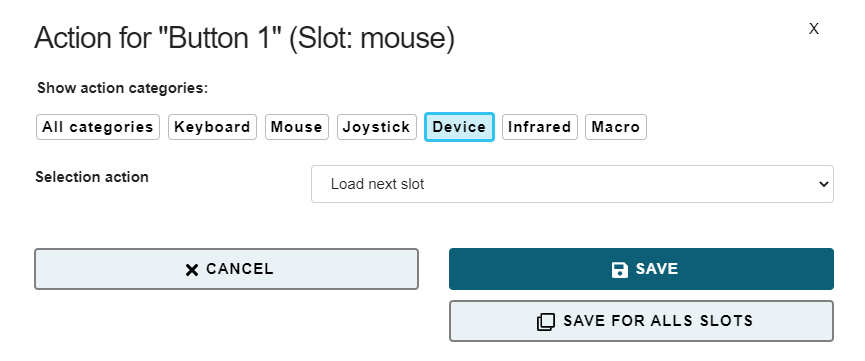

*Figure 23: Window popping up for choice of action for selected button / stick movement or sip/puff activity*

In the following, the individual actions for the different action categories will be briefly described.

#### Action category “Mouse”

**Hold Left / Middle / Right Mouse Button**
The hold action creates a continued pressing of a particular mouse button (for example, when dragging a file, continuously pressing the left mouse click is necessary). The mouse button is released when the assigned user activity ends (for example when the sip/puff activity ends, or when the stick is moved back to middle position or when an external button is released).

**Click Left / Middle / Right Mouse Button**
Creates mouse button clicks. (The left/right or middle mouse button is pressed and released again after short time).

**Double Click Left Mouse Button**
Double clicking the left mouse button may be necessary in cases such as opening a file. However, producing a double click with the regular click mouse button function may not be convenient, so you may assign a double click to a desired user activity. 

**Toggle Left / Middle / Right Mouse Button**
The toggle action changes the state of a mouse button from pressed to not pressed and vice vera. This is useful for if a user has problems with a continuous sip/puff action which is needed for dragging etc.

**Wheel Up / Down**
The actions “Wheel up” or “Wheel down” emulate the mouse scroll wheel. Triggering the “Wheel up” option results in upwards scrolling, while “wheel down” results in downward scrolling. This action is useful for example for reading documents or web sites.

**Move Mouse horizontally / vertically (x-axis / y-axis)**
The "Move mouse horizontally (x-axis)" and "Move mouse vertically (y-axis)" functions generate computer mouse movements along the selected axes. Speed parameters can be set for these functions in the field that appears below. When the button is pressed, the mouse pointer is accelerated up to this maximum speed.

*A positive value for the X direction moves the mouse pointer to the right. 
A negative value for the X direction moves the mouse pointer to the left. 
A positive value for the Y direction moves the mouse pointer down. 
A negative value for the Y direction moves the mouse pointer up.*

#### Action category: Joystick

**Joystick set x-/y-/z-axis/slider**
These actions can be used to send a desired value to the joystick axis. The selectable joystick axes are: X / Y / Z / Z-Turn / slider. The joystick is moved back to middle position when the associated user activity ends.

**Press Joystick Button**
This action can be used to press a desired joystick button. The FLipMouse device supports 32 buttons, so any value from 1 to 32 is allowed. The joystick button is released when the associated user activity ends.

**Joystick hat position**
This action sets the orientation of the joystick hat (in degrees). Allowed values are:
-1, 0, 45, 90, 135, 180, 225, 270, 315. The value of -1 sets the hat to the middle (idle) position. 
The joystick hat is moved back to middle position when the associated user activity ends. 

#### Action category: Keyboard

**Press / Hold / Toggle Keys**
The “Press Keys” action allows pressing one or multiple keyboard keys. A second drop-down menu with possible key identifiers is displayed. **When a key is selected from this menu, it has to be added (Click ADD)** to the Insert keys text field. Thus, multiple keyboard keys can be pressed simultaneously. The keys are released when the associated user activity ends. If you would like to remove or change the assigned keys, you must clear the currently assigned keys by pressing the “CLEAR” button next to the Insert keys field. 

Common key combinations include: 
KEY_CTRL + Z: triggers undo function
KEY_CTRL + C: triggers copy function
KEY_CTRL + V: triggers paste function
KEY_CTRL + KEY_ALT + KEY_ DELETE

The “Hold Key” action keeps the key pressed until the user activity ends.
The “Toggle Key” action changes the key state from pressed to not pressed and vice versa with each user activity.

For a list of all supported key identifiers, see appendix 
or have a look at the [FLipMouse Wiki / Github pages](https://github.com/asterics/FLipMouse/wiki/at-api).

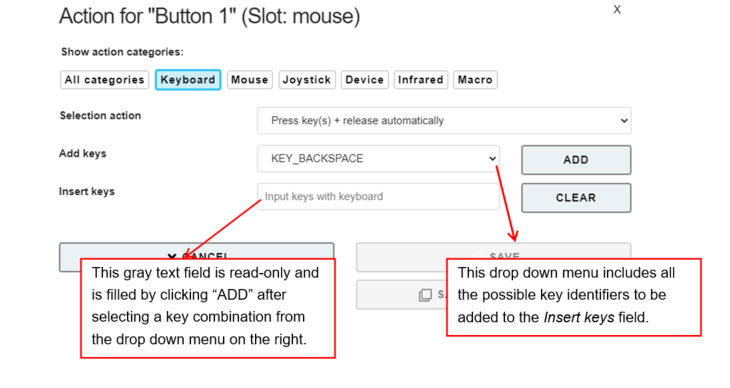

*Figure 24: Add keys for the action press / hold / toggle keys*

**Write Word**
The “Write word” action allows typing a particular text/phrase whenever an user activity occurs (for example: write “Hello” whenever you move the FLipMouse stick up). Selecting this action displays a blank text box under the drop-down menu where the text can be entered, as shown below:

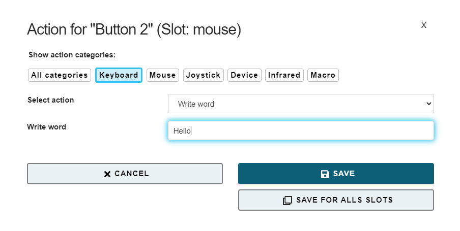

*Figure 25: Write word function*

In this example, "Hello" will be written each time button 2 of the FLipMouse is pressed.

#### Action category: Device

**No Command**
If the action “No Command” is selected, no action will be assigned to the respective user activity.

**Load Next Slot**
This action switches to the next slot. If the last slot is already reached, triggering this action will switch to the first slot. This action is only relevant if you have stored multiple FLipMouse configuration slots. When you switch the slot, the built-in LED bulbs will change accordingly, showing the active slot. 

There are three built in LEDs (red, yellow-orange, green), which will display the binary number for the slot position of the configuration that you have selected. In other words, if you saved two configurations, e.g. “Game settings” and “Mouse”, “Game settings” will be position 1 and “Mouse” will be position 2. 

Additionally to the LEDs, an acoustic signal will indicate the change of the slot.

The following list shows the color codes of the LEDs for each slot position:

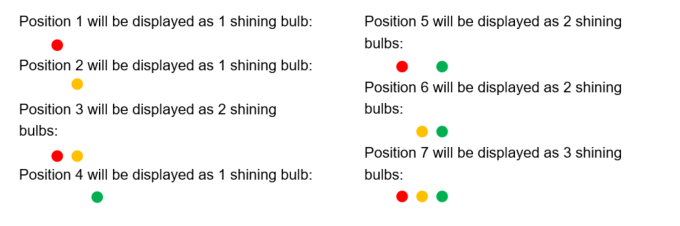

*Figure 26: Color codes of the LEDs*

**Load Slot by Name**
This action allows switching to another slot by its name. The name can be specified in the text field. This action is only relevant if you have stored multiple FLipMouse configuration slots. The LEDs indicate the slot number as described below.

**Calibrate middle position**
This action starts the calibration sequence for the middle position of the stick. Please refer to the description “*Calibration of the stick’s middle position*”.

#### Action category: Infrared

**Play / Hold / Stop Infrared Command**
This action plays an infrared code of given command name. The existing commands can be selected from the drop-down menu. The “play” action sends the recorded code once, whereas the “hold” action repeats the code until the user activity ends. For more information about infrared codes please refer to section “*Infrared Code Recording and Replay*”.

#### Action category: Macro

**Execute Command Macro**
This action allows running a so-called command macro which consists of several individual actions. Thus, a desired sequence of actions can be performed which consists for example of a number of mouse moves, mouse clicks, text inputs or key presses. This action is powerful, but also a bit more complicated because the individual actions must be specified in form of so-called AT-commands which are separated by semicolons. For example: the following command macro will move the mouse cursor 100 steps to the left, 20 steps up, then wait 100 milliseconds and then perform a left mouse click: “MX 100; MY -20; WA 100; CL”. For a list and detailed explanation of all supported AT-commands, see appendix or have a look at the [FLipMouse Wiki / Github pages](https://github.com/asterics/FLipMouse/wiki/at-api).

### Tab SLOTS

In the SLOTS tab you can create new slots, delete existing slots, download single or all slots and upload a file with a slot configuration. After starting the *FLipMouse Configuration Manager*, only one default slot named “mouse” exists. When you create a slot using the “CREATE SLOT” button, you create a new slot **by copying the settings of the current slot**. Before creating the new slot, you can assign a name in the corresponding field (“insert name for new slot”) that will help you remember the slot’s purpose:

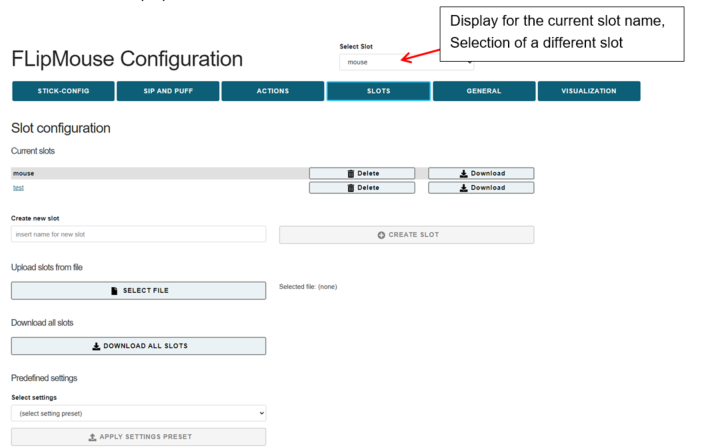

*Figure 27: FLipMouse Configuration Manager: Tab SLOTS*

In the middle of the top of the Configuration manager (red arrow in Figure 10) you can see the current slot and you can choose a different one.
The settings of the current slot will be stored and remembered when changing to another slot. The maximum slot count is five. 

**Delete a slot**
A slot can be removed using the “Delete” button next to the according slot.

**Loading and saving the configuration to/from file**
The button “*Download all slots*” allows transferring all current slots to a settings (.set) file on your computer. All settings can thus be transferred to the same or to another FLipMouse device. Multiple setups (for example for individual users or use-cases) can be kept on a computer and applied with a single click. A file chooser window will be opened which allows selection of the desired filename for saving or loading the configuration.

**Changing the settings of the active slot**
The functional features and settings of the active slot can be changed by using the sliders and selection boxes displayed on the different tabs of the *FLipMouse Configuration Manager* window. These settings tabs will be described in detail in the next chapter.

**Storing current Settings**
The current settings are stored automatically in this web-based FLipMouse Configuration Manager.

### General Settings (Tab GENERAL)

The next tab is dedicated to “GENERAL” and allows changing the USB/Bluetooth mode and other settings of the current slot:

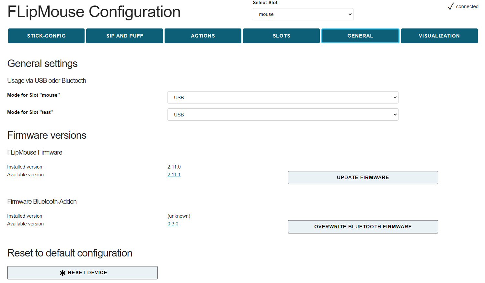

*Figure 28: General Settings*

#### USB/Bluetooth mode

This setting is only relevant if a Bluetooth add-on module is used (see [FLipMouse Wiki pages](https://github.com/asterics/FLipMouse/wiki/bt-conn) for more information). Using this combo box selection, it is possible to decide if mouse / keyboard activities are sent via USB cable, via Bluetooth connection, or both. Thus, dedicated slots for USB and Bluetooth can be created, so that a user can switch e.g. from a laptop computer (where the FLipMouse is connected via cable) to a wireless connection (phone / tablet) and back.

#### FLipMouse Firmware (“UPDATE FIRMWARE”)

Here you can see the installed version and the available version of the FLipMouse Firmware. If these two differ, you can press the button “UPDATE FIRMWARE”. Pressing this button will attempt to download the latest Arduino software (firmware) on the FLipMouse and install it. If the installed version and the available version are the same, then the button changes to “OVERWERITE FIRMWARE”. 

#### Firmware Bluetooth-Addon (“UPDATE BLUETOOTH FIRMWARE”)

Here you can see the installed version and the available version of the Bluetooth Module. If these two differ, you can press the button “UPDATE BLUETOOTH FIRMWARE”, which will attempt to download the latest software (firmware) for the Bluetooth module and install it on the module. This process can take a few minutes and is only possible if a Bluetooth module is connected to the FLipMouse. If there is no Bluetooth module connected to the FLipMouse, there may be written that the installed version is unknown or it just does not work. If the installed version and the available version are the same, then the button changes to “OVERWERITE BLUETOOTH FIRMWARE”. 

### View Force Levels (Tab VISUALIZATION)

The FLipMouse stick is attached to four force sensors – one for each movement direction (up, down, left, right). The numeric value of each of those sensors is displayed in the “VISUALIZATION” tab. The live values can be monitored when the FLipMouse device is connected. Whenever the stick is moved, the sensor values change. Specifically, a movement in each direction increases the respective sensor value. The sensor values also depend on the use of the adjustment screws which change the force which is applied to the sensor pads via 4 metal springs. Therefore, when assembling the FLipMouse, the live sensor values can be used as guidance. **When not touching the stick, the values should look similar to screenshot below. All values should decrease and raise similarily when moving the stick. Significant deviation in one direction indicates a sensor problem. The sensors should be checked and might need to be replaced.**

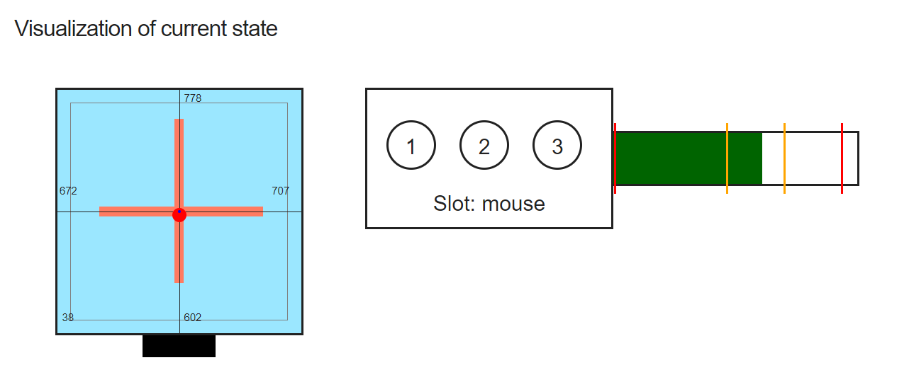

*Figure 29: Left: Live display of force sensor values; Middle: current slot with the 3 buttons (if one button is pressed, the corresponding circle will be yellow; Right: Sip and Puff live value and current thresholds*

### Infrared Code Recording and Replay

The FLipMouse device includes an infrared remote receiver module and a high current IR LED so that it can record and replay remote control codes of many remote controls used in consumer electronic devices. If you want to use this feature of the FLipMouse, make sure that the IR sending LED is mounted so that it points to the device you want to control (usually the IR LED points to the direction the user looks when using the FLipMouse). For instructions how to connect an external IR LED to increase the transmit power, please visit the [FLipMouse Wiki pages](https://github.com/asterics/FLipMouse/wiki).

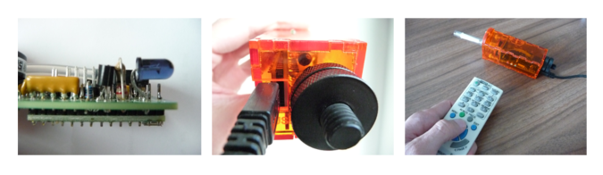

*Figure 30: Infrared Code Recording*

To record a new IR code, go to the tab ACTIONS. Select the desired button / stick activity / Sip or Puff or combination and click on the right side on the current defined action. Go to the action category “**Infrared**”. There are three different types of commands in the drop down menu of “Selection action”: The “Play infrared command” action sends the recorded code once, whereas the “Hold infrared command” action repeats the code until the user activity ends. The existing commands can be selected from the drop-down menu next to “Play infrared command”. This action plays an infrared code of the here selected command name.
In this window you can also manage IR commands. Next to “New IR Command”, you can enter a name and then press “RECORD” - point your IR remote to the side of the FLipMouse where the LEDs stick out and send the IR command (you have 10 seconds for this). The new command is now stored in the FLipMouse and can be chosen and replayed by choosing it in the drop down menu above as an action for this button / stick direction / sip or puff. If the command is not correctly replayed, try to increase the IR-Code timeout – for example to 250 milliseconds. Under “Delete IR command” commands can be deleted. 

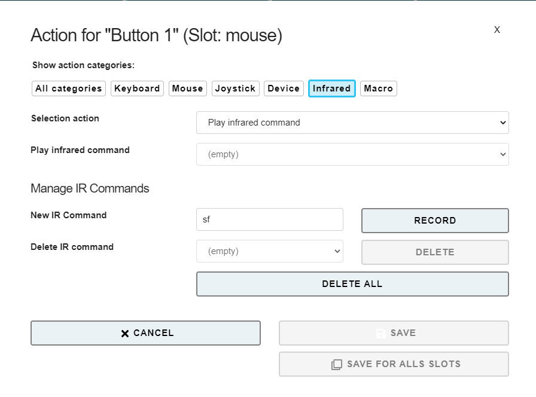

*Figure 31: Infrared Recording and Replay Configuration Manager*

### Using the Bluetooth module

The optional Bluetooth "AddOn" module allows connection and control of cell phones, tablets and computers with Bluetooth capability. The Bluetooth module is available separately from the AsTeRICS Foundation or included in the appropriate version of the FLipMouse kit. 

#### Installation of the Bluetooth module

The Bluetooth module is plugged onto the internal 10-pin connector of the FLipMouse. To do this, open the FLipMouse housing and push the module onto the pin header as far as possible:

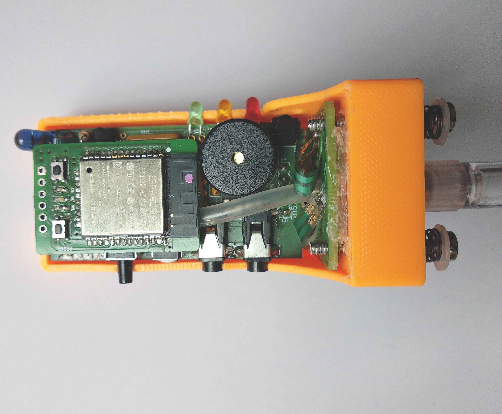

*Figure 32: Bluetooth module*

#### Connecting with a Bluetooth device (pairing)

The Bluetooth module indicates by fast flashing (approx. 2 times per second) that it is ready to establish a connection with a host device. The host device could be a cell phone, for example. A “New Bluetooth” device must now be added in the Bluetooth settings of the host device. Here it should be possible to select the "FLipMouse" device name. If the connection is successful, the LED of the Bluetooth module should flash slowly (approx. 1 time per second). The decision whether an action of the FLipMouse is performed via USB or via Bluetooth or both is made in the settings in the "GENERAL" tab. If Bluetooth and USB is selected, the FLipMouse can control the host device via Bluetooth in parallel controlling the device which is already connected via USB (executing the same action on both devices). 

# Mod your Mouthpiece?

Several users reported that they would prefer a different shape of the mouthpiece. It is of course possible to apply your own modifications and extensions which feel comfortable to you. Here we want to give some suggestions using affordable, disposable cigarette holders. The link between the *Hygienic Stick* and the cigarette holder is established with a small brass tube. It is also possible to cut the cigarette holder and insert it into the *Hygienic Stick* so that a tight fit is ensured.

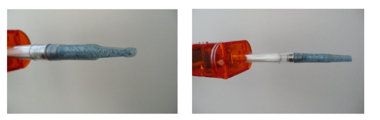
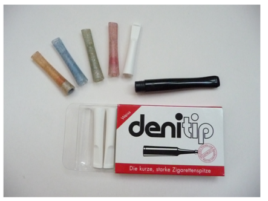

*Figure 33: Modify shape of Mouthpiece*

Regardless of your desired mouthpiece modifications: Always take care for a hygienic operation and apply the cleaning procedures as described in the following chapter!

# Instructions for cleaning and maintenance

If the mouthpiece is used to actuate the cursor movements via lip/mouth movements, a careful cleaning procedure is essential to avoid bacteria and health problems! Read this section carefully and apply the needed cleaning procedures whenever necessary.

**Exchanging the saliva filter:**
The saliva filter is placed inside the hygienic stick. Usually, no (or nearly no) saliva should enter the stick – but it strongly depends on the person using the mouthpiece and his/her condition. If saliva enters the *Hygienic Stick*, the saliva filters prevents the moisture entering the inner parts of the FLipMouse (respectively the pressure sensor). The filter can be replaced as shown below:

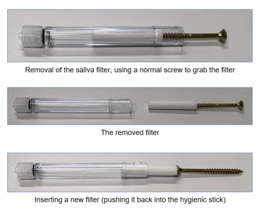

*Figure 34: Exchanging the filter*

**Disinfection of the mouthpiece/hygienic stick:**
To disinfect a mouthpiece, use boiling water. Place the *Hygienic Stick* (without saliva filter) in boiling water for at least five minutes. Then let the *Hygienic Stick* dry before the next application.

**Ordering replacement sticks and filters:**
Saliva filters and *Hygienic Sticks* can be directly ordered from the [*Quadjoy* online shop](https://quadjoy.com/shop). We would like to thank Bill and Debra Street for letting us use their *Quadjoy Hygienic Stick* together with our FLipMouse device – you guys are great!

## Hygienic considerations and risks

If the mouthpiece is actuated with the lips, it is important to respect the following hygienic precautions: 
1. One mouthpiece must be used exclusively by one person
2. The filter tip must be replaced whenever saliva or dirt have formed
3. The mouthpiece must be cleaned whenever saliva or dirt have formed
(see chapter “Cleaning and Maintenance”)

With the lack of hygiene concerning the mouthpiece, especially when the mouthpiece is used by more than one person, it is possible that 

1. skin rash arises
2. viruses and bacteria are transmitted causing diseases
3. dirt formats in the mouthpiece, which is dangerous to health

With wrong positioning of the FLipMouse there is the risk of feeling uncomfortable after longer periods of use, and it is possible to get muscle cramps or muscle pain due to unusual head positioning – pay attention to a convenient position and schedule pauses if you work for longer time periods!

# Updating the firmware via Arduino

In addition to the possibility of updating the FLipMouse firmware via the configuration manager, the firmware can also be updated via the Arduino IDE or the Teensy loader application. Find the most recent versions in the latest release package on [Github](https://github.com/asterics/FLipMouse/releases). Unzip the FLipMouse.zip package and start the teensy.exe program (the Teensy Loader).

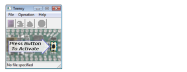

*Figure 35: Teensy Loader Step 1*

The Teensy Loader user interface should look as on the picture above (Figure 35). If there is any security warning (related to Windows User Access Control), please ensure that the Publisher is “PJRC.COM, LLC” and click on “Run”.
As next step, activate the “download mode” of the FLipMouse by using some pointed tool (needle, small screwdriver, …) to press the reset button which is accessible via the small hole on the bottom side. After a few seconds (driver installation), the Teensy Loader GUI should indicate connection to the FLipMouse as shown here in Figure 36:

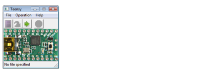

*Figure 36: Teensy Loader Step 2*

Choose “File → Open HEX file” and select the file “FLipWare.hex” from the FLipMouse folder (or location where you downloaded the release .zip file).

Select “Operation → Program”. After a few seconds, you should see the notification “Download complete”, as on the next picture (Figure 37). (If this step does not work in the first place, try to unplug and replug the FLipMouse and restart the Teensy Loader software.)

*Figure 37: Teensy Loader Step 3*

To finish the firmware installation, select “Operation → Reboot”.
You should read “Reboot” and the FLipMouse should beep for a short time.

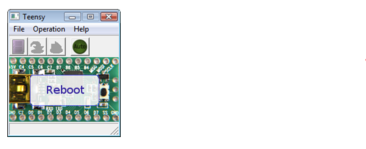

*Figure 38: Teensy Loader Step 4*

To update the GUI software, copy the file “FLipMouseGUI.exe” from the zip package to the desired location (replacing the old FLipMouseGUI.exe file).

# Building the Firmware

If you want to adapt the software (firmware) of the FLipMouse, follow these steps:

1. Clone the FLipMouse repository, https://github.com/asterics/FLipMouse 

2. Download and install the Arduino IDE, https://www.arduino.cc/en/main/software 

3. Download and install Teensyduino, https://www.pjrc.com/teensy/td_download.html 

4. Open FLipWare/FLipware.ino with the Arduino IDE, see: https://github.com/asterics/FLipMouse/blob/master/FLipWare/FLipWare.ino

5. Use the following settings in Arduino IDE: 
   o    Tools -> Board -> Teensy LC
   o    Tools -> USB Type -> "Serial + Mouse + Keyboard + Joystick"
   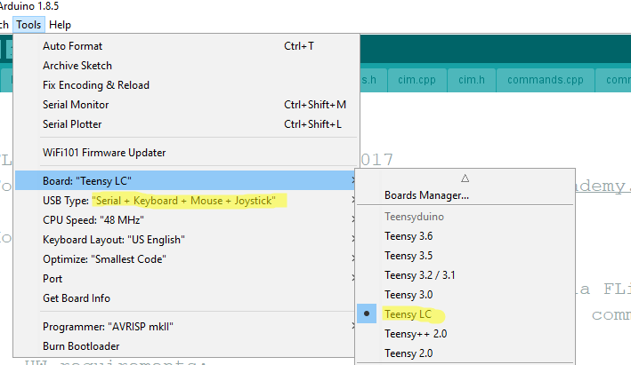
   
   *Figure 39: Adapting the Firmware*

# Further instructions and troubleshooting

For further instruction and troubleshooting please refer to the [GitHub Wiki of the FLipMouse project](https://github.com/asterics/FLipMouse/wiki). 

# Appendix: Macro commands and Key codes

## Supported Macro commands:

| **Abbreviation** | **Function**                                                                                                                   | **example**                                                                                                                     |
| ---------------- | ------------------------------------------------------------------------------------------------------------------------------ | ------------------------------------------------------------------------------------------------------------------------------- |
| CL               | click left mouse button                                                                                                        |                                                                                                                                 |
| CR               | click right mouse button                                                                                                       |                                                                                                                                 |
| CM               | click middle mouse button                                                                                                      |                                                                                                                                 |
| CD               | click double with left mouse button                                                                                            |                                                                                                                                 |
| HL               | hold the left mouse button                                                                                                     |                                                                                                                                 |
| HR               | hold the right mouse button                                                                                                    |                                                                                                                                 |
| HM               | hold the middle mouse button                                                                                                   |                                                                                                                                 |
| TL               | toggle left mouse button                                                                                                       | Ändert: gedrückt <-> nicht gedrückt                                                                                             |
| TM               | toggle middle mouse button                                                                                                     |                                                                                                                                 |
| TR               | toggle right mouse button                                                                                                      |                                                                                                                                 |
| RL               | release the left mouse button                                                                                                  |                                                                                                                                 |
| RR               | release the right mouse button                                                                                                 |                                                                                                                                 |
| RM               | release the middle mouse button                                                                                                |                                                                                                                                 |
| WU               | move mouse wheel up                                                                                                            |                                                                                                                                 |
| WD               | move mouse wheel down                                                                                                          |                                                                                                                                 |
| MX <int>         | move mouse in x direction                                                                                                      | MX 4 -> moves cursor 4 pixels to the right                                                                                      |
| MY <int>         | move mouse in y direction                                                                                                      | MY -10 -> moves cursor 10 pixels up                                                                                             |
| KW <string>      | keyboard write string                                                                                                          | KW Hello! -> writes "Hello!" on the keyboard                                                                                    |
| KP <string>      | key press: Press keyboard keys (once). Keys are identified by keyboard shortcuts (see list below)                              | KP KEY_UP -> presses the "Cursor-Up" key; KP KEY_CTRL KEY_ALT KEY_DELETE presses all 3 keys                                     |
| KH <string>      | key hold: hold keyboard keys                                                                                                   | sKH KEY_LEFT -> holds the "Cursor-Left" key                                                                                     |
| KT <string>      | key toggle: toggle keyboard keys; the key will remain pressed until "AT KT" command is sent again or a "AT KR" command is sent | KT KEY_DOWN -> toggles the "Cursor-Down" key                                                                                    |
| KR <string>      | key release                                                                                                                    | KR KEY_UP -> releases the "Cursor-Up" key                                                                                       |
| RA               | releases all = Release all currently pressed keys and mouse buttons                                                            |                                                                                                                                 |
| WA <int>         | wait a certain number of milliseconds                                                                                          | WA 100 -> waits 100 milliseconds                                                                                                |
| NE               | next slot: load next slot                                                                                                      |                                                                                                                                 |
| LO <string>      | Load slot per name, changes to the given slot                                                                                  | LO mouse                                                                                                                        |
| NC               | No command                                                                                                                     |                                                                                                                                 |
| JX <int>         | set joystick x axis                                                                                                            | JX 512 -> sets the x-axis to middle position                                                                                    |
| JY <int>         | set joystick y axis                                                                                                            | JY 1023 -> sets the y-axis to full up position                                                                                  |
| JZ <int>         | set joystick z axis                                                                                                            | JZ 0 -> sets the z-axis to lowest poistion                                                                                      |
| JT <int>         | set joystick turn axis                                                                                                         | JT 512 -> sets the rotation to middle position                                                                                  |
| JS <int>         | set joystick slider position                                                                                                   | JS 512 -> sets the slider to middle position                                                                                    |
| JP <int>         | press joystick button                                                                                                          | JP 1 -> presses joystick button 1                                                                                               |
| JR <int>         | release joystick button                                                                                                        | JR 2 -> releases joystick button 2                                                                                              |
| JH <int>         | set joystick hat position                                                                                                      | JH 45 -> sets joystick hat to 45 degrees; possible values are: 0, 45, 90, 135, 180, 225, 270, 315 and -1 to set center position |
| MM <int>         | mouse mode: cursor on (int==1) or alternative functions on (int==0)                                                            | MM1 -> switches to mouse mode                                                                                                   |
| CA               | Calibrate zero position                                                                                                        | calibrates stick / mouthpiece middle position                                                                                   |
| IP <string>      | play infrared command                                                                                                          | IP channelUp; plays infrared command "channelUp" (if this IR-command name has been recorded)                                    |

Please note that certain commands for adjusting FLipMouse settings are not shown in this table (for example setting thresholds or accelerations, recording IR-commands etc.). For a full list of commands please refer to the [FLipMouse wiki](https://github.com/asterics/FLipMouse/wiki/at-api). 

## Supported Key Identifiers:

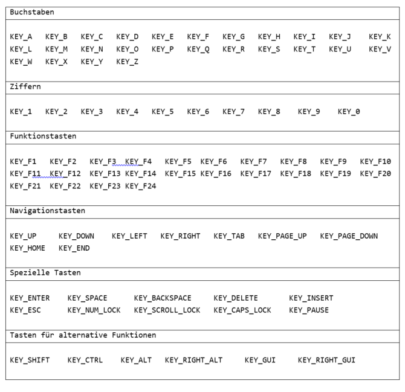

  *Figure 39: Supporded key identifiers*

# Contact Information

University of Applied Sciences Technikum Wien
  
Faculty of Electronic Engineering
  
Höchstädtplatz 6
  
A-1200 Wien
  
AUSTRIA

  
  
AsTeRICS Foundation
  
Webpage: [www.asterics-foundation.org](http://www.asterics-foundation.org)
  
Email: <office@asterics-foundation.org>

# Disclaimer

The University of Applied Sciences Technikum Wien and the AsTeRICS Foundation do not assume any warranty and liability for the functionality of the set of Assistive Technology and the correctness of the documents handed over.

Additionally, the UAS TW is not liable for any damages to health due to the use of the Assistive Technology provided. The provided software applications and hardware modules are used at own risk!

# Acknowledgement

We want to thank Ilana Snitkovski for her support in creating this User Manual.  

This project was partly funded by the City of Vienna, 
Municipal department of Economic Affairs, Labour and Statistics (MA 23), 
in course of the projects AsTeRICS Academy (14-02), ToRaDes (18-04) 
and Wissensdrehscheibe für Barrierefreie Technologien (26-02) 

