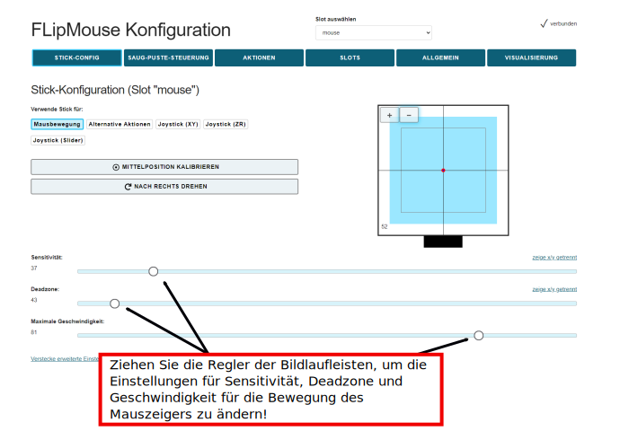

# FLipMouse - Finger & Lippen - Maus

**Anwendungsanleitung v3.1**

**Inhaltsverzeichnis:**

[TOC]

____

# Einleitung

Die FLipMouse ist ein alternatives Eingabesystem, das an der [Fachhochschule Technikum Wien](https://www.technikum-wien.at) entwickelt und von der [AsTeRICS Foundation](https://asterics-foundation.org) als Open Source Baukasten angeboten wird. Die FLipMouse ermöglicht es,  mittels minimaler Finger- oder Lippenbewegungen die Computermaus, einen Joystick oder Tasten der Tastatur zu verwenden. Weiters können Geräte via Bluetooth oder Infrarot gesteuert werden.

Die FLipMouse kann über den *Konfigurationsmanager* (eine webbasierte grafische Anwendung) konfiguriert werden. Der Konfigruationsmanager ist auf der Website [flipmouse.asterics.eu](https://flipmouse.asterics.eu/index_fm.htm) zu finden. Dieses Benutzerhandbuch enthält eine Beschreibung des Konfigurationsmanagers und erklärt, wie die verschiedenen Funktionen der FLipMouse verwendet werden. Die FLipMouse kann auf Windows-, Mac- oder Linux-Computern ohne Installation von spezieller Software verwendet werden, da sie sich wie ein Standard-Maus/Joystick/Tastatur-Gerät verhält. Mit der Bluetooth-Funktion können auch Smartphones oder Tablet-Computer angesteuert werden - was ebenfalls in diesem Handbuch erklärt wird.

Darüber hinaus enthält dieses Handbuch wichtige Richtlinien für die Verwendung der FLipMouse, insbesondere Reinigungsverfahren und hygienische Vorsichtsmaßnahmen.

Alle Designdateien für die Elektronik und das 3d-gedruckte Gehäuse - sowie der Software-Quellcode - sind als Open Source verfügbar und werden über die Website der AsTeRICS Foundation und über GitHub verbreitet. Detaillierte Anleitungen sind in der [FlipMouse-Bauanleitung](https://github.com/asterics/FLipMouse/blob/master/ConstructionKit/ConstructionManual.pdf) enthalten. Viel Spaß beim Bauen und Benutzen deiner FLipMouse!

Die AsTeRICS Foundation

[www.asterics-foundation.org](https://asterics-foundation.org/)

    

# Hardware Übersicht

Die FLipMouse ist mit einem 3d-gedruckten Gehäuse erhältlich. Designdateien für das 3d-gedruckte Gehäuse werden im [Github-Repository](https://github.com/asterics/FLipMouse/tree/master/Hardware/case-design/3D_printer) bereitgestellt. Die primäre Methode zur Interaktion mit der FLipMouse ist ein transparenter Stab ("Mundstück" bzw. "Finger-Joystick"), der an der Vorderseite der FLipMouse angebracht ist. Ersatzstäbe können über den [Webshop](https://www.asterics-foundation.org/webshop) der AsTeRICS Foundation bestellt werden. (Bitte beachten Sie die Reinigungshinweise im entsprechenden Abschnitt dieser Anleitung).

    

*Abbildung 1*: Verwendung der FLipMouse (hier Version 2) als Mundsteuerung für Computer

Zusätzlich können zwei externe Taster an die Klinkenbuchsen auf den beiden Seite des FlipMouse-Gehäuses angeschlossen werden, und eine Taste ist bereits auf dem Gerät integriert.

**Benutzer können auf verschiedene Weise mit der FLipMouse interagieren:**

1. durch Berühren des Mundstücks mit den Lippen oder Fingern und Aufbringen kleiner Kräfte in vertikaler oder horizontaler Richtung
2. durch Erhöhen oder Verringern des Drucks im Mundstück (pusten oder ansaugen)
3. durch Betätigung von (bis zu) 3 Schaltern / Drucktastern
4. falls gewünscht, kann ein Kunststoffschlauch an den Drucksensor angeschlossen werden, so dass der Joystick mit einem Finger bedient werden kann und ein separates Mundstück für pusten/saugen verwendet werden kann. Alternativ kann der Druck auch durch das Anbringen eines Gummiballs am Kunststoffschlauch beeinflusst werden (Kissenschalter / Softschalter).

**Die Hardware-Eigenschaften der FLipMouse:** 

(a)    "Zero-way" Finger-Joystick/Mundstück: sehr geringe Kräfte reichen aus, um eine Auf-/Ab-/Links-/Rechts-Bewegung zu erzeugen

        o  Der Zero-Way Joystick kann z.B. mit Fingern oder Zehen bedient werden

        o  Er kann auch als Mundstück verwendet werden (Betätigung durch Lippen/Mundbewegungen)

        o  Falls gewünscht,  können durch pusten/saugen am Mundstück zusätzliche Funktionen ausgelöst werden. Hier stehen jeweils 2 unterschiedliche Stärke-Einstellungen zur Verfügung.

(b)    Ein eingebauter Schalter (*Button1*) am Gerät, z.B. zum Ändern der aktiven Konfiguration (Funktionen)

(c)    Zwei 3,5-mm-Klinkenbuchsen zum Anschluss von externen Schaltern / Tastern zur Auslösung von Zusatzfunktionen (*Button2* und *Button3*)

(d)    Anzeige der aktiven Konfiguration, des Kalibrierungsvorgangs usw. durch Farbe an der Frontseite

(e)    Universal-Infrarot-Fernbedienungsempfänger und -sender

(f)    Bluetooth-Unterstützung z. B. zur Steuerung von Smartphones oder iOS-Geräten

(g)    "Hot Shoe"-Adapter zur Montage an einem Manfrotto Magic Arm oder einem ähnlichen Montagesystem

(h)    Firmware-Aktualisierung über die FLipMouse-Webanwendung auf [flipmouse.asterics.eu](https://flipmouse.asterics.eu/index_fm.htm)

   

    

Auf der linken Seite der FLipMouse befindet sich eine Taste (B1), die eine konfigurierbare Funktion bietet (z. B. Ändern des Betriebsmodus). Eine 3,5-mm-Klinkenbuchse ermöglicht den Anschluss eines externen Tasters.

Auf der rechten Seite des FLipMouse-Gehäuses ist das Infrarot (IR) Empfängermodul zugänglich. Mit diesem Modul können beliebige Infrarot-Fernbedienungsbefehle aufgezeichnet werden (z.B. zum Ändern der Lautstärke oder der Kanaleinstellungen eines TV-Gerätes). Die IR-Signale können dann über die IR-Sendediode auf der Rückseite der FLipMouse wiedergegeben werden. Weiters kann zweiter externer Taster (B3) angeschlossen werden.

Die Frontseite des Gehäuses bietet eine Anschlussmöglichkeit für das Mundstück / den Finger-Joystick. Hier wird auch der aktuelle Betriebsmodus durch eine einstellbare Lichtfarbe angezeigt.

# Montage und Verwendung

**1. Befestigung des Mundstücks / des Joysticks**

Befestigen Sie das transparente Acrylglasrohr auf den vorderen Anschluss (Luer Lock Adapter) und drehen Sie es im Uhrzeigersinn, bis es gut sitzt (bitte nicht zu stark drehen, weil dadurch der Luer-Lock Adapter bzw. die Befestigung beschädigt werden könnten).

**2. Montieren der FLipMouse in einer geeigneten Weise**

Das Bild zeigt eine Kombination aus "[Manfrotto Gelenkarm](https://www.manfrotto.com/global/single-arm-2-section-196ab-2/)" + "[SuperClamp](https://www.manfrotto.com/global/super-photo-clamp-without-stud-aluminium-035/)" Halterung. Sie können auch den [Manfrotto Magic Arm](https://www.manfrotto.com/global/magic-photo-arm-smart-centre-lever-and-flexible-extension-143n/) oder eine andere Befestigungslösung verwenden, die auf den 3/8"-HotShoe-Adapter der FLipMouse passt.

*Verwendung als Mundsteuerung*

*Abbildung 3*: Verwendung der FLipMouse mit Mund/Lippen

Achten Sie darauf, dass sich der Kopf des Benutzers/der Benutzerin in einer bequemen Position befindet. Das Mundstück sollte die Lippen nur leicht berühren. Es ist nicht sinnvoll, das Mundstück weiter in den Mund zu nehmen - dies könnte unangenehm sein und die Kontrolle der seitlichen Bewegung erschweren.

*Verwendung als Finger-Joystick*

*Abbildung 4*: Verwendung der FLipMouse mit den Fingern

Wenn der Benutzer / die Benutzerin die FLipMouse mit einem Finger oder dem Daumen betätigen möchte, montieren Sie das System so, dass sich die Hand in einer Ruheposition befindet und der Finger den Joystick ohne Belastung berühren kann. Bringen Sie einen oder zwei zusätzliche externe Schalter an, falls gewünscht, und montieren Sie die Schalter an geeigneten Stellen (z. B. an den Beinen/Zehen/Schultern usw.).

*Soft-Taster mittels Gummiball*
Ein Kunststoffschlauch kann mittels eines *Luer-Lock*-Adapters am vorderen Anschluss der FLipMouse befestigt werden. Dieser Kunststoffschlauch kann mit einem weichen Ball verbunden werden, sodass ein Drücken das Balles eine verwertbare Druckänderung erzeugt. Diese Lösung kann als weicher Kopfschalter / Kissenschalter oder Schulterschalter ausgeführt und mit anderen externen Schaltern kombiniert werden.

**3. Schließen Sie die FLipMouse über die gewünschte Schnittstelle (USB, Bluetooth oder USB-OTG) an einen Computer, ein Tablet oder ein Smart Phone an**. Bitte beachten Sie, dass die Einstellungen der FLipMouse nur geändert werden können, wenn die FLipMouse an einen PC über USB angeschlossen ist.

#### Verwendung der FLipMouse über USB

Die FLipMouse kann über ein USB-Micro-Kabel an einen Computer angeschlossen werden.  Nach dem Anschließen der FLipMouse wird eine Kalibrierung der Nullstellung durchgeführt, die etwa 2 Sekunden dauert. Während dieser Zeit sollte das Mundstück nicht berührt werden.

*Abbildung 5*: Verbinden der FLipMouse mit dem Computer

**Bitte seien Sie vorsichtig** beim Anbringen des USB-Steckers, starke Kräfte können den Stecker beschädigen!

#### Verwendung der FLipMouse über Bluetooth

Die Bluetooth-Funktion der FLipMouse ermöglicht die kabellose Maus-/Tastatursteuerung von Computern, Tablets und Smartphones. Darüber hinaus können iPhones oder iPads über VoiceOver & Assistive-Switch Unterstützung genutzt werden. Falls die FLipMouse nur über Bluetooth verwendet werden soll, muss die Stromversorgung über ein USB-Micro-Kabel hergestellt werden (entweder über ein 5V-Netzteil oder über eine USB-Powerbank).

#### Verwendung der FLipMouse über USB-OTG

Die FLipMouse sollte mit jedem Betriebssystem funktionieren, das USB-HID-Geräte (Maus/Tastatur/Joystick) unterstützt, z. B. Windows, Linux oder MacOS. Einige Android-Geräte verfügen über einen USB-Anschluss mit USB-OTG-Funktionalität ("on-the-go"). Wenn Ihr Gerät "OTG" unterstützt, können Sie die FLipMouse mit einem USB-OTG-Adapter/Kabel anschließen (siehe Abbildung unten). Nach dem Anschließen sollten Sie einen Mauszeiger und/oder eine Bildschirmtastatur sehen. Sie können mit der App "OTG Checker" testen, ob Ihr Android-Telefon oder -Tablet die USB-OTG-Funktion unterstützt. 

*Abbildung 6*: Verwendung der FLipMouse mit dem Smart Phone

# FLipMouse-Konfigurationsmanager

Der *FLipMouse Konfigurationsmanager* ist eine grafische Benutzeroberfläche (GUI) zur Anpassungen der Einstellungen der FLipMouse an persönliche Bedürfnisse. Der Konfigurationsmanager ist über die folgende Website zugänglich: [https://flipmouse.asterics.eu](https://flipmouse.asterics.eu). Der FLipMouse-Konfigurationsmanager sendet und empfängt Informationen von der FLipMouse über einen Kommunikationsanschluss (COM-Port).  **Derzeit werden folgende WebBrowser unterstützt: Chrome, Chromium, Edge, Safari**.

Die folgende Abbildung zeigt die Einstiegsseite des FLipmouse-Konfigurationsmanagers:

    

*Abbildung 7: Willkommensseite des FLipMouse-Konfigurationsmanagers*.

## Verbindungsaufbau mit der FLipMouse

1. Stellen Sie sicher, dass die FLipMouse über einen USB-Anschluss mit Ihrem Computer verbunden ist und dass ein unterstützter Webbrowser - Chrome, Chromium, Edge oder Safari - verwendet wird. (Der Testmodus erlaubt die Verwendung des Konfigurationsmanagers ohne eine echte FlipMouse, was z. B. zum Anzeigen oder Ändern von Einstellungen aus einer Backup-Datei nützlich sein kann).
2. Klicken Sie auf *VERBINDEN ZU FLIPMOUSE (ÜBER USB ANGESCHLOSSEN)* und wählen Sie im Auswahlfeld den entsprechenden COM-Port (Kommunikationsanschluss) aus. Wenn das Auswahlfeld leer erscheint, bedeutet dies, dass kein Kommunikationsanschluss erkannt wurde. Schließen Sie in diesem Fall das FLipMouse-Gerät erneut an und warten Sie, bis der COM-Port aktualisiert wird. Falls auch nach wiederholten Versuchen kein COM-Port wählbar ist, liegt vermutlich ein Problem mit dem Treiber vor. Legen Sie in diesem Fall bitte ein [Issue im Github Repository](https://github.com/asterics/FLipMouse/issues) an bzw. suchen Sie dort nach Lösungsmöglichkeiten.
3. Sobald der COM-Port ausgewählt ist, klicken Sie auf die Schaltfläche "Verbinden" am unteren Rand des Auswahlfeldes.
4. Nach erfolgreicher Verbindung des COM-Ports wird das Hauptfenster geöffnet. Die Titelleiste zeigt in der oberen rechten Ecke des Fensters den COM-Port Status als "verbunden" an, und die Auswahlbox *Slot auswählen* zeigt den aktiven Konfigurations-Speicherplatz (Slot). Darunter könnten die Tabs (Reiter) mit den Hauptfunktionen gewählt werden:

*Abbildung 8: Titelleiste des FLipMouse-Konfigurationsmanagers*

## Ändern von Einstellungen und Funktionen

### Speicherplätze ("Slots")

Der Konfigurationsmanager ermöglicht die Anpassung aller Einstellungen und Betriebsarten der FLipmouse. Die Einstellungen werden in einzelnen **Speicherplätzen (Slots)** abgelegt - z.B. ein Slot für schnellen Mausbetrieb, ein Slot für langsamen Mausbetrieb, ein Slot für Tastatur-ASDW usw. Alle Einstellungen werden in der FLipMouse gespeichert. Die Einstellungen können auch in einer Datei auf Ihrem Computer abgelegt (oder von dort geladen) werden. 
Die in der FLipMouse gespeicherten Einstellungen bleiben auch dann erhalten, wenn die Stromversorgung unterbrochen wird. Wenn die FLipMouse das nächste Mal angeschlossen wird, sind die Einstellungen wieder verfügbar - auch wenn Sie einen anderen Computer oder ein anderes Betriebssystem verwenden!

## Tab STICK-CONFIG

Im Tab STICK-CONFIG wird die **Betriebsart des Mundstücks/Joysticks für den aktiven Slot eingestellt**. Weiters können etwa die *Sensitivität*, die *Deadzone* und weitere Parameter für geändert werden. Durch die Möglichkeit, mehrere Slots mit unterschiedlichen Stick-Einstellungen bzw. Betriebsarten zu konfigurieren, können flexible Anwendungsszenarien für die FLipMouse realisiert werden. Die Slots können durch eine beliebige Aktion des Benutzers / der Benutzerin gewechselt werden (z.B. das Drücken eines externen Tasters oder starkes Pusten in das Mundstück, siehe Abschnitt [*Zuweisung von verschiedenen Aktionen*](https://github.com/asterics/FLipMouse/blob/master/Documentation/UserManual/Markdown/FLipMouseAnwendungsanleitung.md#tab-aktionen)).

### Betriebsart (“Verwende Stick für”)

Diese Einstellung bestimmt die Auswirkung einer Berührung des Sticks: 

1. **Mausbewegung:** Diese Betriebsart bewegt den Maus-Zeiger (dies ist die Standardeinstellung, um Computer oder Smartphones zu steuern). Ist dieser Modus aktiv, so wirken sich die weiteren Parameter (z.B. Sensitivität oder Deadzone) direkt auf die Geschwindigkeit des Maus-Zeigers aus. 
2. **Alternative Aktionen:** Wird diese Betriebsart gewählt, so kann der Stick für eine ganze Reihe unterschiedlicher Aktionen verwendet werden (z. B. Drücken der Taste 'A' wenn der Stick nach oben gedrückt wird, oder Abspielen eines Infrarot-Kommandos wenn der Sick nach rechts gedrückt wird). Diese Aktionen können im Tab ACTIONS festgelegt werden (siehe Abschnitt [*Zuweisung von verschiedenen Aktionen*](https://github.com/asterics/FLipMouse/blob/master/Documentation/UserManual/Markdown/FLipMouseAnwendungsanleitung.md#tab-aktionen)). **Wichtig:**Ist diese Betriebsart aktiv, so ist in erster Linie der Deadzone-Parameter ausschlaggebend dafür, ab welcher Betätigungsstärke die zugeweisene Aktion ausgelöst wird. 
3. **Joystick (XY):** In dieser Betriebsart  beeinflusst der Stick die X- und Y-Achse eines Joysticks/Gamepads (siehe Abschnitt [*Verwendung des Sticks für Joystick-Bewegungen*](https://github.com/asterics/FLipMouse/blob/master/Documentation/UserManual/Markdown/FLipMouseAnwendungsanleitung.md#verwenden-des-sticks-f%C3%BCr-joystick-bewegungen)).
4. **Joystick (ZR):** In dieser Betriebsart  beeinflusst der Stick die Z- und R-Achse eines Joysticks/Gamepads.
5. **Joystick (Slider):** In dieser Betriebsart  beeinflusst der Stick zwei Slider-Achsen eines Joysticks/Gamepads.

Falls eine der Joystick-Betriebsarten gewählt wird, verhält sich die FLipMouse wie ein Gamepad mit 6 Achsen (*X/Y*, *Z/Rotation* und *Slider1/Slider2*). Da der FLipMouse-Stick zu einem Zeitpunkt nur 2 Auslenkungen liefern kann, muss eine Auswahl der Joystick-Achsen getroffen werden:

    

*Abbildung 9: Konfiguration für Joystick-Bewegung einstellen*

Bitte beachten Sie, dass die Joystick-Funktion von entsprechenden Software-Anwendungen - z.B. Computerspielen - unterstützt werden muss. (Microsoft Windows bietet eine Test-Software für die Live-Anzeige der Joystick-Achsen- und Button-Aktivitäten an - dieses Tool kann durch Eingabe von "*joy.cpl*" in den Suchdialog gestartet werden.)

#### Mittelposition Kalibrieren

Die Betätigung dieser Schaltfläche führt eine Kalibration der Ruheposition des Sticks durch. Dies dauert etwa 1 Sekunde - dann ist die Kalibrierungssequenz abgeschlossen. In dieser Zeit sollte der Stick nicht berührt werden. (Die Kalibration kann bei Bedarf auch als *Alternative Aktion* zugewiesen werden, sodass sie während der Verwendung des FLipMouse-Geräts durchgeführt werden kann.

#### Nach Rechts Drehen (Stick-Ausrichtung ändern)

Die FLipMouse wird mit einer *HotShoe 3/8"*-Montageschraube befestigt, die sich an der Unterseite des FLipMouse-Gehäuses befindet. Die Ausrichtung kann je nach Bedarf geändert werden (ist die FLipMouse z.B. seitlich montiert, kann die Stick-Ausrichtung entsprechend geändert werden, sodass Bewegungen weiterhin korrekt interpretiert werden). Ein Klick auf "NACH RECHTS DREHEN" ändert die Ausrichtung um 90°. Es sind Ausrichtungseinstellungen für 0 / 90 / 180 und 270 Grad möglich, so dass jede Einbaulage möglich ist.

### Einstellung der Bewegungsparameter

Die Bildlaufleisten ermöglichen es, die Bewegungsparameter des Sticks und das Verhalten des Mauszeigers nach den Wünschen des Benutzers / der Benutzerin zu ändern. Das Verhalten der folgenden Merkmale kann geändert werden:

    

*Abbildung 10: Tab STICK-CONFIG, Einstellung der Bewegungsparameter*

#### Sensitivität

Wenn Sie den Stick für die Mausbewegung verwenden, kann die Empfindlichkeit über die Bildlaufleiste *Sensitivität* eingestellt werden. Ein kleinerer Wert führt zu einer langsameren Bewegung des Mauszeigers. Um den Wert zu ändern, klicken und ziehen Sie den Regler der Bildlaufleiste oder klicken Sie auf die Leiste neben dem Regler.

#### Deadzone

Die *Deadzone*-Einstellung definiert einen passiven Bereich für die Stickbewegungen: Ist der Deadzone-Wert niedrig, führen schon sehr geringe Stickbewegungen zu einer Cursorbewegung (oder führen die zugewiesene Alternativfunktion aus - siehe Kapitel *Zuweisung verschiedener Aktionen*). Ist die Deadzone zu niedrig eingestellt, beginnt der Cursor eventuell unbeabsichtigt mit einer Bewegung. Erhöhen Sie in diesem Fall den Wert der Deadzone, sodass die Stärke der Auslenkung für einen bestimmten Benutzer/Benutzerin geeignet ist. Beim Betriebsmodus *Alternative Aktionen* ist es sinnvoll, einen größeren Wert für die Deadzone zu verwenden, sodass z.B. die Richtungen bei Verwendung von Tastatur-Aktionen eindeutig ausgelöst weren können.

#### Separate Achseneinstellungen für Sensitivität und Deadzone

Falls gewünscht, können die Sensitivitäts- und Deadzonewerte für horizontale oder vertikale Bewegungen individuell geändert werden. Wählen Sie dazu die Option "*zeige x/y getrennt*", wie unten gezeigt:

    

*Abbildung 11: Tab STICK-CONFIG, Aufteilung der x/y-Achsen*

#### Maximale Geschwindigkeit

Die Einstellung der maximalen Geschwindigkeit auf ein niedriges Niveau ist nützlich, wenn der Benutzer die Cursorgeschwindigkeit begrenzen und gleichzeitig eine hohe Empfindlichkeit/Beschleunigung beibehalten möchte. (Diese Einstellung ist nur in der Betriebsart *Mausbewegung* relevant.)

#### Beschleunigung

Die Beschleunigungseinstellung erlaubt es, das Beschleunigungsverhalten des Mauszeigers zu beeinflussen: Wenn die Beschleunigung auf einen niedrigen Wert eingestellt ist, wird selbst eine starke Auslenkung des Sticks eine langsame (aber fortschreitende) Bewegung des Mauszeigers auslösen, was es einfacher macht, kleine Ziele präzise zu erreichen. (Diese Einstellung ist nur in der Betriebsart *Mausbewegung* relevant.)

#### Sensitivitäts-Profil

(Diese Einstellung wird erst durch Klicken auf *"Zeige erweiterte Einstellungen "* sichtbar.)
Die Kraftsensoren der FLipMouse weisen mechanisch bedingt kleine Ungenauigkeiten auf, die zu einem Abdriften des Mauszeigers führen können. Die Auswahlbox für verschiedene Empfindlichkeitsprofile erlaubt es, die Gesamtverstärkung und die Driftkorrektur einzustellen. In der Regel (und sofern keine anderen Sensorvarianten zum Einsatz kommen) sollte die Einstellung "Medium" verwendet werden.

### Anwenden der Einstellungen auf alle Slots

Die aktuellen Regler-Werte für die Bewegungsparameter sowie die Stick-Einstellung kann durch die beiden Schaltflächen am Ende des Tabs auf alle existierenden Slots übertragen werden. (Diese Möglichkeit besteht auch in anderen Tabs, wie z.B. bei den Einstellungen der Saug-Puste-Steuerung).

*Abbildung 12: Einstellungen auf alle Slots anwenden*

## Tab SAUG-PUSTE-STEUERUNG

Im Tab "SAUG-PUSTE-STEUERUNG" können die Schwellenwerte für Pusten und Ansaugen  nach Belieben eingestellt werden. Falls die FLipMouse angeschlossen ist, können die aktuellen Druckwerte anhand der horizontalen blauen Säule überwacht werden. Die aktuellen Minimal- und Maximalwerte sind anhand der vertikalen blauen und roten Linien erkennbar). Für das Ansaugen und das Pusten können jeweils zwei Schwellwerte eingestellt werden (normal und stark), denen im Tab "AKTIONEN" unterschiedliche Aktionen zugeordnet werden können. **Tipp**: die Schwellwerte für leichte Betätigung sollten so sensibel wie möglich eingestellt werden, und der Unterschied zur starken Betätigung sollte groß genug sein, um ein versehentliches Auslösen der zugeordneten Aktionen zu verhindern. Eventuell ist es nützlich, in der ersten Lernphase die starken Schwellwerte nicht zu verwenden (also so einzustellen, dass sie gar nicht erreichbar sind).

    

*Abbildung 13: Einstellungen für Pusten und Ansaugen*

Beachten Sie, dass der Leerlaufdruck (ohne Saugen und ohne Pusten) bei 
bei etwa 512 liegt, und der Druck steigt, wenn Sie in das Mundstück pusten, das dadurch auch einen erhöhten Druck anzeigt. Mit den Schiebereglern kann der Schwellendruck für Saugen und Pusten eingestellt werden. Die graue gepunktete Linie stellt den aktuellen Druck dar. Die blaue und die rote gepunktete Linie stellen die in dieser Sitzung erreichten Grenzwerte dar.

#### Erweiterte Gesten für Stark Ansaugen und Stark Pusten

Durch die Kombination eines starken Ansaugens oder Pustens mit einer kurzen Stick-Bewegung können bis zu 8 weitere Aktionen ausgelöst werden (z.B. "stark ansaugen + nach oben" oder "stark pusten + nach links"). Dabei muss der Stick kurz *nach* der Saug- oder Puste-Aktivität in die entsprechende Richtung ausgelenkt werden. (Wird der Stick nicht innerhalb einer Sekunde bewegt, so wird die eingestellte Aktion für stark pusten oder stark ansaugen ausgelöst.)

## Tab AKTIONEN

Im Tab AKTIONEN können unterschiedliche Benutzeraktivitäten zu gewünschten FlipMouse-Funktionen (Aktionen) zugeordnet werden. Die Benutzeraktivitäten sind:

- das Drücken oder Loslassen der 3 Tasten (eingebaute Taste *Button1* oder externe Tasten *Button2* oder *Button3*)
- Stickbewegungen (auf/ab/links/rechts), die den Schwellenwert der Deadzone überschreiten
- Saug- und Puste-Aktivitäten (oder erweiterte Saug-Puste-Gesten).

Die Zuweisung von Benutzeraktivitäten zu Aktionen wird in einer Tabelle dargestellt. Durch die Darstelloptionen *Aktueller Slot*, *Tabelle* oder *Liste* ist es möglich, einen Überblick auf alle existierenden Slots oder eine detaillierte Darstellung des aktuellen Slots zu erhalten.

    

*Abbildung 14: Verschiedene Aktionen für Benutzeraktivitäten zuweisen*

 Die Zuweisung von Aktionen kann durch Anklicken des Eintrags in der Tabelle geändert werden - dadurch öffnet sich ein Fenster mit weiteren Optionen:

    

*Abbildung 15: Pop-up-Fenster zur Auswahl der gewünschten Aktion*

Im Folgenden werden die einzelnen Aktionskategorien und die verschiedenen Aktionen kurz beschrieben.

### Aktionskategorie “Maus”

**Linke / Mittlere / Rechte Maustaste halten (für die Dauer der Eingabe-Aktion)**
Bei der Aktion *Halten* wird eine bestimmte Maustaste kontinuierlich gedrückt (z. B. um ein Element über den Bildschirm zu ziehen). Die Maustaste wird losgelassen, wenn die zugewiesene Benutzeraktivität endet (z. B. wenn die Aktivität "Saugen/Pusten" endet, wenn der Stick wieder in die mittlere Position gebracht wird oder wenn eine externe Taste losgelassen wird).

**Klick linke / mittlere / rechte Maustaste**
Mit diesen Funktionen kann ein Klick der linken, rechten oder mittleren Maustaste ausgeführt werden. **Anmerkung:** ein Klick besteht aus drücken & loslassen der entsprechenden Maustaste, beides passiert kurz hintereinander nach Betätigen des Tasters / Bewegen des Sticks / Saug-/Pustesteuerung!

**Doppelklick linke Maustaste**
Erzeugt einen Doppelklick mit der linken Maustaste. Ein Doppelklick der linken Maustaste ist zum Beispiel zum Öffnen einer Datei notwendig. Das Ausführen von schnellen Mausklicks kann jedoch für manche NutzerInnen schwierig sein.

**Drücken oder Loslassen linke / mittlere / rechte Maustaste (umschalten)**
Die Aktion *Umschalten* ändert den Zustand einer Maustaste von gedrückt zu nicht gedrückt und umgekehrt. Dies ist z. B. nützlich, wenn eine Benutzeraktivität länger aufrechterhalten werden soll (z. B. beim Ziehen eines Objekts oder um eine Taste gedrückt zu halten, während andere Tasten gedrückt/losgelassen werden). Beachten
Sie, dass die Maustaste solange gedrückt bleibt, bis die zugewiesene Benutzeraktivität ein weiteres Mal aufgerufen wird!

**Nach oben / unten scrollen**
Die Aktionen *Nach oben / unten scrollen* ahmen das Maus-Scrollrad nach. Das Auslösen der Aktion *Nach oben scrollen* führt zu einem Bildlauf nach oben, während *Nach unten scrollen* zu einem Bildlauf nach unten führt. Diese Aktion ist zum Beispiel beim Lesen von Dokumenten oder Webseiten nützlich.

**Maus horizontal / vertikal bewegen (x-Achse / y-Achse)**
Die Funktionen *Maus horizontal bewegen (x-Achse)* und *Maus vertikal bewegen (y-Achse)* erzeugen Computermausbewegungen entlang der ausgewählten Achsen. Die Geschwindigkeitsparameter für diese Funktionen können in dem darunter erscheinenden Feld eingestellt werden. Solange die Benutzeraktivität vorhanden ist, wird der Mauszeiger bis zu dieser maximalen Geschwindigkeit beschleunigt. Bitte beachten Sie dies:

*Ein positiver Wert für die X-Richtung bewegt den Mauszeiger nach rechts. 
Ein negativer Wert für die X-Richtung verschiebt den Mauszeiger nach links. 
Ein positiver Wert für die Y-Richtung verschiebt den Mauszeiger nach unten. 
Ein negativer Wert für die Y-Richtung bewegt den Mauszeiger nach oben.* 

### Aktionskategorie "Joystick"

**Joystick x-/y-/z-Achse/z-Drehung/Regler setzen**
Diese Aktionen können verwendet werden, um einen gewünschten Wert an die Joystick-Achse zu senden. Die wählbaren Joystick-Achsen sind: *X / Y / Z / Z-Drehung / Regler*. Der Joystick wird in die Mittelstellung zurückbewegt, wenn die zugehörige Benutzeraktivität endet.

**Joystick-Button halten (für Dauer der Eingabe-Aktion)**
Diese Aktion kann verwendet werden, um einen gewünschte Joystick-Button zu drücken. Das FLipMouse-Gerät unterstützt 32 Tasten, so dass jeder Wert von 1 bis 32 zulässig ist. Der Joystick-Button wird losgelassen, wenn die zugehörige Benutzeraktivität beendet ist.

**Joystick Hat-Position setzen**
Mit dieser Aktion wird die Ausrichtung des Joystick-"Hats" (in Grad) festgelegt. Erlaubte Werte sind:
*-1, 0, 45, 90, 135, 180, 225, 270, 315*. Der Wert -1 setzt den Hat auf die mittlere Position (Leerlauf). 
Der Joystick-Hat wird in die Mittelstellung zurückbewegt, wenn die zugehörige Benutzeraktivität endet.

### Aktionskategorie "Tastatur"

**Taste(n) drücken + wieder loslassen / halten / umschalten**
Die Aktion *Taste(n) drücken + wieder loslassen* ermöglicht das Drücken einer oder mehrerer Tastaturtasten. Es wird ein zweites Dropdown-Menü mit möglichen Tastenbezeichnungen angezeigt (***Tasten hinzufügen***). **Wenn eine Taste aus diesem Menü ausgewählt wird, muss sie in das Feld *Eingabe Tasten* eingefügt werden (auf HINZUFÜGEN klicken)**. Auf diese Weise können mehrere Tasten der Tastatur gleichzeitig gedrückt werden. Die Taste(n) wird kurz darauf wieder losgelassen. Wenn Sie die zugewiesenen Tasten entfernen oder ändern möchten, müssen Sie die aktuell zugewiesenen Tasten löschen, indem Sie auf die Schaltfläche "LÖSCHEN" neben dem Feld *Eingabe Tasten* einfügen klicken.

Gängige Tastenkombinationen sind: 
TASTE_CTRL + Z: löst die Rückgängig-Funktion aus
TASTE_CTRL + C: löst die Kopierfunktion aus
KEY_CTRL + V: löst die Einfügefunktion aus
KEY_CTRL + KEY_ALT + KEY_ DELETE

Die Aktion *Taste(n) halten (für Dauer der Eingabe-Aktion)* hält die Taste gedrückt, bis die Benutzeraktivität beendet ist.
Die Aktion *Taste(n) drücken oder auslassen (umschalten)* wechselt bei jeder Benutzeraktivität den Zustand der Taste von gedrückt zu nicht gedrückt und umgekehrt.

Eine Liste aller unterstützten Tastenbezeichner finden Sie im [Anhang](https://github.com/asterics/FLipMouse/blob/master/Documentation/UserManual/Markdown/FLipMouseAnwendungsanleitung.md#liste-der-k%C3%BCrzel-f%C3%BCr-keybord-tasten) 
oder werfen Sie einen Blick auf die [FLipMouse Wiki / Github Seiten](https://github.com/asterics/FLipMouse/wiki/at-api).

    

*Abbildung 16: Hinzufügen von Tasten für die Aktionen Tasten Drücken / Halten / Umschalten*

**Schreibe Wort**
Die Aktion *Schreibe Wort* ermöglicht die Eingabe eines bestimmten Textes/Satzes bei zugewiesener Benutzeraktivität (z. B.: Schreiben Sie "Hallo", wenn Sie den FLipMouse-Stick nach oben bewegen). Wenn Sie diese Aktion auswählen, wird unter dem Dropdown-Menü ein leeres Textfeld angezeigt, in das der Text eingegeben werden kann (siehe unten):

    

*Abbildung 17: Funktion "Schreibe Wort"*

In diesem Beispiel wird jedes Mal, wenn die Taste *Button1* der FLipMouse gedrückt wird, "Hallo" geschrieben.

### Aktionskategorie "Gerät"

**Keine Funktion (leer)**
Wenn die Aktion *Keine Funktion (leer)* ausgewählt ist, wird der entsprechenden Benutzeraktivität keine Aktion zugewiesen.

**Nächsten Slot laden**
Diese Aktion ist nur relevant, wenn Sie mehrere FLipMouse-Konfigurations-Slots gespeichert haben. Diese Aktion schaltet auf den nächsten Slot um. Wenn der letzte Slot bereits erreicht ist, wird durch Auslösen dieser Aktion zum ersten Slot gewechselt. Wenn Sie den Steckplatz wechseln, ändern die eingebauten LED-Lampen entsprechend die Farbe an der Gehäusefront und zeigen so den aktiven Slot an. Zusätzlich zur Farbe LEDs wird der Wechsel des Steckplatzes durch ein akustisches Signal angezeigt (die Anzahl der Töne entspricht der Nummer des Slots).

**Slot per Name laden**
Mit dieser Aktion wird der Konfigurations-Slot mit dem angegebenen Namen aktiviert. Der Name kann im Drop-Down Menü ausgewählt werden. Diese Aktion ist nur relevant, wenn Sie mehrere FLipMouse-Konfigurations-Slots gespeichert haben. Die LEDs zeigen die Slotnummer wie oben beschrieben an.

**Stick-Mittelposition kalibrieren**
Diese Aktion startet die Kalibrierungssequenz für die mittlere Position des Sticks. Bitte beachten Sie die Beschreibung ["*Kalibrierung der Mittelposition des Sticks*"](https://github.com/asterics/FLipMouse/blob/master/Documentation/UserManual/Markdown/FLipMouseAnwendungsanleitung.md#kalibrierung-der-mittelposition-des-sticks).

### Aktionskategorie: "Infrarot"

**Infrarot-Kommando abspielen / halten**
Diese Aktion gibt den Infrarot (IR-)Code mit dem angegebenen Befehlsnamen wieder. Die vorhandenen (aufgezeichneten) IR-Befehle können aus dem Dropdown-Menü ausgewählt werden. Die Aktion *Infrarot-Kommando abspielen* sendet den aufgezeichneten Code einmal, während die Aktion *Infrarot-Kommando halten* den Code wiederholt, bis die Benutzeraktivität beendet ist. 

    

*Abbildung 18: Konfigurationsmanager für Infrarot-Aufnahme und -Wiedergabe*

Die FLipMouse verfügt über ein Infrarot-Fernbedienungs-Empfängermodul und eine Hochstrom-IR-LED, sodass sie Fernbedienungscodes vieler in der Unterhaltungselektronik verwendeter Fernbedienungsgeräte aufzeichnen und wiedergeben kann. Wenn Sie diese Funktion der FLipMouse nutzen möchten, achten Sie darauf, dass die IR-Sende-LED auf das zu steuernde Gerät gerichtet ist. Eine Anleitung zum Anschluss einer externen IR-LED zur Erhöhung der Sendeleistung finden Sie auf den [FLipMouse Wiki-Seiten](https://github.com/asterics/FLipMouse/wiki).

*Abbildung 19: Infrarot-Code-Aufzeichnung (hier mit FLipMouse V1 Hardware)*

Um einen neuen IR-Code aufzuzeichnen, gehen Sie auf die Registerkarte AKTIONEN. Klicken Sie auf die gewünschte Aktion und wählen Sie im Popup-Fenster die Aktionskategorie "**Infrarot**". Dort können zwei verschiedene Arten von IR-Aktionen aus dem Kombinationsfeld ausgewählt werden:

- *Infrarot-Kommando abspielen*: sendet den aufgezeichneten Code einmal
- *Infrarot-Kommando halten (für Dauer der Eingabe-Aktion)*: wiederholt den Code, bis die Benutzeraktivität beendet ist

Die vorhandenen Befehle können aus dem Dropdown-Menü ausgewählt werden.

In diesem Fenster können Sie auch IR-Kommandos verwalten. Neben *Neues IR-Kommando* können Sie einen Namen eingeben und dann auf AUFNAHME klicken - richten Sie Ihre IR-Fernbedienung auf die Seite der FLipMouse, an der die LEDs herausragen, und senden Sie den IR-Befehl (für die Aufzeichnungsphase gibt es ein Zeitlimit von 10 Sekunden). Der neue Befehl wird nun in der FLipMouse gespeichert und kann durch Auswahl des Namens im Dropdown-Menü ausgewählt und wiedergegeben werden. Wenn der Befehl nicht korrekt wiedergegeben wird, versuchen Sie, den IR-Code-Timeout zu erhöhen - zum Beispiel auf 250 Millisekunden ("Zeige erweiterte Optionen"). Mit *IR Kommando Löschen* können Befehle gelöscht werden.

### Aktionskategorie: Makro

**Benutzderdefiniertes Makro**
Diese Aktion ermöglicht das Ausführen eines sogenannten benutzerdefiniertem Makro, das aus mehreren Einzelaktionen besteht. Damit kann eine gewünschte Abfolge von Aktionen ausgeführt werden, die z.B. aus einer Anzahl von Mausbewegungen, Mausklicks, Texteingaben oder Tastendrücken besteht. Diese Aktion ist mächtig, aber auch etwas komplizierter, da die einzelnen Aktionen in Form von sogenannten AT-Befehlen angegeben werden müssen, die durch Semikolons getrennt sind. Ein Beispiel: Das folgende Befehlsmakro bewegt den Mauszeiger 100 Schritte nach links, 20 Schritte nach oben, wartet dann 100 Millisekunden und führt dann einen linken Mausklick aus: "MX 100; MY -20; WA 100; CL". Eine Liste und detaillierte Erklärung aller unterstützten AT-Befehle finden Sie im [Unterstützte Makro-Kommandos](https://github.com/asterics/FLipMouse/blob/master/Documentation/UserManual/Markdown/FLipMouseAnwendungsanleitung.md#liste-der-unterst%C3%BCtzten-makrokommandos) oder auf den [FLipMouse Wiki / Github Seiten](https://github.com/asterics/FLipMouse/wiki/at-api).

## Tab SLOTS

Im SLOTS-Tab können Sie neue Slots erstellen, bestehende Slots löschen, einen einzelnen oder alle Slots herunterladen (Backup erstellen) und eine Datei hochladen, die eine vollständige Konfiguration mit mehreren Slots enthält (Backup wiederherstellen). Außerdem können verschiedene Demo-Einstellungen (Presets) angewendet werden.

    

*Abbildung 20: SLOT Einstellungen*

### Slot-Liste / Slot-Auswahl

Die Slotliste zeigt alle vorhandenen Slots in der richtigen Reihenfolge an. Der aktuelle Slot ist durch die grüne Zeilenfarbe gekennzeichnet. Ein Klick auf einen anderen Slot in der Slot-Liste aktiviert diesen Slot. Außerdem wird der aktuelle Slot oben in der Mitte des Fensters im Feld *Slot auswählen* angezeigt und kann dort geändert werden. Die Einstellungen des aktuellen Slots werden gespeichert und beim Wechsel zu einem anderen Slot beibehalten. Die maximale Anzahl von Slots beträgt 10. 

#### Slot-Farbe 

Jedem Slot kann eine Farbe zugewiesen werden, die auf der Vorderseite der FLipMouse angezeigt wird. Die Farbe kann durch Anklicken der farbigen Schaltfläche über einen Auswahldialog  geändert werden. 

#### Verbindung (USB- oder Bluetooth Modus)

Durch Anklicken der Schaltfläche *Verbindung* in der Slot-Liste wird zwischen USB- und Bluetooth-Modus für diesen Slot umgeschaltet. Der Bluetooth-Modus ermöglicht die Steuerung von Handys, Tablets und Computern, die Bluetooth-fähig sind. Auf diese Weise können benutzerdefinierte Slots für USB oder Bluetooth erstellt werden, so dass es möglich ist, z. B. von einem Laptop (USB) zu einer drahtlosen Verbindung (Telefon/Tablet) und zurück zu wechseln (mit den Aktionen *Nächster Slot* oder *Slot per Name laden*.

**Bluetooth-Kopplung**
Die Bluetooth-Funktion kann nur funktionieren, wenn ein Host-Gerät mit der FLipMouse verbunden (gekoppelt/gepairt) ist. Ein Host-Gerät kann z. B. ein Mobiltelefon mit Android- oder iOS-Betriebssystem sein. Die FLipMouse kann nur dann mit einem Host-Gerät gekoppelt werden, wenn derzeit kein anderes Gerät verbunden ist und somit der Kopplungsmodus aktiv ist.  Ein aktiver Kopplungsmodus der FlipMouse wird durch langsames Dimmen der Lichtfarbe auf der Vorderseite des FLipMouse-Moduls angezeigt. Sobald eine Bluetooth-Verbindung hergestellt ist, leuchtet die Lichtfarbe dauerhaft. Um die Kopplung herzustellen, öffnen Sie die Bluetooth-Einstellungen Ihres Hostgeräts, aktivieren die Bluetooth-Funktion, wählen *Neues BT-Gerät hinzufügen*, und wählen dann die FLipMouse aus der Liste der verfügbaren Geräte aus. 

#### Slot löschen

Ein Slot kann durch Klicken auf die Schaltfläche *Löschen* in der Slotliste entfernt werden.

#### Slot herunterladen

Ein Slot kann auf dem Computer gespeichert werden, indem Sie auf die Schaltfläche *Slot herunterladen* in der Slotliste klicken (eine Datei wird von Ihrem Browser heruntergeladen - Sie können sie an einem beliebigen Ort speichern).

### Neuen Slot erstellen / vorhandenen Slot kopieren

Ein neuer Slot kann erstellt werden, indem die Einstellungen des derzeit aktiven Slots kopiert werden. Geben Sie dazu den gewünschten Namen für den neuen Slot in das entsprechende Textfeld ein (*Name für neuen Slot einfügen*). Klicken Sie dann auf die Schaltfläche "SLOT ERSTELLEN". Dadurch wird **eine Kopie des derzeit aktiven Slots** an das Ende der Slotliste angehängt und ein neuer Name dafür vergeben.

### Slots auf das Gerät hochladen

#### Slots aus Datei hochladen

Mit dieser Funktion können Sie eine Slots-Datei (.set) von Ihrem Computer auswählen und auf die FLipMouse hochladen (Wiederherstellung eines Backups). Seien Sie vorsichtig - dies löscht alle bestehenden Slot-Einstellungen Ihres Geräts!

    

*Abbildung 21: Slots hochladen (Backup wiederherstellen)*

#### Demo-Voreinstellungen anwenden

Mit dieser Funktion können Sie bestehende Demo-Einstellungen anwenden, die von uns erstellt wurden, um verschiedene Funktionen und Anwendungsszenarien der FLipMouse zu zeigen. Die vorhandenen Voreinstellungen können über die Auswahlbox gewählt werden. Falls eine Kurzbeschreibung vorhanden ist, kann diese in einem Pop-up-Fenster geöffnet werden. Das ausgewählte Demo-Preset wird durch Anklicken der entsprechenden Schaltfläche übernommen.

### Sicherung erstellen

Ein Klick auf die Scahltfläche *Alle Slots herunterladen* überträgt alle aktuellen Slots in eine Einstellungsdatei (.set), die auf Ihrem Computer gespeichert wird. Alle Einstellungen können so auf dasselbe oder auf ein anderes FLipMouse-Gerät übertragen werden. Mehrere Einstellungen (z. B. für einzelne Benutzer oder Anwendungsfälle) können auf einem Computer gespeichert und mit einem einzigen Klick übernommen werden. Es wird ein Dateiauswahlfenster geöffnet, in dem der gewünschte Dateiname zum Speichern oder Laden der Konfiguration ausgewählt werden kann.

## Tab ALLGEMEIN

Im Tab ALLGEMEIN können Sie den USB/Bluetooth-Modus ändern und Firmware-Updates für das FLipMouse-Gerät und das Bluetooth-Zusatzmodul (falls installiert) durchführen:

*Abbildung 22: Allgemeine Einstellungen*

### Slot Test Modus

Der Slot-Testmodus ermöglicht eine vorübergehende Anwendung von Einstellungen, um einen Slot-Test durchzuführen und dann zu einer funktionierenden FlipMouse-Konfiguration zurückzukehren. Wenn der Slot-Testmodus aktiviert ist, werden Änderungen an den Einstellungen nicht wie üblich sofort auf die FlipMouse angewendet. Diese Funktion ermöglicht es FLipMouse-Benutzern, mit den Slot-Einstellungen zu experimentieren, ohne Gefahr zu laufen, sich zu "auszusperren". Ein Beispiel: Um einen Slot mit Tastenaktionen für eine Spieleanwendung zu erstellen und zu testen, kann ein Benutzer auf *Aktuellen Slot testen* klicken, dann während der Countdown-Zeit von 10 Sekunden zur Spieleanwendung wechseln, dann die aktuellen Slot-Einstellungen mit der FLipMouse 90 Sekunden lang testen und dann automatisch zu den vorherigen Mauszeiger-Steuerungseinstellungen zurückkehren. Wenn die Einstellungen wie gewünscht funktionieren, kann der aktuelle Slot gespeichert werden, andernfalls können die Slot-Einstellungen rückgängig gemacht werden:

*Abbildung 23: SLOT Test Modus*

### Firmware Version

Hier können Sie die installierte Version der FLipMouse-Software (Firmware) sehen. Falls die installierte Version älter ist als jene Version, die online im FLipMouse-Github-Repository verfügbar ist, so wird die Option "UPDATE FIRMWARE" angezeigt (sonst wird "OVERWRITE FIRMWARE" angezeigt). Wenn Sie auf diese Schaltfläche klicken, wird versucht, die Firmware herunterzuladen und zu installieren. Dieser Vorgang sollte nur auf einem Laptop oder Desktop Computer durchgeführt werden. Die FLipMouse meldet sich dafür vorübergehend als USB-Laufwerk an, und die heruntergeladene Datei muss auf dieses Laufwerk kopiert werden. Danach startet die FLipMouse mit der aktualisierten Software neu. (Dieser Vorgang wird auch im Konfigurationsmanager erklärt, bitte folgen Sie der Anleitung Schritt für Schritt). 

## Tab VISUALISIERUNG

Der FLipMouse-Stick ist mit vier Kraftsensoren verbunden - einer für jede Bewegungsrichtung (oben, unten, links, rechts). Der numerische Wert jedes dieser Sensoren wird auf der Registerkarte "VISUALISIERUNG" angezeigt. Die aktuellen Werte können überwacht werden, wenn das FLipMouse-Gerät angeschlossen ist. Wenn der Stick bewegt wird, ändern sich die Sensorwerte. Insbesondere erhöht eine Bewegung in jede Richtung den jeweiligen Sensorwert. Signifikante Abweichungen in eine Richtung deuten auf ein Sensorproblem hin - in diesem Fall sollten die Sensoren überprüft und möglicherweise ausgetauscht werden.

*Abbildung 24: Links: Live-Anzeige der Kraftsensorwerte; Mitte: aktueller Slot mit den 3 Tasten (wenn eine Taste gedrückt wird, wird der entsprechende Kreis gelb); Rechts: Sip und Puff Live-Wert und aktuelle Schwellenwerte*

# Hinweise zur Reinigung und Wartung

Wenn das Mundstück verwendet wird, um die Cursor-Bewegungen über Lippen-/Mundbewegungen auszulösen, ist ein sorgfältiges Reinigungsverfahren unerlässlich, um Bakterien und gesundheitliche Probleme zu vermeiden! Lesen Sie diesen Abschnitt sorgfältig durch und wenden Sie die erforderlichen Reinigungsverfahren bei Bedarf an.

## Überlegungen zu Hygiene und Risiken

Wenn das Mundstück mit den Lippen betätigt wird, ist es wichtig, die folgenden hygienischen Vorsichtsmaßnahmen zu beachten:

1. Ein Mundstück darf nur von einer Person benutzt werden
2. Die Filterspitze muss ausgetauscht werden, wenn sich Speichel oder Schmutz gebildet hat
3. Das Mundstück muss gereinigt werden, wenn sich Speichel oder Schmutz gebildet hat
   (siehe Kapitel "[Hinweise zur Reinigung und Wartung](https://github.com/asterics/FLipMouse/blob/master/Documentation/UserManual/Markdown/FLipMouseAnwendungsanleitung.md#hinweise-zur-reinigung-und-wartung)")

Bei mangelnder Hygiene des Mundstücks, insbesondere wenn das Mundstück von mehreren Personen benutzt wird, ist es möglich, dass

1. ein Hautausschlag entsteht
2. Viren und Bakterien übertragen werden und Krankheiten verursachen
3. gesundheitsgefährdende Schmutzablagerungen im Mundstück entstehen

Bei falscher Positionierung der FLipMouse besteht die Gefahr, dass man sich nach längerem Gebrauch unwohl fühlt, und es kann zu Muskelkrämpfen oder Muskelschmerzen durch ungewohnte Kopfhaltung kommen - achten Sie auf eine bequeme Position und planen Sie Pausen ein, wenn Sie längere Zeiträume arbeiten!

### Austausch des Speichelfilters

Der Speichelfilter befindet sich im Inneren des Acrylrohrs. Normalerweise sollte kein (oder fast kein) Speichel in den Stick gelangen - dies hängt jedoch stark von der Person ab, die das Mundstück benutzt. Wenn Speichel in das Mundstück gelangt, vermindert der Speichelfilter das Eindringen von Feuchtigkeit in das Innere der FLipMouse (bzw. den Drucksensor). Falls erforderlich, kann zusätzlich bzw. anstelle des einfachen Speichelfilters ein hydrophober Membranfilter verwendet werden. Dieser Membranfilter kann zwischen dem Acrylrohr und dem Luer-Lock-Adapter installiert werden (er ist kompatibel mit dem Luer-Lock-Standard).

Der Stadard-Speichelfilter kann wie unten gezeigt ausgetauscht werden:

    

*Abbildung 25.1: Entfernen des Speichelfilters mit Hilfe einer normalen Schraube zum Ergreifen des Filters*

    

*Abbildung 25.2: Der entfernte Filter*

    

*Abbildung 25.3: Einsetzen eines neuen Filters (Einschieben in das Acrlygals-Rohr)* 

### Desinfektion des Mundstücks

Verwenden Sie zur Desinfektion eines Mundstücks kochendes Wasser: Legen Sie das Mundstück (ohne Speichelfilter) für mindestens fünf Minuten in kochendes Wasser, dann lassen Sie es vor der nächsten Anwendung trocknen.

### Ersatzsticks und Filter

Transparente Acrylglas-Mundstücke können über den [AsTeRICS Foundation Webshop](https://www.asterics-foundation.org/webshop) bestellt werden.

## Modifizieren des Mundstücks / Sticks

Mehrere Benutzer und Benutzerinnen berichteten, dass sie eine andere Form des Mundstücks bevorzugen. Es ist natürlich möglich, eigene Modifikationen und Erweiterungen vorzunehmen, die sich für Sie angenehm anfühlen. Hier möchten wir einige Vorschläge mit Hilfe von erschwinglichen Einweg-Zigarettenspitzen geben. Die Verbindung zwischen dem Standard-Mundstück und der Zigarettenspitze wird mit einem kleinen Messingrohr hergestellt. Es ist auch möglich, die Zigarettenspitze abzuschneiden und ins Acrylrohr zu stecken, sodass ein fester Sitz gewährleistet ist:

*Abbildung 26: Modifizierte Form des Mundstücks*

Unabhängig von den von Ihnen gewünschten Mundstückmodifikationen: Achten Sie stets auf einen hygienischen Betrieb und wenden Sie die im diesem Kapitel beschriebenen Reinigungsverfahren an!

# Makrobefehle und Tastencodes

## Liste der unterstützten Makrokommandos

| **Kürzel**  | **Funktion**                                                                                                                  | **Beispiel**                                                                                                                                  |
| ----------- | ----------------------------------------------------------------------------------------------------------------------------- | --------------------------------------------------------------------------------------------------------------------------------------------- |
| CL          | Klick linke Maustaste                                                                                                         |                                                                                                                                               |
| CR          | Klick rechte Maustaste                                                                                                        |                                                                                                                                               |
| CM          | Klick mittlere Maustaste (Zahnrad)                                                                                            |                                                                                                                                               |
| CD          | Doppelklick linke Maustaste                                                                                                   |                                                                                                                                               |
| HL          | Linke Maustaste halten                                                                                                        |                                                                                                                                               |
| HR          | Rechte Maustaste halten                                                                                                       |                                                                                                                                               |
| HM          | Mittlere Maustaste halten                                                                                                     |                                                                                                                                               |
| TL          | Drücken oder Loslassen linke Maustaste (wechseln)                                                                             | Ändert: gedrückt <-> nicht gedrückt                                                                                                           |
| TM          | Drücken oder Loslassen mittlere Maustaste (wechseln)                                                                          |                                                                                                                                               |
| TR          | Drücken oder Loslassen rechte Maustaste (wechseln)                                                                            |                                                                                                                                               |
| RL          | Linke Maustaste loslassen                                                                                                     |                                                                                                                                               |
| RR          | Rechte Maustaste loslassen                                                                                                    |                                                                                                                                               |
| RM          | Mittlere Maustaste loslassen                                                                                                  |                                                                                                                                               |
| WU          | Nach unten scrollen                                                                                                           |                                                                                                                                               |
| WD          | Nach oben scrollen                                                                                                            |                                                                                                                                               |
| MX          | Maus horizontal bewegen (x-Achse)                                                                                             | MX 4 -> bewegt Cursor 4 Pixel nach rechts                                                                                                     |
| MY          | Maus vertikal bewegen (y-Achse)                                                                                               | MY -10 -> bewegt Cursor 10 Pixel nach oben                                                                                                    |
| KW          | keyboard write string: Schreibe Wort                                                                                          | KW Hallo! -> schreibt "Hallo!“ am Keyboard                                                                                                    |
| KP          | key press: Keyboard-Tasten drücken (und wieder loslassen). Tasten werden durch Tastenkürzel identifiziert (siehe Liste unten) | KP KEY_UP -> drückt die "Cursor-Up" Taste; KP KEY_CTRL KEY_ALT KEY_DELETE drückt alle 3 Tasten                                                |
| KH          | key hold: Keyboard-Tasten drücken (und halten)                                                                                | siehe KP                                                                                                                                      |
| KT          | key toggle: Zustand der Keyboard-Tasten ändern (drücken wenn nicht gedrückt, loslassen wenn gedrückt)                         | siehe KP                                                                                                                                      |
| KR          | key release: Spezifische Tasten auslassen; Tasten werden durch Tastenkürzel identifiziert (siehe Liste unten)                 | KR KEY_UP -> lässt die „Cursor-Up“ Taste los                                                                                                  |
| RA          | release all = alle Tasten und Mausbuttons loslassen                                                                           |                                                                                                                                               |
| WA          | Warten (Millisekunden), bestimmte Anzahl Millisekunden warten                                                                 | WA 100 -> wartet 100 Millisekunden                                                                                                            |
| NE          | next slot: nächsten Slot laden                                                                                                |                                                                                                                                               |
| LO          | load slot: Slot per Name laden; wechselt zum angegebenen Slot                                                                 | LO mouse                                                                                                                                      |
| NC          | No command: keine Funktion                                                                                                    |                                                                                                                                               |
| RO <int>    | Orientierung des Sticks rotieren                                                                                              | RO 180 -> vertauscht die x- und y-Bewegungen des Sticks/Mundstücks                                                                            |
| JX <int>    | Joystick x-Achse setzen                                                                                                       | JX 512 -> setzt die x-Achse auf die mittlere Position                                                                                         |
| JY <int>    | Joystick y-Achse setzen                                                                                                       | JY 1023 -> setzt die y-Achse auf die oberste Position                                                                                         |
| JZ <int>    | Joystick z-Achse setzen                                                                                                       | JZ 0 -> setzt die z-Achse auf die niedrigste Position                                                                                         |
| JT <int>    | Joystick z-Drehung setzen                                                                                                     | JT 512 -> setzt die Drehung auf die mittlere Position                                                                                         |
| JS <int>    | Joystick Regler setzen                                                                                                        | JS 512 -> setzt den Regler in die mittlere Position                                                                                           |
| JP <int>    | Joystick Button drücken                                                                                                       | JP 1 -> drückt Joystick button 1                                                                                                              |
| JR <int>    | Joystick Button loslassen                                                                                                     | JR 2 -> drückt Joystick button 2                                                                                                              |
| JH <int>    | Joystick Hat-Position setzen                                                                                                  | JH 45 -> Setzt Joystick Hat auf 45 Grad; Mögliche Werte sind: 0, 45, 90, 135, 180, 225, 270, 315 und -1 zum Einstellen der mittleren Position |
| MM <int>    | Mausmodus: Cursor ein (int=1) oder alternative Funktionen ein (int=0)                                                         | MM1 -> schaltet in den Mausmodus um                                                                                                           |
| CA          | Nullstellung kalibrieren                                                                                                      | kalibriert Stick/Mundstück-Mittelstellung                                                                                                     |
| IP <string> | Infrarot-Kommando abspielen                                                                                                   | IP channelUp; gibt den Infrarot-Befehl "channelUp" wieder (wenn dieser IR-Befehlsname aufgezeichnet wurde)                                    |

Bitte beachten Sie, dass bestimmte Befehle zur Anpassung der FLipMouse-Einstellungen nicht in dieser Tabelle aufgeführt sind (z. B. Einstellung von Schwellenwerten oder Beschleunigungen, Aufzeichnung von IR-Befehlen usw.). Eine vollständige Liste der Befehle finden Sie in der [FLipMouse wiki](https://github.com/asterics/FLipMouse/wiki/at-api).

## Liste der Kürzel für Keybord-Tasten

| **Unterstützte Kürzel für Tastaturtasten**                                                                                                                                                                                                                                                         |
| -------------------------------------------------------------------------------------------------------------------------------------------------------------------------------------------------------------------------------------------------------------------------------------------------- |
| **Buchstaben**                                                                                                                                                                                                                                                                                     |
| KEY_A  KEY_B  KEY_C  KEY_D  KEY_E  KEY_F  KEY_G  KEY_H   KEY_I  KEY_J  KEY_K  KEY_L  KEY_M  KEY_N  KEY_O  KEY_P   KEY_Q  KEY_R  KEY_S  KEY_T  KEY_U  KEY_V  KEY_W  KEY_X KEY_Y KEY_Z                                                                                                       |
| **Ziffern**                                                                                                                                                                                                                                                                                        |
| KEY_1  KEY_2  KEY_3  KEY_4  KEY_5  KEY_6  KEY_7  KEY_8  KEY_9  KEY_0                                                                                                                                                                                                                               |
| **Funktionstasten**                                                                                                                                                                                                                                                                                |
| KEY_F1  KEY_F2  KEY_F3  KEY_F4  KEY_F5  KEY_F6  KEY_F7  KEY_F8  KEY_F9  KEY_F10   KEY_F11  KEY_F12  KEY_F13  KEY_F14  KEY_F15  KEY_F16  KEY_F17  KEY_F18  KEY_F19  KEY_F20  KEY_F21  KEY_F22  KEY_F23  KEY_F24                                                                             |
| **Navigationstasten**                                                                                                                                                                                                                                                                              |
| KEY_UP  KEY_DOWN  KEY_LEFT  KEY_RIGHT  KEY_TAB  KEY_PAGE_UP  KEY_PAGE_DOWN  KEY_HOME  KEY_END                                                                                                                                                                                                  |
| **Spezielle Tasten**                                                                                                                                                                                                                                                                               |
| KEY_ENTER  KEY_SPACE  KEY_BACKSPACE  KEY_DELETE  KEY_INSERT  KEY_ESC  KEY_NUM_LOCK KEY_SCROLL_LOCK  KEY_CAPS_LOCK  KEY_PAUSE  KEY_SEMICOLON  KEY_COMMA  KEY_PERIOD  KEY_MINUS  KEY_EQUAL  KEY_SLASH KEY_BACKSLASH  KEY_LEFT_BRACE  KEY_RIGHT_BRACE  KEY_QUOTE  KEY_TILDE  KEY_MENU |
| **Keypad Tasten**                                                                                                                                                                                                                                                                                  |
| KEYPAD_1  KEYPAD_2  KEYPAD_3  KEYPAD_4  KEYPAD_5  KEYPAD_6  KEYPAD_7  KEYPAD_8 KEYPAD_9  KEYPAD_0   KEYPAD_SLASH  KEYPAD_ASTERIX  KEYPAD_MINUS  KEYPAD_PLUS  KEYPAD_ENTER  KEYPAD_PERIOD                                                                                                   |
| **Tasten für alternative Funktionen**                                                                                                                                                                                                                                                              |
| KEY_SHIFT  KEY_CTRL  KEY_ALT  KEY_RIGHT_ALT  KEY_GUI  KEY_RIGHT_GUI                                                                                                                                                                                                                                |

# Kontakt

**Fachhochschule Technikum Wien**
Department Electronic Engineering
Höchstädtplatz 6
A-1200 Wien
ÖSTERREICH

**AsTeRICS Foundation**
Webpage: [www.asterics-foundation.org](http://www.asterics-foundation.org)
Email: <office@asterics-foundation.org>

## Haftungsausschluss

Die Fachhochschule Technikum Wien und die AsTeRICS Foundation übernehmen keine Gewährleistung und Haftung für die Funktionsfähigkeit der beschriebenen Geräte, Software und die Richtigkeit der übergebenen Unterlagen.

Weiters haftet die FH TW nicht für gesundheitliche Schäden, die durch die Verwendung der beschriebenen Hard- und Software entstehen. Die Nutzung der bereitgestellten Softwareanwendungen und Hardwaremodule erfolgt auf eigene Gefahr!

## Danksagung

Dieses Projekt wurde teilweise von der Stadt Wien finanziert, 
Magistratsabteilung für Wirtschaft, Arbeit und Statistik (MA 23), 
im Rahmen der Projekte AsTeRICS Academy (14-02), ToRaDes (18-04) 
und Wissensdrehscheibe für Barrierefreie Technologien (26-02)

