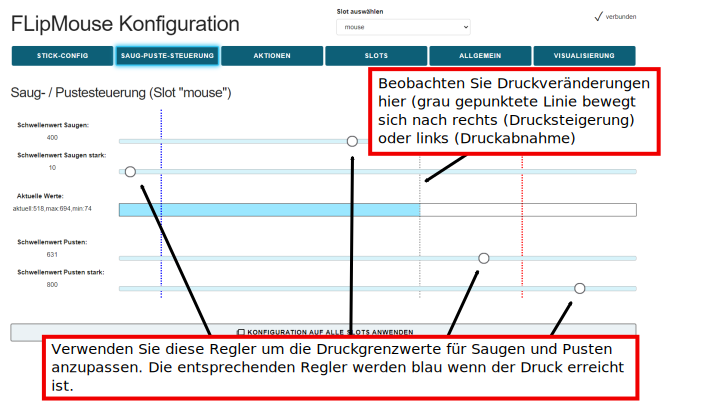

# FLipMouse - Finger & Lippen - Maus

**Anwendungsanleitung v3.1, AsTeRICS Foundation**

**Inhaltsverzeichnis:**

[TOC]

____

# Einleitung

Die FLipMouse ist ein alternatives Eingabesystem, das an der [Fachhochschule Technikum Wien](https://www.technikum-wien.at) entwickelt und von der [AsTeRICS Foundation](https://asterics-foundation.org) als Open Source Baukasten angeboten wird. Die FLipMouse ermöglicht es Menschen, die keine Standard-Computer-Eingabegeräte verwenden können, eine Computermaus oder einen Joystick zu steuern, sowie die gewünschten Tasten auf der Tastatur zu drücken oder Infrarot-Fernbedienungen zu verwenden. Die FLipMouse kann mit minimalen Finger- oder Lippenbewegungen und/oder durch Schluckbewegungen über ein spezielles Mundstück betätigt werden.

Die FLipMouse kann über eine webbasierte Konfigurationsanwendung konfiguriert werden, die von nun an *Konfigurationsmanager* genannt wird. Sie ist auf der Website [flipmouse.asterics.eu](https://flipmouse.asterics.eu/index_fm.htm) zu finden. Dieses Benutzerhandbuch enthält eine Beschreibung des Konfigurationsmanagers und erklärt, wie die verschiedenen Funktionen und Merkmale der FLipMouse verwendet werden. Die FLipMouse kann auf jedem Windows-, Mac- oder Linux-Computer ohne Installation von spezieller Software verwendet werden, da sie sich wie ein Standard-Maus/Joystick/Tastatur-Gerät verhält. Mit dem optionalen Bluetooth-Zusatzmodul können auch Smartphones oder Tablet-Computer angesteuert werden - was ebenfalls in diesem Handbuch erklärt wird.

Darüber hinaus enthält dieses Handbuch wichtige Richtlinien für die Verwendung der FLipMouse, insbesondere Reinigungsverfahren und hygienische Vorsichtsmaßnahmen.

Alle Designdateien für die Elektronik und das 3d-gedruckte Gehäuse - sowie der Software-Quellcode - sind Open Source verfügbar und werden über die Website der AsTeRICS Foundation und über GitHub verbreitet. Der Bausatz für die FLipMouse kann bei [Hackerspaceshop.com](https://hackerspaceshop.com/collections/flipmouse) erworben werden. Detaillierte Anleitungen sind in der [FlipMouse-Bauanleitung](https://github.com/asterics/FLipMouse/blob/master/ConstructionKit/ConstructionManual.pdf) enthalten. Viel Spaß beim Bauen und Benutzen deiner FLipMouse!

Die AsTeRICS Foundation

[www.asterics-foundation.org](https://asterics-foundation.org/)

    

# Hardware Übersicht

Die FLipMouse ist mit einem 3d-gedruckten Gehäuse erhältlich. Designdateien für das 3d-gedruckte Gehäuse werden im [Github-Repository](https://github.com/asterics/FLipMouse/tree/master/Hardware/case-design/3D_printer) bereitgestellt. Die primäre Methode zur Interaktion mit der FLipMouse ist der transparente Stick ("Hygienic Stick" oder "Mundstück"), der an der Vorderseite der FLipMouse angebracht ist. Der *Hygienic Stick* wird von der Firma *QuadJoy* hergestellt. Ersatzstäbchen können über die Homepage bestellt werden: [quad.life](https://quad.life/). Wir bedanken uns bei Bill und Debra Street von *QuadJoy*, dass wir ihr Mundstück für unseren FLipMouse-Baukasten verwenden durften! (Bitte beachten Sie die Reinigungshinweise im entsprechenden Abschnitt dieser Anleitung).

    

*Abbildung 1*: Verwendung der FLipMouse für die Computersteuerung durch Lippeninteraktion

Zusätzlich können zwei externe Taster an die Klinkenbuchsen auf der linken Seite des FlipMouse-Gehäuses angeschlossen werden, und eine Taste ist bereits auf dem Gerät integriert ("B1", siehe Abbildung 3).

**Benutzer können auf verschiedene Weise mit der FLipMouse interagieren:**

1. durch Berühren des Mundstücks mit den Lippen oder Fingern und Aufbringen kleiner Kräfte in vertikaler oder horizontaler Richtung
2. durch Erhöhen oder Verringern des Drucks im Mundstück (puffen oder schlürfen)
3. durch Betätigung von (bis zu) 3 Schaltern / Drucktastern
4. falls gewünscht, kann ein Kunststoffschlauch an den Drucksensor angeschlossen werden, so dass der Joystick mit einem Finger bedient werden kann und ein separates Mundstück die Steuerung von Schlucken/Pusten ermöglicht. Alternativ kann der Druck auch durch das Anbringen eines Gummiballs am Kunststoffschlauch beeinflusst werden (Kissenschalter / Softschalter).

**Die Hardware-Eigenschaften der FLipMouse:** (siehe Bilder am Ende dieser Liste)

(a)    "Zero-way"-Joystick/Mundstück: sehr geringe Kräfte reichen aus, um eine Auf-/Ab-/Links-/Rechts-Bewegung zu erzeugen

        o  Der Zero-Way-Joystick kann mit Fingern oder Zehen etc. bedient werden

        o  Er kann auch als Mundstück verwendet werden (Betätigung durch Lippen/Mundbewegungen)

        o  Falls gewünscht, können Schluck-/Puste-Aktivitäten in das Mundstück zusätzliche Funktionen auslösen

(b)    Ein eingebauter Schalter ("Taste 1 / B1") am Gerät, z.B. zum Ändern der aktiven Konfiguration (Funktionen)

(c)    Zwei 3,5-mm-Klinkenbuchsen zum Anschluss von externen Schaltern / Tastern zur Auslösung von Zusatzfunktionen ("Taster 2 / B2" und "Taster 3 / B3")

(d)    3 Leuchtdioden (LED) zur Anzeige der aktiven Konfiguration, des Kalibrierungsvorgangs usw.

(e)    Universal-Infrarot-Fernbedienungsempfänger und -sender

(f)    "Hot Shoe"-Adapter zur Montage an einem Manfrotto Magic Arm oder einem ähnlichen Montagesystem

(g)    Firmware-Aktualisierung über die FLipMouse-Webanwendung auf [flipmouse.asterics.eu](https://flipmouse.asterics.eu/index_fm.htm)

(h)    Optionale Zusatzplatine für Bluetooth (z. B. zur Steuerung von Smartphones oder iOS-Geräten)

(i)     Reset-Taste

    

*Abbildung 2*: FLipMouse rechte Seite

    

*Abbildung 3*: FLipMouse linke Seite

Auf der rechten Seite des FLipMouse-Gehäuses zeigen 3 LEDs den aktuellen Betriebsmodus an (der geändert werden kann, um verschiedene Geschwindigkeitseinstellungen oder Funktionsoptionen zu aktivieren). Außerdem ist hier das Infrarot (IR) Empfängermodul zugänglich. Mit diesem Modul können beliebige Infrarot-Fernbedienungsbefehle aufgezeichnet werden (z.B. zum Ändern der Lautstärke oder der Kanaleinstellungen eines TV-Gerätes). Die IR-Signale können dann über die IR-Sendediode auf der Rückseite der FLipMouse wiedergegeben werden.

Auf der linken Seite der FLipMouse befindet sich eine Taste (B1), die eine konfigurierbare Funktion bietet (z. B. Ändern des Betriebsmodus). Neben dieser Taste befindet sich ein Loch, das den Zugang zur Reset-Taste der FlipMouse ermöglicht (wird normalerweise nicht benötigt). 
Zwei 3,5-mm-Klinkenbuchsen mit den Bildbezeichnungen (B2) und (B3) ermöglichen den Anschluss von externen Tastern. Es können Standardschalter mit 3,5-mm-Klinkenstecker verwendet werden.

## 3D-gedrucktes Gehäuse

    

*Abbildung 4*: FLipMouse 3D-gedrucktes Gehäuse

Es sind verschiedene Alternativen für das FLipMouse-Gehäuse verfügbar, z.B. eine Acrylversion. Die empfohlene Version ist das 3D-gedruckte Gehäuse, das auch in der Bauanleitung dokumentiert ist. Die 3D-Designdateien können vom [Github Repository](https://github.com/asterics/FLipMouse/tree/master/Hardware/case-design/3D_printer) heruntergeladen werden. Die elektronischen Komponenten und PCB sind gleich wie bei der früheren Acrylgehäuse-Variante - die Geräte bieten daher genau die gleiche Funktionalität.

## Bluetooth – Zusatzmodul

Das optionale Bluetooth-Zusatzmodul ermöglicht den Anschluss der FLipMouse als Bluetoothmaus/ -tastatur an verschiedene mobile Geräte (Smartphones, Tablets, IOs-Geräte). Wenn dieses Modul nicht im DIY-Kit enthalten ist, kann es einzeln bei der AsTeRICS Foundation bestellt oder mit Hilfe der auf Github verfügbaren Hardware-Design-Dateien gebaut werden (Teile müssen einzeln bestellt werden). Wenn Sie sich für diese Funktion interessieren, werfen Sie einen Blick auf das [FLipMouse Wiki](https://github.com/asterics/FLipMouse/wiki), wo der Bau des Zusatzmoduls erklärt wird.

    

*Abbildung 5*: Bluetooth Zusatzmodul

# Anweisungen für die ordnungsgemäße Montage und Verwendung

**1. Befestigen Sie den "Hygienic Stick**

*Abbildung 6*: Befestigen des Hygienic Stick

Verwenden Sie einen sauberen "Hygienic Stick", stecken Sie ihn auf den vorderen Anschluss und drehen Sie ihn im Uhrzeigersinn (nicht zu fest).

**2. Montieren des FLipMouse-Geräts in einer für den Benutzer / die Benutzerin geeigneten Weise**

*Abbildung 7*: Montieren der FlipMouse

Das Bild zeigt eine Kombination aus "[Manfrotto Gelenkarm](https://www.manfrotto.com/global/single-arm-2-section-196ab-2/)" + "[SuperClamp](https://www.manfrotto.com/global/super-photo-clamp-without-stud-aluminium-035/)" Halterung. Sie können auch den [Manfrotto Magic Arm](https://www.manfrotto.com/global/magic-photo-arm-smart-centre-lever-and-flexible-extension-143n/) oder eine andere Befestigungslösung verwenden, die auf den HotShoe-Adapter der FLipMouse passt. Seien Sie vorsichtig, wenn Sie die Halterung an der 3/8"-Schraube des HotShoe-Adapters befestigen: Bei starker Krafteinwirkung kann das Gehäuse des Geräts brechen.

*Abbildung 8*: Verwendung der FLipMouse mit Mund/Lippen

Achten Sie darauf, dass der Kopf des Benutzers bequem aufliegt. Das Mundstück sollte die Lippen leicht berühren. Es ist nicht sinnvoll, das Mundstück in den Mund zu stecken! Dies könnte zu einem unangenehmen Gefühl führen und die Kontrolle der seitlichen Bewegung erschweren.

*Abbildung 9*: Verwendung der FLipMouse mit den Fingern

Wenn der Benutzer / die Benutzerin die FLipMouse mit einem Finger oder dem Daumen betätigen möchte, montieren Sie das System so, dass sich die Hand in einer Ruheposition befindet und der Finger den Joystick ohne Belastung berühren kann. Bringen Sie einen oder zwei zusätzliche externe Schalter an, falls gewünscht, und montieren Sie die Schalter an geeigneten Stellen (z. B. an den Beinen/Zehen/Schultern usw.).

*Abbildung 10*: Verwendung der FLipMouse als Ball-Switch-Schnittstelle

Wenn eine Interaktionsmethode mit einem weichen Ball gewünscht wird, kann ein Kunststoffrohr mit einem *Luer-Lock*-Adapter am vorderen Anschluss der FLipMouse befestigt werden. Dieser Kunststoffschlauch kann mit einem weichen Ball verbunden werden (das Bild oben zeigt ein billiges "Hundespielzeug" aus einer Tierhandlung). Diese Lösung kann als weicher Kopfschalter / Kissenschalter oder Schulterschalter verwendet werden und kann mit anderen externen Schaltern kombiniert werden.

**3. Anschließen der FLipMouse an einen Computer, ein Tablet oder ein Smart Phone**

Wenn Sie die FLipMouse über das mitgelieferte USB-Mikrokabel anschließen, berühren Sie das Mundstück nicht, solange die LEDs blinken (das anfängliche Blinken zeigt die Phase der Nullpunktkalibrierung an). Warten Sie, bis das Gerät vom Computer erkannt wird, und bewegen Sie dann den Joystick/das Mundstück, um den korrekten Betrieb zu überprüfen.

*Abbildung 11*: Verbinden der FLipMouse mit dem Computer

**Bitte beachten Sie**, dass jedes Mal, wenn Sie das FLipMouse-Gerät mit Strom versorgen (bzw. wenn Sie es einstecken), eine **Nullkalibrierung** durchgeführt wird, was durch Blinken aller 3 LEDs angezeigt wird. **Es ist wichtig, dass Sie den Joystick / das Mundstück nicht berühren, bis die LEDs nicht mehr blinken.**

#### Verwendung der FLipMouse mit Smart Phones oder Tablets

Die FLipMouse sollte mit allen Betriebssystemen funktionieren, die USB-HID-Geräte (Maus/Tastatur/Joystick) unterstützen, wie Windows, Linux oder MacOS. Einige Android-Geräte bieten einen USB-Anschluss mit USB-OTG-Funktionalität ("on-the-go"). Wenn Ihr Gerät "OTG" unterstützt, können Sie die FLipMouse mit einem USB-OTG-Adapter (siehe Bild unten) anschließen und sie sollte wie eine normale Maus (Sie erhalten einen Mauszeiger) oder Tastatur funktionieren. Sie können mit der App "OTG Checker" testen, ob Ihr Android-Telefon oder Android-Tablet die USB-OTG-Funktion unterstützt.

*Abbildung 12*: Verwendung der FLipMouse mit dem Smart Phone

#### Verwendung der FLipMouse über Bluetooth

Das Bluetooth - Zusatzmodul für die FLipMouse ermöglicht die kabellose Maus-/Tastatursteuerung von Computern, Tablets und Smartphones. Darüber hinaus können iPhones oder iPads über VoiceOver & Assistive-Switch-Unterstützung genutzt werden. Weitere Informationen finden Sie im Kapitel [*Verwendung des Bluetooth-Moduls*](https://github.com/asterics/FLipMouse/blob/master/Documentation/UserManual/Markdown/FLipMouseAnwendungsanleitung.md#verwendung-des-bluetooth-moduls).

# FLipMouse-Konfigurationsmanager

Der [FLipMouse Konfigurationsmanager](https://flipmouse.asterics.eu/index_fm.htm) bietet eine grafische Benutzeroberfläche (GUI) zum Ändern und Speichern von Einstellungen des FLipMouse-Geräts, sodass alle Merkmale und Funktionen an persönliche Vorlieben und Bedürfnisse angepasst werden können. **Derzeit muss der Google Chrome-Browser (oder ein Chromium-basierter Browser) verwendet werden.** Der Konfigurationsmanager ist über die folgende Website zugänglich: **flipmouse.asterics.eu**. Der FLipMouse-Konfigurationsmanager sendet und empfängt Informationen von/zu der FLipMouse. Diese Informationsübertragung erfolgt über einen Kommunikationsanschluss (COM-Anschluss).  Die folgende Abbildung zeigt die Einstiegsseite des FLipmouse-Konfigurationsmanagers:

    

*Abbildung 13: Willkommensseite des FLipMouse-Konfigurationsmanagers*

### Anschließen des FLipMouse-Geräts

Gehen Sie folgendermaßen vor, um das Gerät anzuschließen:

1. Vergewissern Sie sich, dass Ihr Gerät über einen USB-Anschluss mit Ihrem Computer verbunden ist (siehe "Hinweise zur ordnungsgemäßen Montage und Verwendung").

2. Klicken Sie auf VERBINDEN ZU FLIPMOUSE (ÜBER USB ANGESCHLOSSEN) und wählen Sie im Auswahlfeld den entsprechenden COM-Port (Kommunikationsanschluss) aus. Wenn das Auswahlfeld leer erscheint, bedeutet dies, dass kein Kommunikationsanschluss erkannt wurde. Schließen Sie in diesem Fall das FLipMouse-Gerät erneut an und warten Sie, bis der COM-Port aktualisiert wird.

3. Sobald der COM-Port ausgewählt ist, klicken Sie auf die Schaltfläche "Verbinden" am unteren Rand des Auswahlfeldes.

4. Nach erfolgreicher Verbindung des COM-Ports wird das Hauptfenster (siehe Abbildung 14) angezeigt und Sie sollten ein Live-Feedback der Stick-Bewegung sehen. Der Port-Status in der oberen rechten Ecke des Fensters zeigt "verbunden" an:

   

   

*Abbildung 14*: FLipMouse Konfigurationsmanager

## Ändern von Einstellungen und Funktionen

### Betriebsarten - "Speicherplätze"

Der FLipMouse-Konfigurationsmanager ermöglicht die Anpassung aller wichtigen Einstellungen (Betriebsmodi). Die Einstellungen werden in einzelnen **Speicherplätzen - "SLOTS"** gespeichert (z.B. ein Slot für schnellen Mausbetrieb, ein Slot für langsamen Mausbetrieb, ein Slot für Tastaturtastengenerierung usw.). Alle Einstellungen können auf dem FLipMouse-Gerät gespeichert (oder von dort geladen) werden. Die Einstellungen können auch in einer Datei auf Ihrem Computer gespeichert (oder von dort geladen) werden. 
Die in der FLipMouse gespeicherten Einstellungen bleiben auch dann gültig, wenn die Stromversorgung / das USB-Kabel entfernt wird. Wenn die FLipMouse das nächste Mal eingesteckt wird, sind die Einstellungen wieder verfügbar - auch wenn Sie einen anderen Computer oder ein anderes Betriebssystem verwenden!

### Stick-Konfiguration (Tab STICK-CONFIG)

Im Tab STICK-CONFIG des FLipMouse-Konfigurationsmanagers können Sie die *Sensitivität, Deadzone* und *Maximale Geschwindigkeit* des FLipMouse-Sticks ändern. Außerdem können Sie *Beschleunigung, Drift compensation range* und *Drift compensation gain* ändern - diese Einstellungen sind nur sichtbar, wenn Sie auf *Zeige erweiterte Einstellungen"* klicken. Sie können auch die *Mittelposition* des Sticks kalibrieren und die *Orientierung* ändern, um die tatsächliche Einbaulage der FLipMouse zu berücksichtigen.

#### Stick-Verwendung definieren (“Verwende Stick für”)

Im Tab STICK-CONFIG ganz oben kann die Hauptfunktion des Sticks ausgewählt werden. Standardmäßig erzeugt der Stick Mausbewegungen. Der Stick kann jedoch auch für alternative Aktionen verwendet werden (z. B. Drücken der Taste 'A', wenn der Stick nach oben gedrückt wird), die im Tab ACTIONS festgelegt werden können (siehe Abschnitt [*Zuweisung von verschiedenen Aktionen*](https://github.com/asterics/FLipMouse/blob/master/Documentation/UserManual/Markdown/FLipMouseAnwendungsanleitung.md#zuweisung-von-verschiedenen-aktionen-tab-aktionen). Außerdem kann der Stick einen echten Joystick oder ein Gamepad nachahmen (siehe Abschnitt [*Verwendung des Sticks für Joystick-Bewegungen*](https://github.com/asterics/FLipMouse/blob/master/Documentation/UserManual/Markdown/FLipMouseAnwendungsanleitung.md#verwenden-des-sticks-f%C3%BCr-joystick-bewegungen).

#### Kalibrierung der Mittelposition des Sticks

Wenn Sie den Stick für die Cursorbewegung verwenden, sollte der Cursor an seinem Platz bleiben, wenn der Stick nicht berührt wird. Manchmal kann die Ruheposition des Sticks ungenau werden und unerwünschte Cursorbewegungen verursachen, auch wenn der Stick nicht verwendet wird. In diesem Fall können Sie entweder den Wert der Deadzone erhöhen (siehe unten) oder eine Kalibrierung einleiten. Wenn der Konfigurationsmanager aktiv ist, kann eine Kalibrierung durch Drücken der Schaltfläche "*Mittelposition kalibrieren*" eingeleitet werden. Sobald Sie auf diese Schaltfläche klicken, dürfen Sie den FLipMouse-Stick nicht mehr bewegen, da die Kalibrierung sonst nicht korrekt durchgeführt wird. Die LEDs auf dem Gerät blinken und der Lautsprecher gibt einen tiefen Ton ab, der den Beginn der Kalibrierung anzeigt. Dies dauert etwa 1 Sekunde - dann ist die Kalibrierungssequenz abgeschlossen. Die Kalibrierung kann auch als Reaktion auf Tastendruck, Schluck-/Puste-Aktionen oder alternative FLipMouse-Stick-Aktionen zugewiesen werden, so dass sie bei Bedarf während der Verwendung des FLipMouse-Geräts durchgeführt werden kann.

#### Stick-Ausrichtung (Ändern mit Klick auf "NACH RECHTS DREHEN")

Die FLipMouse wird mit einer HotShoe 3/8"-Montageschraube befestigt, die sich an der Seite des FLipMouse-Gehäuses befindet. Die Ausrichtung kann je nach den Vorlieben des Benutzers geändert werden. Ist die FLipMouse z.B. verkehrt herum montiert, kann die Stick-Ausrichtung entsprechend gewählt werden, so dass die Auf/Ab/Links/Rechts-Bewegungen weiterhin korrekt interpretiert werden. Ein Klick auf "NACH RECHTS DREHEN" ändert die Ausrichtung um 90°. Es sind Ausrichtungseinstellungen für 0 / 90 / 180 und 270 Grad möglich, so dass jede Einbaulage möglich ist.

    

*Abbildung 15: FLipMouse Konfigurationsmanager: Tab STICK-CONFIG, Bildlaufleisten*

Die Bildlaufleisten ermöglichen es, die Parameter des Sticks und das Verhalten des Mauszeigers nach den Wünschen des Benutzers / der Benutzerin zu ändern. Das Verhalten der folgenden Merkmale kann geändert werden:

#### Sensitivität

Wenn Sie den Stick für die Cursorbewegung verwenden, kann die Empfindlichkeit des Sticks über die Bildlaufleiste *Sensitivität* eingestellt werden. Ein kleinerer Wert führt zu einer langsameren Bewegung des Cursors. Um den Wert zu ändern, klicken und ziehen Sie den Regler der Bildlaufleiste oder klicken Sie auf die Leiste neben dem Regler.

#### Deadzone

Die *Deadzone*-Einstellung definiert einen passiven Bereich für die Stickbewegungen: Ist der Deadzone-Wert niedrig, führen schon sehr geringe Stickbewegungen zu einer Cursorbewegung (oder führen die zugewiesene Alternativfunktion aus - siehe Kapitel *Zuweisung verschiedener Aktionen*). Ist die Deadzone zu niedrig eingestellt, beginnt der Cursor ungewollt zu driften, insbesondere wenn zuvor eine stärkere Kraft aufgewendet wurde. Erhöhen Sie in diesem Fall den Wert der Deadzone, sodass der Cursor unter normalen Betriebsbedingungen für einen bestimmten Benutzer/Benutzerin nicht abdriftet. (Für manche Benutzer / Benutzerinnen könnte es jedoch wünschenswert sein, eine sehr kleine Deadzone zu verwenden, um Cursorbewegungen mit minimaler Kraft zu ermöglichen). Bei anderen Aktionen (z. B. Tastendruck) ist es sinnvoll, einen größeren Wert für die Deadzone zu verwenden, um unbeabsichtigte Aktionen zu vermeiden.

#### Geteilte Achsensteuerung für Sensitivität und Deadzone

Falls gewünscht, können die Sensitivitäts- und Deadzonewerte für horizontale oder vertikale Bewegungen individuell geändert werden. Wählen Sie dazu die Option "*zeige x/y getrennt*", wie unten gezeigt:

    

*Abbildung 16: FLipMouse Konfigurationsmanager: Tab STICK-CONFIG, zeige x/y getrennt*

#### Maximale Geschwindigkeit

Die Einstellung der maximalen Geschwindigkeit auf ein niedriges Niveau ist nützlich, wenn der Benutzer die Cursorgeschwindigkeit begrenzen und gleichzeitig eine hohe Empfindlichkeit/Beschleunigung beibehalten möchte.

**“Zeige erweiterte Einstellungen”**:

#### Beschleunigung

Diese Einstellung wird durch Klicken auf *"Zeige erweiterte Einstellungen"* aktiviert. Die Beschleunigungseinstellung erlaubt es, das Beschleunigungsverhalten des Mauszeigers zu beeinflussen: Wenn die Beschleunigung auf einen niedrigen Wert eingestellt ist, wird selbst eine starke Auslenkung des Sticks eine langsame (aber fortschreitende) Bewegung des Mauszeigers auslösen, was es einfacher macht, kleine Ziele präzise zu erreichen.

#### Drift compensation range + Drift compensation gain

Diese Einstellungen werden durch Klicken auf *"Zeige erweiterte Einstellungen"* aktiviert.
Aus mechanischen Gründen weisen die Kraftsensoren der FLipMouse kleine Ungenauigkeiten auf, die zu einem Abdriften des Mauszeigers führen können. Kritisch ist dieser Effekt bei sehr kleinen Deadzone-Einstellungen (sehr feinfühlige Maussteuerung): Wenn Sie das Mundstück/den Joystick in eine Richtung bewegen und dann loslassen, "driftet" der Mauszeiger weiterhin leicht in diese Richtung, da sich die Sensorwerte nicht an der kalibrierten Mittelposition einpendeln. Seit Version 2.9 bietet die FLipMouse eine "Driftkompensation", bei der die Software versucht, die zu erwartende Drift, die durch die letzte Interaktion verursacht wurde, zu berechnen und den Bias zu korrigieren, so dass die Leistung insbesondere bei kleinen Deadzoneeinstellungen verbessert wird.

Der Wert "Drift compensation gain" steht für den Grad der Korrektur, während der Wert "Drift compensation range" für den Betrag der Kraft steht, die bei der Berechnung berücksichtigt wird. 
Jeder dieser Werte hat einen entsprechenden Schieberegler. Es ist auch möglich, unterschiedliche Werte für die x-Achse und die y-Achse einzustellen, wenn Sie auf "*zeige x/y getrennt*" klicken (siehe folgende Abbildung).

    

*Abbildung 17: FLipMouse Konfigurationsmanager: Tab STICK-CONFIG, zeige x/y getrennt*

Die besten Werte für eine bestimmte FLipMouse können durch Experimentieren ermittelt werden.
Zum Beispiel:

1. Drücken Sie das Mundstück nach oben und lassen Sie es los. Wenn der Mauszeiger weiterhin nach oben driftet, versuchen Sie, den Wert für den vertikalen Ausgleich zu erhöhen
2. Drücken Sie das Mundstück nach links und lassen Sie es los. Wenn der Mauszeiger nach rechts driftet, versuchen Sie, den horizontalen Ausgleichswert zu verringern.

### Verwenden des Sticks für Joystick-Bewegungen

Wenn Sie im Tab STICK-CONFIG einen der Joystick-Modi auswählen, führt das Bewegen des FLipMouse-Sticks nach oben/unten/links/rechts zu Joystick-Aktivitäten. Die FLipMouse verhält sich dann wie ein Gamepad mit 6 Achsen (*X/Y*, *Z/Z-Turn* und *Slider1/Slider2*). Da der FLipMouse-Stick jeweils nur 2 Achsen Informationen liefern kann, muss die gewünschte Joystick-Achse ausgewählt werden.

    

*Abbildung 18: Stickkonfiguration für die Joystick-Bewegung einstellen*

Bitte beachten Sie, dass die Joystick-Funktion von den auf dem Computer laufenden Software-Anwendungen (z.B. Computerspiele) unterstützt werden muss. Microsoft Windows bietet eine Test-Software namens "*joy.cpl*" an - Sie können dieses Programm starten, indem Sie "*joy.cpl*" in den Suchdialog eingeben.

Der von der FLipMouse bereitgestellte Joystick-Controller heißt *"Serial+Keyboard+Mouse+Joystick "*. Wenn Sie dieses Gerät im Dienstprogramm "*joy.cpl*" auswählen, klicken Sie auf die Eigenschaften, um seine Einstellungen anzuzeigen. Die Live-Werte der Joystick-Achsen und der Tastenaktivitäten werden in einem Fenster angezeigt, das dem hier gezeigten ähnelt:

    

*Abbildung 19: Joy.cpl Eigenschaften*

Gewünschte Joystick-Tasten-Aktivitäten können mit Saug/Puste- oder anderen Interaktionsereignissen erstellt werden, indem Sie "*Joystick ... setzen"* aus dem Aktionsmenü wählen, wie im Abschnitt [*Zuweisung von verschiedenen Aktionen*](https://github.com/asterics/FLipMouse/blob/master/Documentation/UserManual/Markdown/FLipMouseAnwendungsanleitung.md#zuweisung-von-verschiedenen-aktionen-tab-aktionen)) beschrieben.

### Saug/Puste Aktionen and Schwellenwerte (Tab SAUG-PUSTE-Steuerung)

Wenn der FLipMouse-Stick mit dem Mund verwendet wird, kann der Benutzer Aktionen auslösen, indem er am Mundstück saugt oder pustet. Der Schlauch ist mit einem Drucksensor verbunden, der einen Wert ausgibt, der dem festgestellten Druck entspricht. Wenn der Benutzer saugt, sinkt der Sensorwert, und wenn er pustet, steigt der Wert. 
Über die Registerkarte "AKTIONEN" können Sie Aktionen für das Saugen oder Pusten zuweisen, wie im nächsten Abschnitt erläutert wird. Die Schwellenwerte für Saugen und Pusten können Sie auf im Tab "SAUG-PUSTE-STEUERUNG"" nach Belieben einstellen. Wenn die FLipMouse angeschlossen ist, können Sie in dieser Registerkarte auch die aktuellen Druckwerte und die Auslösung von Saug- und Puste-Aktionen überwachen:

    

*Figure 20:* Tab SAUG-PUSTE-STEUERUNG

Beachten Sie, dass der Leerlaufdruck (ohne Saugen und ohne Pusten) bei 
bei etwa 512 liegt, und der Druck steigt, wenn Sie 
in das Mundstück pusten, das dadurch auch einen erhöhten Druck anzeigt.
Mit den Schiebereglern kann der Schwellendruck für Saugen und Pusten eingestellt werden. Die graue gepunktete Linie stellt den aktuellen Druck dar. Die blaue und die rote gepunktete Linie stellen die in dieser Sitzung erreichten Grenzwerte dar.

#### Stark (An)saugen and Stark Pusten

Im Tab SAUG-PUSTE-STEUERUNG können zusätzliche Schwellenwerte für starkes Saugen und starkes Pusten definiert werden, die dann unterschiedliche Aktionen auslösen können. Zum Beispiel könnte der nächste Slot durch starkes Pusten aktiviert werden. Um die Funktionalität der FLipMouse insbesondere für Personen zu erweitern, die nicht auf externe Schalter zugreifen können, sind noch zusätzliche Aktionen verfügbar, die mit starkem Saugen oder starkem Pusten ausgelöst werden. Diese Gesten ermöglichen das Auslösen von Aktionen durch starken Saugen oder starkes Pusten, gefolgt von einer Stick-Bewegung (rauf / runter / links / rechts). Starkes Saugen oder starkes Pusten wird durch ein akustisches Signal (hoher Ton) angezeigt. Wird der Stick innerhalb einer Sekunde bewegt, wird die entsprechende Aktion (z.B. "Stark ansaugen + nach oben") ausgelöst. Wird der Stick nicht innerhalb einer Sekunde bewegt, wird die einzelne Stark pusten- oder Stark ansaugen-Aktion ausgelöst. Insgesamt können also 10 zusätzliche Aktionen ausgeführt werden.

### Zuweisung von verschiedenen Aktionen (Tab AKTIONEN)

Das Tab AKTIONEN ermöglicht die Zuordnung von Benutzeraktivitäten zu gewünschten FlipMouse-Funktionen (Aktionen). Die Benutzeraktivitäten sind:

- das Drücken oder Loslassen der 3 Tasten (eingebaute Taste 1 oder externe Taste 2 oder 3)
- Stickbewegungen (auf/ab/links/rechts), die den Schwellenwert der Deadzone überschreiten
- Saug- und Puste-Aktivitäten (siehe Abschnitt *Stark (An)saugen und Stark Pusten*).

Die Aktionen können durch Anklicken des Eintrags in der Aktionskonfigurationstabelle geändert werden (siehe das blaue Feld in Abbildung 21). Die Tabelle zeigt die Aktionen für alle Benutzeraktivitäten an, entweder nur für den gerade aktiven Slot oder für alle Slots (was einen Überblick über alle Aktionen gibt). Wenn Sie auf eine bestimmte Aktion klicken, öffnet sich ein Fenster, in dem Sie die Aktionskategorie (in Abbildung 22 für Button 1: Gerät) und die Aktion selbst (hier: Nächsten Slot laden) ändern können, siehe Abbildung 22.

    

*Abbildung 21: Benutzeraktivitäten verschiedene Aktionen zuordnen*

    

*Abbildung 22: Pop-up-Fenster zur Auswahl der gewünschten Aktion*

Im Folgenden werden die einzelnen Aktionskategorien und die verschiedenen Aktionen kurz beschrieben.

#### Aktionskategorie “Maus”

**Linke / Mittlere / Rechte Maustaste halten (für die Dauer der Eingabe-Aktion)**
Bei der Aktion *Halten* wird eine bestimmte Maustaste kontinuierlich gedrückt (z. B. um ein Element über den Bildschirm zu ziehen). Die Maustaste wird losgelassen, wenn die zugewiesene Benutzeraktivität endet (z. B. wenn die Aktivität "Saugen/Pusten" endet, wenn der Stick wieder in die mittlere Position gebracht wird oder wenn eine externe Taste losgelassen wird).

**Klick linke / mittlere / rechte Maustaste**
Mit diesen Funktionen kann ein Klick der linken, rechten oder mittleren Maustaste ausgeführt werden. **Anmerkung:** ein Klick besteht aus drücken & loslassen der entsprechenden Maustaste, beides passiert kurz hintereinander nach Betätigen des Tasters / Bewegen des Sticks / Saug-/Pustesteuerung!

**Doppelklick linke Maustaste**
Erzeugt einen Doppelklick mit der linken Maustaste. Ein Doppelklick der linken Maustaste ist zum Beispiel zum Öffnen einer Datei notwendig. Das Ausführen von schnellen Mausklicks kann jedoch für manche NutzerInnen schwierig sein.

**Drücken oder Loslassen linke / mittlere / rechte Maustaste (umschalten)**
Die Aktion *Umschalten* ändert den Zustand einer Maustaste von gedrückt zu nicht gedrückt und umgekehrt. Dies ist z. B. nützlich, wenn eine Benutzeraktivität länger aufrechterhalten werden soll (z. B. beim Ziehen eines Objekts oder um eine Taste gedrückt zu halten, während andere Tasten gedrückt/losgelassen werden). Beachten
Sie, dass die Maustaste solange gedrückt bleibt, bis die zugewiesene Benutzeraktivität ein weiteres Mal aufgerufen wird!

**Nach oben / unten scrollen**
Die Aktionen *Nach oben / unten scrollen* ahmen das Maus-Scrollrad nach. Das Auslösen der Aktion *Nach oben scrollen* führt zu einem Bildlauf nach oben, während *Nach unten scrollen* zu einem Bildlauf nach unten führt. Diese Aktion ist zum Beispiel beim Lesen von Dokumenten oder Webseiten nützlich.

**Maus horizontal / vertikal bewegen (x-Achse / y-Achse)**
Die Funktionen *Maus horizontal bewegen (x-Achse)* und *Maus vertikal bewegen (y-Achse)* erzeugen Computermausbewegungen entlang der ausgewählten Achsen. Die Geschwindigkeitsparameter für diese Funktionen können in dem darunter erscheinenden Feld eingestellt werden. Solange die Benutzeraktivität vorhanden ist, wird der Mauszeiger bis zu dieser maximalen Geschwindigkeit beschleunigt. Bitte beachten Sie dies:

*Ein positiver Wert für die X-Richtung bewegt den Mauszeiger nach rechts. 
Ein negativer Wert für die X-Richtung verschiebt den Mauszeiger nach links. 
Ein positiver Wert für die Y-Richtung verschiebt den Mauszeiger nach unten. 
Ein negativer Wert für die Y-Richtung bewegt den Mauszeiger nach oben.* 

#### Aktionskategorie "Joystick"

**Joystick x-/y-/z-Achse/z-Drehung/Regler setzen**
Diese Aktionen können verwendet werden, um einen gewünschten Wert an die Joystick-Achse zu senden. Die wählbaren Joystick-Achsen sind: *X / Y / Z / Z-Drehung / Regler*. Der Joystick wird in die Mittelstellung zurückbewegt, wenn die zugehörige Benutzeraktivität endet.

**Joystick-Button halten (für Dauer der Eingabe-Aktion)**
Diese Aktion kann verwendet werden, um einen gewünschte Joystick-Button zu drücken. Das FLipMouse-Gerät unterstützt 32 Tasten, so dass jeder Wert von 1 bis 32 zulässig ist. Der Joystick-Button wird losgelassen, wenn die zugehörige Benutzeraktivität beendet ist.

**Joystick Hat-Position setzen**
Mit dieser Aktion wird die Ausrichtung des Joystick-"Hats" (in Grad) festgelegt. Erlaubte Werte sind:
*-1, 0, 45, 90, 135, 180, 225, 270, 315*. Der Wert -1 setzt den Hat auf die mittlere Position (Leerlauf). 
Der Joystick-Hat wird in die Mittelstellung zurückbewegt, wenn die zugehörige Benutzeraktivität endet.

#### Aktionskategorie "Tastatur"

**Taste(n) drücken + wieder loslassen / halten / umschalten**
Die Aktion *Taste(n) drücken + wieder loslassen* ermöglicht das Drücken einer oder mehrerer Tastaturtasten. Es wird ein zweites Dropdown-Menü mit möglichen Tastenbezeichnungen angezeigt (***Tasten hinzufügen***). **Wenn eine Taste aus diesem Menü ausgewählt wird, muss sie in das Feld *Eingabe Tasten* eingefügt werden (auf HINZUFÜGEN klicken)**. Auf diese Weise können mehrere Tasten der Tastatur gleichzeitig gedrückt werden. Die Taste(n) wird kurz darauf wieder losgelassen. Wenn Sie die zugewiesenen Tasten entfernen oder ändern möchten, müssen Sie die aktuell zugewiesenen Tasten löschen, indem Sie auf die Schaltfläche "LÖSCHEN" neben dem Feld *Eingabe Tasten* einfügen klicken.

Gängige Tastenkombinationen sind: 
TASTE_CTRL + Z: löst die Rückgängig-Funktion aus
TASTE_CTRL + C: löst die Kopierfunktion aus
KEY_CTRL + V: löst die Einfügefunktion aus
KEY_CTRL + KEY_ALT + KEY_ DELETE

Die Aktion *Taste(n) halten (für Dauer der Eingabe-Aktion)* hält die Taste gedrückt, bis die Benutzeraktivität beendet ist.
Die Aktion *Taste(n) drücken oder auslassen (umschalten)* wechselt bei jeder Benutzeraktivität den Zustand der Taste von gedrückt zu nicht gedrückt und umgekehrt.

Eine Liste aller unterstützten Tastenbezeichner finden Sie im [Anhang](https://github.com/asterics/FLipMouse/blob/master/Documentation/UserManual/Markdown/FLipMouseAnwendungsanleitung.md#liste-der-k%C3%BCrzel-f%C3%BCr-keybord-tasten) 
oder werfen Sie einen Blick auf die [FLipMouse Wiki / Github Seiten](https://github.com/asterics/FLipMouse/wiki/at-api).

    

*Abbildung 23: Hinzufügen von Tasten für die Aktionen Tasten Drücken / Halten / Umschalten*

**Schreibe Wort**
Die Aktion *Schreibe Wort* ermöglicht die Eingabe eines bestimmten Textes/Satzes bei zugewiesener Benutzeraktivität (z. B.: Schreiben Sie "Hallo", wenn Sie den FLipMouse-Stick nach oben bewegen). Wenn Sie diese Aktion auswählen, wird unter dem Dropdown-Menü ein leeres Textfeld angezeigt, in das der Text eingegeben werden kann (siehe unten):

    

*Abbildung 24: Funktion Schreibe Wort*

In diesem Beispiel wird jedes Mal, wenn die Taste 1 der FLipMouse gedrückt wird, "Hallo" geschrieben.

#### Aktionskategorie "Gerät"

**Keine Funktion (leer)**
Wenn die Aktion *Keine Funktion (leer)* ausgewählt ist, wird der entsprechenden Benutzeraktivität keine Aktion zugewiesen.

**Nächsten Slot laden**
Diese Aktion ist nur relevant, wenn Sie mehrere FLipMouse-Konfigurations-Slots gespeichert haben. Diese Aktion schaltet auf den nächsten Slot um. Wenn der letzte Slot bereits erreicht ist, wird durch Auslösen dieser Aktion zum ersten Slot gewechselt. Wenn Sie den Steckplatz wechseln, ändern sich die eingebauten LED-Lampen entsprechend und zeigen den aktiven Steckplatz an.

Es gibt drei eingebaute LEDs (rot, gelb-orange, grün), die die Binärzahl für die Steckplatzposition der von Ihnen gewählten Konfiguration anzeigen. Wenn Sie also zwei Konfigurationen gespeichert haben, z.B. "Spieleinstellungen" und "Maus", dann ist "Spieleinstellungen" der Slot 1 und "Maus" der Slot 2.

Zusätzlich zu den LEDs wird der Wechsel des Steckplatzes durch ein akustisches Signal angezeigt.

Die folgende Liste zeigt die Farbcodes und die akustischen Signale der LEDs für jede Steckplatzposition:

| **Aktiver Slot** | **Akkustisches Signal** | **Aufleuchtende LEDs** |
| ---------------- | ----------------------- | ---------------------- |
| Slot 1           | ein Biepton             | rot                    |
| Slot 2           | zwei Bieptöne           | gelb                   |
| Slot 3           | drei Bieptöne           | rot, gelb              |
| Slot 4           | vier Bieptöne           | grün                   |
| Slot 5           | fünf Bieptöne           | rot, grün              |
| Slot 6           | sechs Bieptöne          | gelb, grün             |
| Slot 7           | sieben Bieptöne         | rot, gelb, grün        |

Die nächste Abbildung (Abbildung 25) zeigt eine ähnliche Liste, aber die leuchtenden LEDs in den entsprechenden Farben für die visuellen Menschen. Die verschiedenen Slots werden in dieser Abbildung als "Position" bezeichnet.

*Abbildung 25: Farbcodes der LEDs*

**Slot per Name laden**
Mit dieser Aktion wird der Konfigurations-Slot mit dem angegebenen Namen aktiviert. Der Name kann im Drop-Down Menü ausgewählt werden. Diese Aktion ist nur relevant, wenn Sie mehrere FLipMouse-Konfigurations-Slots gespeichert haben. Die LEDs zeigen die Slotnummer wie oben beschrieben an.

**Stick-Mittelposition kalibrieren**
Diese Aktion startet die Kalibrierungssequenz für die mittlere Position des Sticks. Bitte beachten Sie die Beschreibung ["*Kalibrierung der Mittelposition des Sticks*"](https://github.com/asterics/FLipMouse/blob/master/Documentation/UserManual/Markdown/FLipMouseAnwendungsanleitung.md#kalibrierung-der-mittelposition-des-sticks).

#### Aktionskategorie: "Infrarot"

**Infrarot-Kommando abspielen / halten**
Diese Aktion gibt den Infrarot (IR-)Code mit dem angegebenen Befehlsnamen wieder. Die vorhandenen (aufgezeichneten) IR-Befehle können aus dem Dropdown-Menü ausgewählt werden. Die Aktion *Infrarot-Kommando abspielen* sendet den aufgezeichneten Code einmal, während die Aktion *Infrarot-Kommando halten* den Code wiederholt, bis die Benutzeraktivität beendet ist. Weitere Informationen zu Infrarot-Codes finden Sie im Abschnitt ["*Infrarot-Code-Aufzeichnung und -Wiedergabe*"](https://github.com/asterics/FLipMouse/blob/master/Documentation/UserManual/Markdown/FLipMouseAnwendungsanleitung.md#infrarot-code-aufzeichnung-und--wiedergabe).

#### Aktionskategorie: Makro

**Benutzderdefiniertes Makro**
Diese Aktion ermöglicht das Ausführen eines sogenannten benutzerdefiniertem Makro, das aus mehreren Einzelaktionen besteht. Damit kann eine gewünschte Abfolge von Aktionen ausgeführt werden, die z.B. aus einer Anzahl von Mausbewegungen, Mausklicks, Texteingaben oder Tastendrücken besteht. Diese Aktion ist mächtig, aber auch etwas komplizierter, da die einzelnen Aktionen in Form von sogenannten AT-Befehlen angegeben werden müssen, die durch Semikolons getrennt sind. Ein Beispiel: Das folgende Befehlsmakro bewegt den Mauszeiger 100 Schritte nach links, 20 Schritte nach oben, wartet dann 100 Millisekunden und führt dann einen linken Mausklick aus: "MX 100; MY -20; WA 100; CL". Eine Liste und detaillierte Erklärung aller unterstützten AT-Befehle finden Sie im [Anhang](https://github.com/asterics/FLipMouse/blob/master/Documentation/UserManual/Markdown/FLipMouseAnwendungsanleitung.md#liste-der-unterst%C3%BCtzten-makrokommandos) oder auf den [FLipMouse Wiki / Github Seiten](https://github.com/asterics/FLipMouse/wiki/at-api).

### Speicherplätze verwalten (Tab SLOTS)

Im Tab SLOTS können Sie neue Konfigurations-Speicherplätze  (Slots) erstellen, vorhandene Slots löschen, einen einzelnen oder alle Slots herunterladen und eine Datei hochladen, die eine vollständige Konfiguration mit mehreren Slots enthält. Nach dem Start des FLipMouse-Konfigurationsmanagers ist nur ein Standard-Slot namens "mouse" vorhanden. Wenn Sie mit der Schaltfläche "SLOT ANLEGEN" einen Slot erstellen, wird **der aktuelle Slot kopiert und an den letzten vorhandenen Slot angehängt**. Bevor Sie den neuen Slot erstellen, vergeben Sie im entsprechenden Feld ("Name für neuen Slot eingeben") einen Namen, der Ihnen hilft, sich an den Zweck des Slots zu erinnern:

    

*Abbildung 26: FLipMouse Konfigurationsmanager: Tab SLOTS*

Oben in der Mitte des Fensters des Konfigurationsmanagers (blaues Kästchen in Abbildung 26) wird der aktuelle Slot angezeigt und kann geändert werden.
Die Einstellungen des aktuellen Slot werden gespeichert und beim Wechsel zu einem anderen Slot beibehalten. Die maximale Anzahl von Slots beträgt 10.

**Löschen eines Slots**
Ein Slot kann über die Schaltfläche *Löschen* neben dem entsprechenden Slot entfernt werden.

**Laden und Speichern der Konfiguration in/aus Datei**
Die Schaltfläche *Alle Slots herunterladen* ermöglicht das Übertragen aller aktuellen Slots in eine Einstellungsdatei (.set), die auf Ihrem Computer gespeichert wird. Alle Einstellungen können so auf dasselbe oder auf ein anderes FLipMouse-Gerät übertragen werden. Mehrere Einstellungen (z. B. für einzelne Benutzer oder Anwendungsfälle) können auf einem Computer gespeichert und mit einem einzigen Klick übernommen werden. Es wird ein Dateiauswahlfenster geöffnet, in dem der gewünschte Dateiname zum Speichern oder Laden der Konfiguration eingegeben werden kann.

### Allgemeine Einstellungen (Tab ALLGEMEIN)

Im Tab ALLGEMEIN können Sie den USB/Bluetooth-Modus ändern und Firmware-Updates für das FLipMouse-Gerät und das Bluetooth-Zusatzmodul (falls installiert) durchführen:

*Abbildung 27: Allgemeine Einstellungen*

#### USB/Bluetooth-Modus

Diese Einstellung ist nur relevant, wenn ein Bluetooth-Zusatz-Modul verwendet wird (siehe [FLipMouse Wiki-Seiten](https://github.com/asterics/FLipMouse/wiki/bt-conn) für weitere Informationen). Mit dieser Auswahlbox kann festgelegt werden, ob die Maus-/Tastaturaktionen eines bestimmten Slots über ein USB-Kabel, über eine Bluetooth-Verbindung oder über beide gesendet werden. So können dedizierte Slots für USB und Bluetooth erstellt werden, so dass ein Benutzer / eine Benutzerin z.B. von einem Laptop (an dem die FLipMouse per Kabel angeschlossen ist) zu einer drahtlosen Verbindung (Telefon / Tablet) und zurückwechseln kann.

#### FLipMouse Firmware ("UPDATE FIRMWARE")

Hier können Sie die installierte und die verfügbare Version der FLipMouse-Software (Firmware) sehen. Wenn die installierte Version älter ist als die Version, die online im FLipMouse-Github-Repository verfügbar ist, wird in der Schaltflächenüberschrift "UPDATE FIRMWARE" angezeigt. Wenn Sie auf die Schaltfläche klicken, wird versucht, die neueste Firmware herunterzuladen und zu installieren. Wenn die installierte Version neuer oder identisch mit der verfügbaren Version ist, wird in der Schaltflächenbeschriftung "FIRMWARE ÜBERSCHREIBEN" angezeigt. - Wenn Sie auf die Schaltfläche klicken, wird auch die online verfügbare Version heruntergeladen und installiert.

#### Firmware Bluetooth-Add-on ("UDPATE BLUETOOTH-FIRMWARE")

Hier können Sie die installierte und die verfügbare Version der Firmware des Bluetooth-Add-On-Moduls sehen. Ähnlich wie bei der FlipMouse-Firmware-Aktualisierung können Sie auf die Schaltfläche "UPDATE BLUETOOTH FIRMWARE / BLUE-TOOTH FIRMWARE ÜBERSCHREIBEN" klicken, wodurch versucht wird, die neueste Software (Firmware) für das Bluetooth-Modul herunterzuladen und auf dem Modul zu installieren. Dieser Vorgang kann einige Minuten dauern und ist nur möglich, wenn ein Bluetooth-Modul an die FLipMouse angeschlossen ist. Wenn kein Bluetooth-Modul an die FLipMouse angeschlossen ist, wird eine Meldung angezeigt, dass die installierte Version unbekannt ist.

### Kraftstufen anzeigen (Tab VISUALISIERUNG)

Der FLipMouse-Stick ist mit vier Kraftsensoren verbunden - einer für jede Bewegungsrichtung (oben, unten, links, rechts). Der numerische Wert jedes dieser Sensoren wird auf der Registerkarte "VISUALISIERUNG" angezeigt. Die aktuellen Werte können überwacht werden, wenn das FLipMouse-Gerät angeschlossen ist. Wenn der Stick bewegt wird, ändern sich die Sensorwerte. Insbesondere erhöht eine Bewegung in jede Richtung den jeweiligen Sensorwert. Die Sensorwerte hängen auch von der Verwendung der Einstellschrauben ab, die die Kraft verändern, die über 4 Metallfedern auf die Sensorpads ausgeübt wird. Daher sollten beim Zusammenbau der FLipMouse die aktuellen Sensorwerte als Richtwerte verwendet werden. **Wenn der Stick nicht berührt wird, sollten die Werte ähnlich wie auf dem Screenshot unten aussehen. Alle Werte sollten in ähnlicher Weise sinken und steigen, wenn der Stick bewegt wird. Signifikante Abweichungen in eine Richtung deuten auf ein Sensorproblem hin. Die Sensoren sollten überprüft werden und müssen möglicherweise ausgetauscht werden.**

*Abbildung 28: Links: Live-Anzeige der Kraftsensorwerte; Mitte: aktueller Slot mit den 3 Tasten (wenn eine Taste gedrückt wird, wird der entsprechende Kreis gelb); Rechts: Sip und Puff Live-Wert und aktuelle Schwellenwerte*

### Infrarot-Code-Aufzeichnung und -Wiedergabe

Die FLipMouse verfügt über ein Infrarot-Fernbedienungs-Empfängermodul und eine Hochstrom-IR-LED, sodass sie Fernbedienungscodes vieler in der Unterhaltungselektronik verwendeter Fernbedienungsgeräte aufzeichnen und wiedergeben kann. Wenn Sie diese Funktion der FLipMouse nutzen möchten, achten Sie darauf, dass die IR-Sende-LED auf das zu steuernde Gerät gerichtet ist. Eine Anleitung zum Anschluss einer externen IR-LED zur Erhöhung der Sendeleistung finden Sie auf den [FLipMouse Wiki-Seiten](https://github.com/asterics/FLipMouse/wiki).

*Abbildung 29: Infrarot-Code-Aufzeichnung*

Um einen neuen IR-Code aufzuzeichnen, gehen Sie auf die Registerkarte AKTIONEN. Klicken Sie auf die gewünschte Aktion und wählen Sie im Popup-Fenster die Aktionskategorie "**Infrarot**". Dort können zwei verschiedene Arten von IR-Aktionen aus dem Kombinationsfeld ausgewählt werden:

- *Infrarot-Kommando abspielen*: sendet den aufgezeichneten Code einmal
- *Infrarot-Kommando halten (für Dauer der Eingabe-Aktion)*: wiederholt den Code, bis die Benutzeraktivität beendet ist

Die vorhandenen Befehle können aus dem Dropdown-Menü ausgewählt werden.

In diesem Fenster können Sie auch IR-Kommandos verwalten. Neben *Neues IR-Kommando* können Sie einen Namen eingeben und dann auf AUFNAHME klicken - richten Sie Ihre IR-Fernbedienung auf die Seite der FLipMouse, an der die LEDs herausragen, und senden Sie den IR-Befehl (für die Aufzeichnungsphase gibt es ein Zeitlimit von 10 Sekunden). Der neue Befehl wird nun in der FLipMouse gespeichert und kann durch Auswahl des Namens im Dropdown-Menü ausgewählt und wiedergegeben werden. Wenn der Befehl nicht korrekt wiedergegeben wird, versuchen Sie, den IR-Code-Timeout zu erhöhen - zum Beispiel auf 250 Millisekunden ("Zeige erweiterte Optionen"). Mit *IR Kommando Löschen* können Befehle gelöscht werden.

    

*Abbildung 30: Konfigurationsmanager für Infrarot-Aufnahme und -Wiedergabe*

# Verwendung des Bluetooth-Moduls

Das optionale Bluetooth-Zusatzmodul ermöglicht den Anschluss und die Steuerung von Handys, Tablets und Computern mit Bluetooth-Fähigkeit. Wenn die FLipMouse über USB an einen PC oder Laptop angeschlossen ist, kann der Benutzer auf Bluetooth-Betrieb umschalten und bei Bedarf wieder auf USB. Das Bluetooth-Modul ist separat bei der AsTeRICS Foundation erhältlich oder in der entsprechenden Version des FLipMouse-Kits enthalten.

#### Einbau des Bluetooth-Moduls

Das Bluetooth-Modul wird auf den internen 10-poligen Anschluss der FLipMouse gesteckt. Öffnen Sie dazu das FLipMouse-Gehäuse und schieben Sie das Modul so weit wie möglich auf die Stiftleiste:

    

*Abbildung 31: Bluetooth-Modul*

#### Verbinden mit einem Bluetooth-Host-Gerät (Pairing)

Das Host-Gerät kann z. B. ein Mobiltelefon mit Android- oder iOS-Betriebssystem sein. 
Die FLipMouse kann nur dann mit einem Host-Gerät verbunden werden, wenn derzeit kein Gerät verbunden ist und somit der Pairing-Modus aktiv ist. Um ein Gerät zu verbinden, öffnen Sie die Bluetooth-Einstellungen Ihres Android- oder iOS-Geräts, aktivieren Sie BT, wählen Sie *neues BT-Gerät hinzufügen* und wählen Sie die FLipMouse aus der Liste der verfügbaren Geräte aus. Öffnen Sie dann die Registerkarte ALLGEMEIN und aktivieren Sie den Bluetooth-Betrieb für die gewünschten Slots (siehe Abschnitt [*Allgemeine Einstellungen*](https://github.com/asterics/FLipMouse/blob/master/Documentation/UserManual/Markdown/FLipMouseAnwendungsanleitung.md#allgemeine-einstellungen-tab-allgemein).

Hinweis: Wenn sich das Bluetooth-Modul im Paring-Modus befindet, blinkt die LED des Moduls schnell (ca. zweimal pro Sekunde). Wenn eine Verbindung hergestellt ist, blinkt die LED langsam (ca. einmal alle 2 Sekunden). Die LED ist nur zu sehen, wenn das Gehäuse der FLipMouse geöffnet ist.

# Modifizieren des Mundstücks / Sticks?

Mehrere Benutzer und Benutzerinnen berichteten, dass sie eine andere Form des Mundstücks bevorzugen würden. Es ist natürlich möglich, eigene Modifikationen und Erweiterungen vorzunehmen, die sich für Sie angenehm anfühlen. Hier möchten wir einige Vorschläge mit Hilfe von erschwinglichen Einweg-Zigarettenspitzen geben. Die Verbindung zwischen dem *Hygienic Stick* und der Zigarettenspitze wird mit einem kleinen Messingrohr hergestellt. Es ist auch möglich, die Zigarettenspitze abzuschneiden und in den *Hygienic Stick* zu stecken, so dass ein fester Sitz gewährleistet ist.

*Abbildung 32: Modifizierte Form des Mundstücks*

Unabhängig von den von Ihnen gewünschten Mundstückmodifikationen: Achten Sie stets auf einen hygienischen Betrieb und wenden Sie die im folgenden Kapitel beschriebenen Reinigungsverfahren an!

# Hinweise zur Reinigung und Wartung

Wenn das Mundstück verwendet wird, um die Cursor-Bewegungen über Lippen-/Mundbewegungen auszulösen, ist ein sorgfältiges Reinigungsverfahren unerlässlich, um Bakterien und gesundheitliche Probleme zu vermeiden! Lesen Sie diesen Abschnitt sorgfältig durch und wenden Sie die erforderlichen Reinigungsverfahren bei Bedarf an.

**Austausch des Speichelfilters:**
Der Speichelfilter befindet sich im Inneren des *Hygienic Stick*. Normalerweise sollte kein (oder fast kein) Speichel in den Stick gelangen - dies hängt jedoch stark von der Person, die das Mundstück benutzt, und ihrem Zustand ab. Wenn Speichel in den *Hygienic Stick* gelangt, verhindert der Speichelfilter das Eindringen von Feuchtigkeit in das Innere der FLipMouse (bzw. den Drucksensor). Der Filter kann wie unten gezeigt ausgetauscht werden:

    

*Abbildung 33.1: Entfernen des Speichelfilters mit Hilfe einer normalen Schraube zum Ergreifen des Filters*

    

*Abbildung 33.2: Der entfernte Filter*

    

*Abbildung 33.3: Einsetzen eines neuen Filters (Einschieben in den Hygienestick)* 

**Desinfektion des Mundstücks/Hygienesticks:**
Verwenden Sie zum Desinfizieren eines Mundstücks kochendes Wasser. Legen Sie den *Hygienic Stick* (ohne Speichelfilter) für mindestens fünf Minuten in kochendes Wasser. Dann lassen Sie den *Hygienic Stick* vor der nächsten Anwendung trocknen.

**Ersatzsticks und Filter bestellen:**
Speichelfilter (Saliva Filters) und *Hygienic Sticks* können direkt im [*Quadjoy* online shop](https://quad.life/product) bestellt werden. Wir möchten Bill und Debra Street dafür danken, dass wir ihren *QuadJoy Hygienic Stick* zusammen mit unserem FLipMouse-Gerät verwenden durften - ihr seid großartig!

## Hygienische Überlegungen und Risiken

Wenn das Mundstück mit den Lippen betätigt wird, ist es wichtig, die folgenden hygienischen Vorsichtsmaßnahmen zu beachten:

1. Ein Mundstück darf nur von einer Person benutzt werden
2. Die Filterspitze muss ausgetauscht werden, wenn sich Speichel oder Schmutz gebildet hat
3. Das Mundstück muss gereinigt werden, wenn sich Speichel oder Schmutz gebildet hat
   (siehe Kapitel "[Hinweise zur Reinigung und Wartung](https://github.com/asterics/FLipMouse/blob/master/Documentation/UserManual/Markdown/FLipMouseAnwendungsanleitung.md#hinweise-zur-reinigung-und-wartung)")

Bei mangelnder Hygiene des Mundstücks, insbesondere wenn das Mundstück von mehreren Personen benutzt wird, ist es möglich, dass

1. ein Hautausschlag entsteht
2. Viren und Bakterien übertragen werden und Krankheiten verursachen
3. gesundheitsgefährdende Schmutzablagerungen im Mundstück entstehen

Bei falscher Positionierung der FLipMouse besteht die Gefahr, dass man sich nach längerem Gebrauch unwohl fühlt, und es kann zu Muskelkrämpfen oder Muskelschmerzen durch ungewohnte Kopfhaltung kommen - achten Sie auf eine bequeme Position und planen Sie Pausen ein, wenn Sie längere Zeiträume arbeiten!

# Aktualisieren der Firmware über die Arduino IDE

Neben der Möglichkeit, die FLipMouse-Firmware über den Konfigurationsmanager zu aktualisieren, kann die Firmware auch über die Arduino-IDE und die Teensyduino-Add-on/Loader-Anwendung aktualisiert werden. Die neuesten Versionen finden Sie im aktuellen Release-Paket auf [Github](https://github.com/asterics/FLipMouse/releases). Entpacken Sie das Paket FLipMouse.zip und starten Sie das Programm teensy.exe (den Teensy Loader).

    

*Abbildung 34: Teensy Loader Schritt 1*

Die Benutzeroberfläche des Teensy Loader sollte wie in Abbildung 34 dargestellt aussehen. Falls eine Sicherheitswarnung (im Zusammenhang mit der Windows-Benutzerzugriffskontrolle) erscheint, stellen Sie bitte sicher, dass der Herausgeber "PJRC.COM, LLC" ist und klicken Sie auf "Ausführen".
Aktivieren Sie im nächsten Schritt den "Download-Modus" der FLipMouse, indem Sie mit einem spitzen Gegenstand (Nadel, kleiner Schraubenzieher, ...) auf die Reset-Taste drücken, die über das kleine Loch an der Unterseite der FLipMouse zugänglich ist. Nach ein paar Sekunden (Treiberinstallation) sollte die Teensy Loader GUI die Verbindung zur FLipMouse anzeigen, wie in der folgenden Abbildung dargestellt:

    

*Abbildung 35: Teensy Loader Schritt 2*

Wählen Sie "File → Open HEX file" (Datei → HEX-Datei öffnen) und wählen Sie die Datei "FLipWare.hex" aus dem FLipMouse-Ordner (oder dem Ort, an dem Sie die .zip-Datei heruntergeladen haben).

Wählen Sie "Betrieb → Programm". Nach ein paar Sekunden sollten Sie die Meldung "Download abgeschlossen" sehen, so wie in der nächsten Abbildung (Abbildung 36). (Wenn dieser Schritt nicht funktioniert, versuchen Sie, die FLipMouse aus- und wieder einzustecken und die Teensy Loader-Software neu zu starten).

    

*Abbildung 36: Teensy Loader Schritt 3*

Um die Installation der Firmware abzuschließen, wählen Sie “Operation → Reboot”.
Sie sollten "Reboot" lesen und die FLipMouse sollte kurz piepen.

    

*Abbildung 37: Teensy Loader Schritt 4*

Um die GUI-Software zu aktualisieren, kopieren Sie die Datei "FLipMouseGUI.exe" aus dem Zip-Paket an den gewünschten Ort (und ersetzen damit die alte FLipMouseGUI.exe-Datei).

# Erstellen der Firmware

Wenn Sie die Software (Firmware) der FLipMouse anpassen möchten, gehen Sie folgendermaßen vor:

1. Kopieren Sie das FLipMouse-Repository, https://github.com/asterics/FLipMouse

2. Laden Sie die Arduino IDE herunter und installieren Sie sie: https://www.arduino.cc/en/main/software

3. Laden Sie Teensyduino herunter und installieren Sie es: https://www.pjrc.com/teensy/td_download.html

4. Öffnen Sie FLipWare/FLipware.ino mit der Arduino IDE, siehe: https://github.com/asterics/FLipMouse/blob/master/FLipWare/FLipWare.ino

5. Verwenden Sie die folgenden Einstellungen in Arduino IDE:
   o    Tools -> Board -> Teensy LC
   o    Tools -> USB Type -> "Serial + Mouse + Keyboard + Joystick"
   

*Abbildung 38: Firmware adaptieren*

# Weitere Anleitungen und Fehlerbehebung

Weitere Anleitungen und Fehlerbehebungen finden Sie im [GitHub Wiki des FLipMouse-Projekts](https://github.com/asterics/FLipMouse/wiki).

# Anhang: Makrobefehle und Tastencodes

## Liste der unterstützten Makrokommandos

| **Kürzel**  | **Funktion**                                                                                                                  | **Beispiel**                                                                                                                                  |
| ----------- | ----------------------------------------------------------------------------------------------------------------------------- | --------------------------------------------------------------------------------------------------------------------------------------------- |
| CL          | Klick linke Maustaste                                                                                                         |                                                                                                                                               |
| CR          | Klick rechte Maustaste                                                                                                        |                                                                                                                                               |
| CM          | Klick mittlere Maustaste (Zahnrad)                                                                                            |                                                                                                                                               |
| CD          | Doppelklick linke Maustaste                                                                                                   |                                                                                                                                               |
| HL          | Linke Maustaste halten                                                                                                        |                                                                                                                                               |
| HR          | Rechte Maustaste halten                                                                                                       |                                                                                                                                               |
| HM          | Mittlere Maustaste halten                                                                                                     |                                                                                                                                               |
| TL          | Drücken oder Loslassen linke Maustaste (wechseln)                                                                             | Ändert: gedrückt <-> nicht gedrückt                                                                                                           |
| TM          | Drücken oder Loslassen mittlere Maustaste (wechseln)                                                                          |                                                                                                                                               |
| TR          | Drücken oder Loslassen rechte Maustaste (wechseln)                                                                            |                                                                                                                                               |
| RL          | Linke Maustaste loslassen                                                                                                     |                                                                                                                                               |
| RR          | Rechte Maustaste loslassen                                                                                                    |                                                                                                                                               |
| RM          | Mittlere Maustaste loslassen                                                                                                  |                                                                                                                                               |
| WU          | Nach unten scrollen                                                                                                           |                                                                                                                                               |
| WD          | Nach oben scrollen                                                                                                            |                                                                                                                                               |
| MX          | Maus horizontal bewegen (x-Achse)                                                                                             | MX 4 -> bewegt Cursor 4 Pixel nach rechts                                                                                                     |
| MY          | Maus vertikal bewegen (y-Achse)                                                                                               | MY -10 -> bewegt Cursor 10 Pixel nach oben                                                                                                    |
| KW          | keyboard write string: Schreibe Wort                                                                                          | KW Hallo! -> schreibt "Hallo!“ am Keyboard                                                                                                    |
| KP          | key press: Keyboard-Tasten drücken (und wieder loslassen). Tasten werden durch Tastenkürzel identifiziert (siehe Liste unten) | KP KEY_UP -> drückt die "Cursor-Up" Taste; KP KEY_CTRL KEY_ALT KEY_DELETE drückt alle 3 Tasten                                                |
| KH          | key hold: Keyboard-Tasten drücken (und halten)                                                                                | siehe KP                                                                                                                                      |
| KT          | key toggle: Zustand der Keyboard-Tasten ändern (drücken wenn nicht gedrückt, loslassen wenn gedrückt)                         | siehe KP                                                                                                                                      |
| KR          | key release: Spezifische Tasten auslassen; Tasten werden durch Tastenkürzel identifiziert (siehe Liste unten)                 | KR KEY_UP -> lässt die „Cursor-Up“ Taste los                                                                                                  |
| RA          | release all = alle Tasten und Mausbuttons loslassen                                                                           |                                                                                                                                               |
| WA          | Warten (Millisekunden), bestimmte Anzahl Millisekunden warten                                                                 | WA 100 -> wartet 100 Millisekunden                                                                                                            |
| NE          | next slot: nächsten Slot laden                                                                                                |                                                                                                                                               |
| LO          | load slot: Slot per Name laden; wechselt zum angegebenen Slot                                                                 | LO mouse                                                                                                                                      |
| NC          | No command: keine Funktion                                                                                                    |                                                                                                                                               |
| RO <int>    | Orientierung des Sticks rotieren                                                                                              | RO 180 -> vertauscht die x- und y-Bewegungen des Sticks/Mundstücks                                                                            |
| JX <int>    | Joystick x-Achse setzen                                                                                                       | JX 512 -> setzt die x-Achse auf die mittlere Position                                                                                         |
| JY <int>    | Joystick y-Achse setzen                                                                                                       | JY 1023 -> setzt die y-Achse auf die oberste Position                                                                                         |
| JZ <int>    | Joystick z-Achse setzen                                                                                                       | JZ 0 -> setzt die z-Achse auf die niedrigste Position                                                                                         |
| JT <int>    | Joystick z-Drehung setzen                                                                                                     | JT 512 -> setzt die Drehung auf die mittlere Position                                                                                         |
| JS <int>    | Joystick Regler setzen                                                                                                        | JS 512 -> setzt den Regler in die mittlere Position                                                                                           |
| JP <int>    | Joystick Button drücken                                                                                                       | JP 1 -> drückt Joystick button 1                                                                                                              |
| JR <int>    | Joystick Button loslassen                                                                                                     | JR 2 -> drückt Joystick button 2                                                                                                              |
| JH <int>    | Joystick Hat-Position setzen                                                                                                  | JH 45 -> Setzt Joystick Hat auf 45 Grad; Mögliche Werte sind: 0, 45, 90, 135, 180, 225, 270, 315 und -1 zum Einstellen der mittleren Position |
| MM <int>    | Mausmodus: Cursor ein (int=1) oder alternative Funktionen ein (int=0)                                                         | MM1 -> schaltet in den Mausmodus um                                                                                                           |
| CA          | Nullstellung kalibrieren                                                                                                      | kalibriert Stick/Mundstück-Mittelstellung                                                                                                     |
| IP <string> | Infrarot-Kommando abspielen                                                                                                   | IP channelUp; gibt den Infrarot-Befehl "channelUp" wieder (wenn dieser IR-Befehlsname aufgezeichnet wurde)                                    |

Bitte beachten Sie, dass bestimmte Befehle zur Anpassung der FLipMouse-Einstellungen nicht in dieser Tabelle aufgeführt sind (z. B. Einstellung von Schwellenwerten oder Beschleunigungen, Aufzeichnung von IR-Befehlen usw.). Eine vollständige Liste der Befehle finden Sie in der [FLipMouse wiki](https://github.com/asterics/FLipMouse/wiki/at-api).

## Liste der Kürzel für Keybord-Tasten

| **Unterstützte Kürzel für Tastaturtasten**                                                                                                                                                                                                                                                         |
| -------------------------------------------------------------------------------------------------------------------------------------------------------------------------------------------------------------------------------------------------------------------------------------------------- |
| **Buchstaben**                                                                                                                                                                                                                                                                                     |
| KEY_A  KEY_B  KEY_C  KEY_D  KEY_E  KEY_F  KEY_G  KEY_H   KEY_I  KEY_J  KEY_K  KEY_L  KEY_M  KEY_N  KEY_O  KEY_P   KEY_Q  KEY_R  KEY_S  KEY_T  KEY_U  KEY_V  KEY_W  KEY_X KEY_Y KEY_Z                                                                                                       |
| **Ziffern**                                                                                                                                                                                                                                                                                        |
| KEY_1  KEY_2  KEY_3  KEY_4  KEY_5  KEY_6  KEY_7  KEY_8  KEY_9  KEY_0                                                                                                                                                                                                                               |
| **Funktionstasten**                                                                                                                                                                                                                                                                                |
| KEY_F1  KEY_F2  KEY_F3  KEY_F4  KEY_F5  KEY_F6  KEY_F7  KEY_F8  KEY_F9  KEY_F10   KEY_F11  KEY_F12  KEY_F13  KEY_F14  KEY_F15  KEY_F16  KEY_F17  KEY_F18  KEY_F19  KEY_F20  KEY_F21  KEY_F22  KEY_F23  KEY_F24                                                                             |
| **Navigationstasten**                                                                                                                                                                                                                                                                              |
| KEY_UP  KEY_DOWN  KEY_LEFT  KEY_RIGHT  KEY_TAB  KEY_PAGE_UP  KEY_PAGE_DOWN  KEY_HOME  KEY_END                                                                                                                                                                                                  |
| **Spezielle Tasten**                                                                                                                                                                                                                                                                               |
| KEY_ENTER  KEY_SPACE  KEY_BACKSPACE  KEY_DELETE  KEY_INSERT  KEY_ESC  KEY_NUM_LOCK KEY_SCROLL_LOCK  KEY_CAPS_LOCK  KEY_PAUSE  KEY_SEMICOLON  KEY_COMMA  KEY_PERIOD  KEY_MINUS  KEY_EQUAL  KEY_SLASH KEY_BACKSLASH  KEY_LEFT_BRACE  KEY_RIGHT_BRACE  KEY_QUOTE  KEY_TILDE  KEY_MENU |
| **Keypad Tasten**                                                                                                                                                                                                                                                                                  |
| KEYPAD_1  KEYPAD_2  KEYPAD_3  KEYPAD_4  KEYPAD_5  KEYPAD_6  KEYPAD_7  KEYPAD_8 KEYPAD_9  KEYPAD_0   KEYPAD_SLASH  KEYPAD_ASTERIX  KEYPAD_MINUS  KEYPAD_PLUS  KEYPAD_ENTER  KEYPAD_PERIOD                                                                                                   |
| **Tasten für alternative Funktionen**                                                                                                                                                                                                                                                              |
| KEY_SHIFT  KEY_CTRL  KEY_ALT  KEY_RIGHT_ALT  KEY_GUI  KEY_RIGHT_GUI                                                                                                                                                                                                                                |

# Kontakt

Fachhochschule Technikum Wien

Fakultät für Elektrotechnik

Höchstädtplatz 6

A-1200 Wien

ÖSTERREICH

AsTeRICS Foundation

Webpage: [www.asterics-foundation.org](http://www.asterics-foundation.org)

Email: <office@asterics-foundation.org>

# Haftungsausschluss

Die Fachhochschule Technikum Wien und die AsTeRICS Foundation übernehmen keine Gewährleistung und Haftung für die Funktionsfähigkeit der beschriebenen Geräte, Software und die Richtigkeit der übergebenen Unterlagen.

Weiters haftet die FH TW nicht für gesundheitliche Schäden, die durch die Verwendung der beschriebenen Hard- und Software entstehen. Die Nutzung der bereitgestellten Softwareanwendungen und Hardwaremodule erfolgt auf eigene Gefahr!

# Danksagung

Dieses Projekt wurde teilweise von der Stadt Wien finanziert, 
Magistratsabteilung für Wirtschaft, Arbeit und Statistik (MA 23), 
im Rahmen der Projekte AsTeRICS Academy (14-02), ToRaDes (18-04) 
und Wissensdrehscheibe für Barrierefreie Technologien (26-02)

