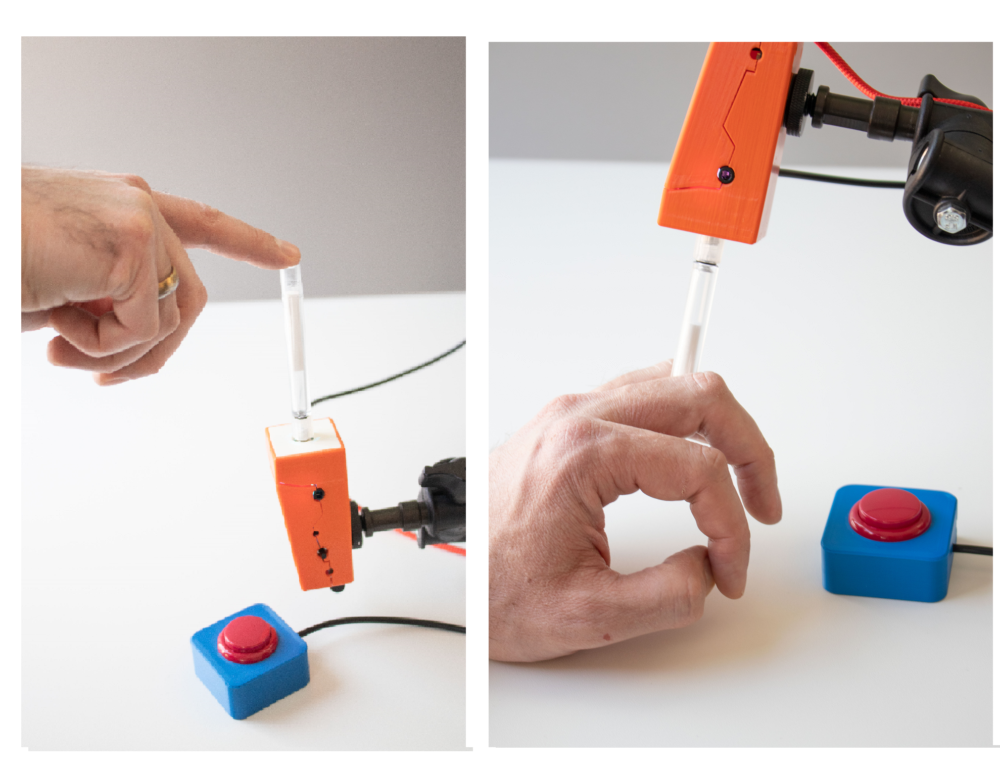
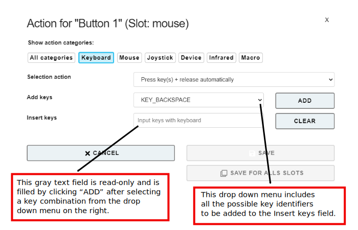
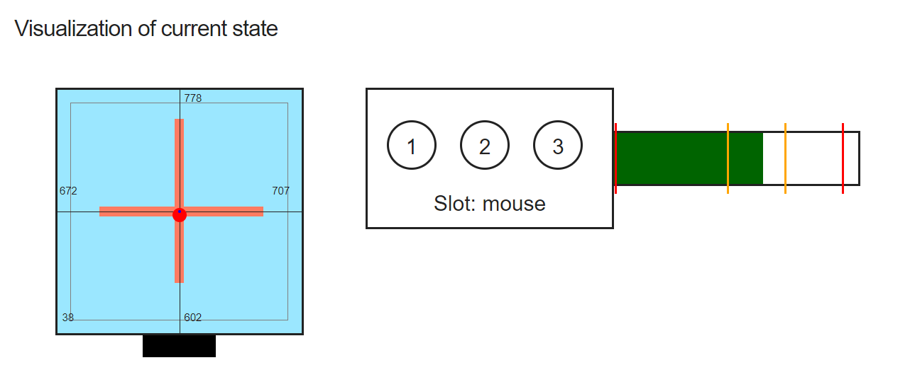

# FLipMouse - Finger & Lip Mouse

**User Manual v3.1**

**Table of Contents**

[TOC]

____

# Preface

The FLipMouse is an open source Assistive Technology module which is developed at the [University of Applied Sciences Technikum Wien](https://www.technikum-wien.at) and delivered as a DIY-construction kit by the [AsTeRICS Foundation](https://asterics-foundation.org). The FLipMouse allows control of a standard computer mouse, a joystick or keyboard keys via minimal finger- or lip-movements. Furthermore, other devices can be controlled via Bluetooth or infrared.

The FLipMouse can be configured via a web-based *configuration manager* which can be found at the website [flipmouse.asterics.eu](https://flipmouse.asterics.eu/index_fm.htm). This user manual includes a description of the configuration manager and explains how to use  the different functions and features of the FLipMouse. The FLipMouse can be used on Windows-, Mac- or Linux computers without installation of special software, because it behaves like a standard mouse / joystick / keyboard device. By using the  Bluetooth function, smart phones or tablet computers can be controlled - which will also be explained in this manual. 

Furthermore, this manual covers important guidelines for using the FLipMouse, in particular cleaning procedures and hygienic precautions.

All design files for the electronics and the 3d-printed enclosure - as well as the software source code - are available as open source and are distributed via the AsTeRICS Foundation website and via GitHub. Detailed instructions are provided in the [FlipMouse construction manual](https://github.com/asterics/FLipMouse/blob/master/ConstructionKit/ConstructionManual.pdf). Have fun building and using your FLipMouse!

The AsTeRICS Foundation

[www.asterics-foundation.org](https://asterics-foundation.org/)

    

## Hardware overview

The FLipMouse is available with a 3d-printed enclosure. Design files for the 3d-printed case are provided in the [Github repository](https://github.com/asterics/FLipMouse/tree/master/Hardware/case-design/3D_printer). The primary method for interacting with the FLipMouse is the transparent stick ("mouthpiece" or "finger-joystick") which is attached to the front of the FLipMouse. Replacement sticks can be ordered via the  [Webshop](https://www.asterics-foundation.org/webshop). (Please note the cleaning instructions in the dedicated section of this manual.)

    

*Figure 1*: Using the FLipMouse (here: version 2) as mouth-joystick for computers

Additionally, two external momentary switches can be attached to the jack plug connectors on the sides of the FlipMouse enclosure and one button is already integrated on the device.

**Users can interact with the FLipMouse in several ways:**

1. by touching the mouthpiece with the lips or fingers and applying small forces in vertical or horizontal direction
2. by increasing or reducing pressure in the mouthpiece (puffing or sipping)
3. by actuating (up to) 3 momentary switches / pushbuttons
4. if desired, a longer plastic tube can be attached to the pressure sensor so that the joystick can be used with a finger and a separate mouthpiece allows sip/puff control. Alternatively, pressure can be influenced by attaching a rubber ball to the plastic tube (pillow switch / soft switch).

**The hardware features of the FLipMouse:**

(a)    “Zero-way” finger joystick / mouthpiece: very low forces are sufficient to create up/down/left/right movement

        o  The zero-way joystick can be used with e.g. fingers or toes

        o  It can also be used as a mouthpiece (actuated by lips / mouth movements) 

        o  If desired, sip / puff activities into the mouthpiece can trigger additional functions - here 2 different levels of sip/puff force can be used.

(b)    One built-in switch (*Button1*) on the device, e.g. to change the active configuration (functions)

(c)    Two 3.5 mm jack plug sockets for attaching external switches to trigger additional functions (*Button2* and *Button3*)

(d)    Color Light Indicator on front side for showing the active configuration, calibration procedure etc.

(e)    Universal infrared remote control receiver and transmitter

(f)    Bluetooth-support e.g. to control smartphones or iOS devices

(g)    “Hot Shoe” Adapter for mounting to a Manfrotto Magic Arm or similar mounting system

(h)    Firmware upgrade via FLipMouse web application on [flipmouse.asterics.eu](flipmouse.asterics.eu)

    

*Figure 2*: FLipMouse in 3D-printed enclosure 

On the left side of the FLipMouse is a button (B1) that provides a configurable function (e.g. changing the operating mode). A 3.5 mm jack socket allows the connection of an external button.

On the right side of the FLipMouse housing, the infrared (IR) receiver module is accessible. This module can be used to record any infrared remote control commands (e.g. to change the volume or channel settings of a TV set). The IR signals can then be played back via the IR transmitter diode on the back of the FLipMouse. Furthermore, a second external button (B3) can be connected.

The front of the housing offers a connection possibility for the mouthpiece / finger joystick. The current operating mode is also indicated here by an adjustable light color.

## Mounting and usage

**1. Attach the mouthpiece / joystick**

Put the transparent acrylic tube which is provided with the FLipMouse on the front connector (Luer Lock adapter) and turn it clockwise until it is well seated (please do not turn too hard, because this could damage the Luer Lock adapter or the attachment!)

**2. Mount the FLipMouse device appropriately for the user**

The picture shows a “[Manfrotto Gelenkarm](https://www.manfrotto.com/global/single-arm-2-section-196ab-2/)” + ”[SuperClamp](https://www.manfrotto.com/global/super-photo-clamp-without-stud-aluminium-035/)” mount combination. You could also use the [Manfrotto Magic Arm](https://www.manfrotto.com/global/magic-photo-arm-smart-centre-lever-and-flexible-extension-143n/) or any other kind of mounting solution which fits to the 3/8”-HotShoe-Adapter of the FLipMouse.  

*Usage as Mouth Joystick*

*Figure 3*: Using the FLipMouse with Mouth/Lips

Ensure that the head of the user rests comfortably. The mouthpiece should gently touch the lips. It is not useful to insert the mouthpiece into the mouth  - this could be uncomfortable and make it harder to control the lateral movement.

*Usage as Finger Joystick*

*Figure 4*: Using the FLipMouse with fingers

If the user desires to actuate the FLipMouse with a finger or the thumb, mount the system appropriately so that the hand is in a resting position and the finger can touch the joystick without stress. Attach one or two additional external switches if desired, and mount the switches at suitable locations (for example at the legs/toes/shoulder etc.).

*Soft-Switch using a rubber ball*
A plastic tube can be attached to the front connector of the FLipMouse using a *Luer Lock* adapter. This plastic tube can be connected to a soft ball, so that pressing the ball results in usable pressure changes. This solution could be used as a soft head-switch / pillow-switch or shoulder-switch and can be combined with other external switches. 

**3. Attach the FLipMouse to a Computer, Tablet or Smart Phone** using a desired interface (USB, Bluetooth or USB-OTG). Please note that the FLipMouse settings can only be changed if the FLipMouse is attached to a PC running via USB.

#### Using the FLipMouse via USB

The FLipMouse can be connected via a USB-micro cable to a computer.  After attaching the FLipMouse, a zero-calibration is performed which takes about 2 seconds. During that time, the mouthpiece should not be touched.  

*Figure 5*: Connecting the FLipMouse with the computer

**Please be careful** when attaching the USB plug, strong forces might damage the connector!

#### Using the FLipMouse via Bluetooth

The Bluetooth–feature for the FLipMouse allows wireless mouse/keyboard control of computers, tablets and smart phones. Furthermore, iPhones or iPads can be used via VoiceOver & assistive switch support. In case the FLipMouse should only be used via Bluetooth, the power supply has to be established via a USB micro cable (either from a 5V wall adapter or from a USB power bank).

#### Using the FLipMouse via USB-OTG

The FLipMouse should work with any operating system which supports USB HID (Mouse/Keyboard/Joystick) devices, such as Windows, Linux or MacOS. Several Android devices provide an USB port with USB-OTG (“on-the-go”) functionality. If your device supports “OTG”, you can attach the FLipMouse using an USB-OTG-adapter/cable (see picture below). After attaching, you should see a mouse cursor and/or on-screen keyboard. You can test if your Android phone or tablet supports the USB-OTG function with the “OTG checker” app. 

*Figure 6*: Using the FLipMouse with a Smartphone or Tablet via USB-OTG

# The FLipMouse Configuration Manager

The *FLipMouse Configuration Manager* offers a Graphical User Interface (GUI) for the adaptation of the FLipMouse device to personal preferences and needs.  The Configuration Manager is available via the website: [https://flipmouse.asterics.eu](https://flipmouse.asterics.eu). The FLipMouse Configuration Manager sends and receives information from/to the FLipMouse through a communication port (COM port). **Please note that currently supported Webbrowsers are: Chrome, Chromium, Edge and Safari**.

The following figure shows the welcome page of the FLipmouse Configuration Manager: 

    

*Figure 7: Welcome page of the FLipMouse Configuration Manager*

## Establishing connection with the FLipMouse

1. Make sure your device is connected to your computer via an USB port and that a supported webbrowser is used. 
2. Click *CONNECT TO FLIPMOUSE CONNECTED VIA USB* and select the appropriate COM port (communication port) in the selection box. If the selection box appears empty, this means that no communication port has been detected. In this case, please reconnect the FLipMouse device and wait for the COM port to be updated. If no COM port can be selected even after repeated attempts, there is probably a problem with the driver. In this case, please create an [Issue in the Github Repository](https://github.com/asterics/FLipMouse/issues) or look for possible solutions there.
3. Once the COM port is selected, click the “Connect” button at the bottom of the selection box. 
4. After successful connection of the COM port, the main window will be displayed and you should see live feedback of the stick movement. The port status at the top right corner of the window will show “connected”:
   

*Figure 8: FLipMouse Configuration Manager*

## Changing Settings and Features

### Operational modes – “memory slots”

The Configuration Manager allows adjustment of all settings an operational modes of the FLipMouse. The settings are stored in individual **slots** - for example one slot for fast mouse operation, one slot for slow mouse operation, one slot for keyboard-keys ASDW etc. All settings are stored in the FLipMouse. The settings can also be saved to (or loaded from) a file on your computer. 
Settings which were stored in the FLipMouse stay valid also after the power supply has been removed. When the FLipMouse is plugged in the next time, the settings will be available – also if you use another computer or operating system!

## Tab STICK-CONFIG

In the STICK-CONFIG tab, the **operational mode function of the mouthpiece/joystick for the active slot is set**. Furthermore, the *sensitivity*, the *deadzone* and other parameters can be changed. The ability to configure multiple slots with different stick settings allows flexible application scenarios for the FLipMouse. The individual slots can be switched by any action of the user (e.g. pressing an external button or puffing strongly into the mouthpiece, see section [*Assigning different actions*](https://github.com/asterics/FLipMouse/blob/master/Documentation/UserManual/Markdown/FLipMouseUserManual.md#tab-actions)).

### Operational Mode ("Use stick for ...")

This setting determines the effect of touching the stick: 

1. **Mouse movement:** The stick moves the mouse pointer (this is the default mode to control computers or smartphones). If this setting is active, the other parameters (e.g. sensitivity or deadzone) directly affect the speed of the mouse pointer. 
2. **Alternative Actions:** If this mode is selected, the stick can be used for a whole range of different actions (e.g. pressing the 'A' key when the stick is pressed upwards, or playing an infrared command when the stick is pressed to the right). These actions can be set in the ACTIONS tab (see section [*Assigning different actions*](https://github.com/asterics/FLipMouse/blob/master/Documentation/UserManual/Markdown/FLipMouseUserManual.md#tab-actions)). If this setting is active, the deadzone parameter is primarily decisive for the actuation strength from which the assigned action is triggered. 
3. **Joystick (XY):** In this mode, the stick mimics the X and Y axis of a joystick/gamepad.
4. **Joystick (ZR):** In this mode, the stick mimics the Z and R axis of a joystick/gamepad.
5. **Joystick (Slider):** In this mode, the stick mimics two slider axes of a joystick/gamepad.

If one of the joystick modes is selected, the FLipMouse behaves like a gamepad with 6 axes (*X/Y*, *Z/Rotation* and *Slider1/Slider2*). Since the FLipMouse stick can only provide 2 deflections at a time, a selection of joystick axes must be made:

    

*Figure 9: Set stick configuration for joystick movement*

Please note that the joystick function must be supported by corresponding software applications - e.g. computer games. (Microsoft Windows offers a test software called "*joy.cpl*" for live display of axis and button activities - this tool can be started by entering "*joy.cpl*" in the search dialog).

#### Calibrate center position

Pressing this button performs a calibration of the rest position of the stick. This takes about 1 second - then the calibration sequence is completed. During this time the stick should not be touched. (Calibration can also be assigned as an *Alternate Action* if required, so that it can be performed while the FLipMouse device is in use.

#### Rotate Right (Change Stick Orientation)

The FLipMouse is attached with a *HotShoe 3/8"* mounting screw, located on the bottom of the FLipMouse housing. The orientation can be changed as needed (for example, if the FLipMouse is mounted sideways, the stick orientation can be changed accordingly so that movements are still interpreted correctly). Clicking on "ROTATE RIGHT" changes the orientation by 90°. Alignment settings for 0 / 90 / 180 and 270 degrees are possible, so that any mounting position is possible.

### Setting the motion parameters

The scroll bars make it possible to change the motion parameters of the stick and the behavior of the mouse pointer according to the user's wishes. The behavior of the following features can be changed: 

    

*Figure 10: FLipMouse Configuration Manager: Tab STICK-CONFIG*

 

#### Sensitivity

When using the stick for cursor movement, the sensitivity of the stick can be adjusted via the *Sensitivity* scroll bar. A smaller value results in slower cursor movement. To change the value, click and drag the scroll bar knob or click the bar next to the knob. 

#### Deadzone

The *Deadzone* setting defines a passive zone/range for the stick movements: If the deadzone value is low, even very small stick movements will cause the cursor to move (or perform the assigned alternate action - see chapter *Assigning alternative actions*). If the deadzone is set too low, the cursor may start moving unintentionally. In this case, increase the value of the deadzone so that the amount of deflection is suitable for a particular user. In the *Alternative actions* operating mode, it makes sense to use a larger value for the deadzone so that, for example, the directions can be triggered unambiguously when keyboard actions are used.

#### Split axis control for sensitivity and deadzone

If desired, the sensitivity- and deadzone-values for horizontal or vertical movements can be changed individually. In order to do that, select “*show x/y separately*”, as shown below: 

    

*Figure 11: FLipMouse Configuration Manager: Tab STICK-CONFIG, splitting x/y*

#### Maximum Speed

Turning the maximum speed setting to a low level is useful if a user desires to limit the cursor speed, keeping high sensitivity / acceleration. (Only relevant in operational mode *Mouse Movement*).

#### Acceleration

The acceleration setting allows influencing the acceleration behavior of the mouse cursor: if acceleration is set to a low level, even a strong deflection of the stick will start a slow (but progressing) cursor movement which makes it easier to reach small targets precisely. (Only relevant in operational mode *Mouse Movement*).

#### Sensitivity Profile

(This setting is enabled by clicking *“Show advanced options”*.)
Due to mechanical reasons, the force sensors of the FLipMouse show small inaccuracies which can result in mouse cursor drifting. The selection box for different Sensitivity Profiles allows to change overall gain/amplification and drift correction settings. Usually (and unless no other sensor variants are in use) the setting "Medium" should be used.

## Tab SIP AND PUFF

In the tab "SIP-PUFF-CONTROL", the threshold values for sipping and puffing into the mouthpiece can be set as desired. If the FLipMouse is connected, the current pressure values can be monitored using the horizontal blue column. The current minimum and maximum values can be seen from the vertical blue and red lines). Two threshold values can be set for sip and puff (Strong and Light), to which different actions can be assigned in the "ACTIONS" tab. **Tip**: the threshold values for light actuation should be set as sensitively as possible, and the difference to strong actuation should be large enough to prevent accidental triggering of the assigned actions. It may be useful not to use the strong thresholds in the initial learning phase (i.e. set them so that they are not reachable at all).

 

    

*Figure 12: Tab SIP AND PUFF*

Note that the idle pressure level (without sip or puff) is 
around 512, and the level increases when you puff 
into the mouthpiece, indicating increased pressure.
With the sliders, the threshold pressure for sip and puff can be regulated. The grey dotted line represents the actual pressure. The blue and red dotted lines represent the limits reached in this session.

#### StrongSip and StrongPuff

The SIP AND PUFF tab allows to define additional threshold values for StrongSip or StrongPuff activities, which can then trigger distinct actions. For example, the next configuration slot could be activated by a strong puff. To enrich the functionality of the FLipMouse especially for persons who cannot access external switches, additional StrongSip and StrongPuff gestures are available. These gestures allow to trigger actions via a strong sip or a strong puff followed by a stick movement (up / down / left / right).  A  strong sip or puff  is indicated via an acoustic signal (high tone). If the stick is moved within one second, the corresponding action (for example “StrongSip+Up” is triggered). If the stick is not moved within one second, the single StrongSip or StrongPuff action will be triggered. Thus, a total of 10 additional actions can be performed.

## Tab ACTIONS

The ACTIONS tab allows the mapping of user activities to desired FlipMouse functions (actions). The user activities are:

* pressing or releasing the 3 buttons (built-in button 1 or external button 2 or 3)
* stick movements (up/down/left/right) which exceed the deadzone threshold value
* sip and puff activities (see section StrongSip and StrongPuff).

The actions can be changed via clicking the entry in the action configuration table (see the blue box in figure 21). The table shows the actions for all user activities, either only for the currently active slot, or for all slots (which gives an overview of all actions). When clicking one particular action,  a window pops up where you can change the action category (here for Button 1: Device) and the action itself (here: Load next slot), see Figure 22.

    

*Figure 13: Assign different actions to user activities*

    

*Figure 14: Pop-up window for choice of desired action*

In the following, the individual action categories and different actions will be briefly described.

### Action category “Mouse”

**Hold Left / Middle / Right Mouse Button**
The *hold* action presses  a particular mouse button continuously (for example for dragging an item across the screen). The mouse button is released when the assigned user activity ends (for example when the sip/puff activity ends, when the stick is moved back to middle position or when an external button is released).

**Click Left / Middle / Right Mouse Button**
Creates mouse button clicks. (The left/right or middle mouse button is pressed and released again after a short time).

**Double Click Left Mouse Button**
Creates a double click with the left mouse button. 

**Toggle Left / Middle / Right Mouse Button**
The *toggle* action changes the state of a mouse button from pressed to not pressed and vice versa. This is useful e.g. if keeping a user activity up for a longer time (e.g. for dragging an item or for keeping a key pressed while other keys are pressed/released).

**Wheel Up / Down**
The actions *Wheel up* or *Wheel down* emulate the mouse scroll wheel. Triggering the *Wheel up* action results in upwards scrolling, while *wheel down* results in downward scrolling. This action is useful for example for reading documents or web sites.

**Move Mouse horizontally / vertically (x-axis / y-axis)**
The *Move mouse horizontally (x-axis)* and *Move mouse vertically (y-axis)* functions generate computer mouse movements along the selected axes. Speed parameters can be set for these functions in the field that appears below. As long as the user activity is present, the mouse pointer is accelerated up to this maximum speed. Please note that:

*A positive value for the X direction moves the mouse pointer to the right. 
A negative value for the X direction moves the mouse pointer to the left. 
A positive value for the Y direction moves the mouse pointer down. 
A negative value for the Y direction moves the mouse pointer up.*

### Action category: Joystick

**Joystick set x-/y-/z-axis/slider**
These actions can be used to send a desired value to the joystick axis. The selectable joystick axes are: *X / Y / Z / Z-Turn / slider*. The joystick is moved back to middle position when the associated user activity ends.

**Press Joystick Button**
This action can be used to press a desired joystick button. The FLipMouse device supports 32 buttons, so any value from 1 to 32 is allowed. The joystick button is released when the associated user activity ends.

**Joystick hat position**
This action sets the orientation of the joystick "hat" (in degrees). Allowed values are:
*-1, 0, 45, 90, 135, 180, 225, 270, 315*. The value of -1 sets the hat to the middle (idle) position. 
The joystick hat is moved back to middle position when the associated user activity ends. 

### Action category: Keyboard

**Press / Hold / Toggle Keys**
The *Press Keys* action allows pressing one or multiple keyboard keys. A second drop-down menu with possible key identifiers is displayed (***Add keys***). **When a key is selected from this menu, it has to be added (Click ADD)** to the *Insert keys text* field. Thus, multiple keyboard keys can be pressed simultaneously. The keys are released when the associated user activity ends. If you would like to remove or change the assigned keys, you must clear the currently assigned keys by pressing the “CLEAR” button next to the Insert keys field. 

Common key combinations include: 
KEY_CTRL + Z: triggers undo function
KEY_CTRL + C: triggers copy function
KEY_CTRL + V: triggers paste function
KEY_CTRL + KEY_ALT + KEY_ DELETE

The *Hold Key* action keeps the key pressed until the user activity ends.
The *Toggle Key* action changes the key state from pressed to not pressed and vice versa with each user activity.

For a list of all supported key identifiers, see [appendix](https://github.com/asterics/FLipMouse/blob/master/Documentation/UserManual/Markdown/FLipMouseUserManual.md#supported-key-identifiers) 
or have a look at the [FLipMouse Wiki / Github pages](https://github.com/asterics/FLipMouse/wiki/at-api).

    

*Figure 15: Add keys for the action press / hold / toggle keys*

**Write Word**
The *Write word* action allows typing a particular text/phrase whenever a user activity occurs (for example: write “Hello” whenever you move the FLipMouse stick up). Selecting this action displays a blank text box under the drop-down menu where the text can be entered, as shown below:

    

*Figure 16: Write word function*

In this example, "Hello" will be written each time button 2 of the FLipMouse is pressed.

### Action category: Device

**No Command**
If the action *No Command* is selected, no action will be assigned to the respective user activity.

**Load Next Slot**
This action is only relevant if you have stored multiple FLipMouse configuration slots. This action switches to the next slot. If the last slot is already reached, triggering this action will switch to the first slot.  When you switch the slot, the built-in LED bulbs will change the color of the device front accordingly, showing the active slot. Additionally an acoustic signal indicates the slot number (the number of tones represents the slot number).

**Load Slot by Name**
This action activates the configuration slot with the given name (if it exists). The name can be specified in the text field. This action is only relevant if you have stored multiple FLipMouse configuration slots. The LEDs indicate the slot number as described above.

**Calibrate middle position**
This action starts the calibration sequence for the middle position of the stick. Please refer to the description [“*Calibration of the stick’s middle position*”](https://github.com/asterics/FLipMouse/blob/master/Documentation/UserManual/Markdown/FLipMouseUserManual.md#calibration-of-the-sticks-middle-position).

### Action category: Infrared

**Play / Hold / Stop Infrared Command**
This action replays the infrared (IR-)code with the given command name. The existing (recorded) IR-commands can be selected from the drop-down menu. The *play* action sends the recorded code once, whereas the *hold* action repeats the code until the user activity ends. 

    

*Figure 21: Infrared Recording and Replay Configuration Manager*

The FLipMouse device includes an infrared remote control receiver module and a high current IR LED so that it can record and replay remote control codes of many remote control devices used in consumer electronics. If you want to use this feature of the FLipMouse, make sure that the IR sending LED is points towards the device you want to control. For instructions how to connect an external IR LED to increase the transmit power, please visit the [FLipMouse Wiki pages](https://github.com/asterics/FLipMouse/wiki).

*Figure 20: Infrared Code Recording*

To record a new IR code, go to the tab ACTIONS. Click the desired action and select the action category “**Infrared**” in the popup-window. There, three different types of IR-actions can be selected from the combo box:

* *Play infrared command*: sends the recorded code once
* *Hold infrared command*: repeats the code until the user activity ends
* *Stop infrared command*: stops a currently plaing IR-code

The existing commands can be chosen from the drop-down menu.

In this window you can also manage IR commands. Next to *New IR Command*, you can enter a name and then click RECORD - point your IR remote to the side of the FLipMouse where the LEDs stick out and send the IR command (there is a 10 seconds time limit for the recording phase). The new command is now stored in the FLipMouse and can be chosen and replayed by selecting it's name in the drop down menu. If the command is not correctly replayed, try to increase the IR-Code timeout – for example to 250 milliseconds. Using *Delete IR command* commands can be deleted. 

### Action category: Macro

**Execute Command Macro**
This action allows running a so-called command macro which consists of several individual actions. Thus, a desired sequence of actions can be performed which consists for example of a number of mouse moves, mouse clicks, text inputs or key presses. This action is powerful, but also a bit more complicated because the individual actions must be specified in form of so-called AT-commands which are separated by semicolons. For example: the following command macro will move the mouse cursor 100 steps to the left, 20 steps up, then wait 100 milliseconds and then perform a left mouse click: “MX 100; MY -20; WA 100; CL”. For a list and detailed explanation of all supported AT-commands see [Supported Macro Commands](https://github.com/asterics/FLipMouse/blob/master/Documentation/UserManual/Markdown/FLipMouseUserManual.md#supported-macro-commands) or have a look at the [FLipMouse Wiki / Github pages](https://github.com/asterics/FLipMouse/wiki/at-api).

## Tab SLOTS

In the SLOTS tab you can create new slots, delete existing slots, download a single or all slots (backup settings) and upload a file containing a complete configuration with multiple slots (restore backup). Furthermore, several demo settings (presets) can be applied. 

    

*Figure 17: SLOTS Settings Tab*

### Slot List / Slot selection

The Slot List displays all existing slots in the correct order. The current slot is indicated by the green row color. Clicking another slot in the Slot-List activates that particular slot. Furthermore, at the top center of the Configuration Manager window, the current slot is shown in the *Select Slot* box and can be changed there. The settings of the current slot will be stored and remembered when changing to another slot. The maximum number of slots is 10. 

#### Slot Color 

Each slot can be assigned with a color which is displayed on the front panel of the FLipMouse. The color can be chosen from a selection dialog by clicking the colored button. 

#### Connection mode (USB or Bluetooth)

Clicking the *Connection* button in the Slot List switches between USB or Bluetooth mode for this particular slot. The Bluetooth mode allows control of cell phones, tablets and computers which provide Bluetooth capability. In this way, custom slots can be created for USB or Bluetooth, so that it is possible to switch e.g. from a laptop (USB) to a wireless connection (phone / tablet) and back (using the *Next Slot* or *Load Slot by Name* actions.

**Bluetooth pairing**
The Bluetooth function can only work if a host devices is connected (paired) with the FLipMouse. (A host device can be for example, a cell phone with Android or iOS operating system.) The FLipMouse can only be paired with a host device if no other  device is currently connected and thus pairing mode is active.  An active pairing mode of the FlipMouse is indicated via slow dimming of the light color on the front of the FLipMouse module. As soon as a Bluetooth connection is established, the light color lights up continuously. To establish the pairing, open the Bluetooth settings of your host device, enable the Bluetooth feature, select *Add new BT device*, and then select the FLipMouse from the list of available devices. 

#### Delete slot

A slot can be removed by clicking the *Delete* button in the Slot List.

#### Download slot

A slot can be stored on the computer by clicking the *Download Slot* button in the Slot List (a file will be downloaded from your browser - you can store it wherever you like).

### Create a new Slot / Copy existing Slot

A new slot can be created by copying the settings of the currently active slot. In order to do this, enter the desired name for the new slot into the corresponding text field (*Insert name for new slot*). Then, click the “CREATE SLOT” button. This **appends a copy of the currently active slot** to the end of the Slot List and assigns a new name for it.

### Upload Slots to device

#### Upload Slots from file

This function lets you select a Slots-file (.set) from your computer and upload it to the FLipMouse (restore a backup). Be careful - this deletes all existing Slot-settings of your device!

#### Appy Demo Settings

This function lets you apply existing demo settings which have bee made by us to show different functions and applications scenarios of the FLipMouse. The existing presets can be chosen from the Selection box. In case a short description is available, it can be opened in a pop-up window. The selected demo-preset is applied when the corresponding button is clicked.

### Create Backup

Clicking the button *Download all slots* transfers all current slots to a settings file (.set) which is the stored on your computer. All settings can thus be transferred to the same or to another FLipMouse device. Multiple setups (for example for individual users or use-cases) can be kept on a computer and applied with a single click. A file chooser window will be opened which allows selection of the desired filename for saving or loading the configuration.

## Tab GENERAL

The  GENERAL tab allows changing the USB/Bluetooth mode and apply firmware updates of the FLipmouse device and the Bluetooth Add-On module (if installed):

*Figure 18: General Settings*

### Slot Test Mode

TBD

### Firmware Versions

Here you can see the installed version of the FLipMouse software (firmware). If the installed version is older than the version available online in the FLipMouse github repository, the option "UPDATE FIRMWARE" is displayed (otherwise "OVERWRITE FIRMWARE" is displayed). Clicking this button will attempt to download and install the firmware version which is available in the repository. This process should only be done on a laptop or desktop computer. The FLipMouse will temporarily appear as a USB drive, and the downloaded file must be copied to that drive. After that, the FLipMouse restarts with the updated software. (This process is also explained in the configuration manager, please follow the instructions step by step).

## Tab VISUALIZATION

The FLipMouse stick is attached to four force sensors – one for each movement direction (up, down, left, right). The numeric value of each of those sensors is displayed in the “VISUALIZATION” tab. The live values can be monitored when the FLipMouse device is connected. Whenever the stick is moved, the sensor values change. Specifically, a movement in each direction increases the respective sensor value. Significant deviation in one direction indicates a sensor problem - in this case, the sensors should be checked and might need to be replaced.

*Figure 19: Left: Live display of force sensor values; Middle: current slot with the 3 buttons (if one button is pressed, the corresponding circle will get yellow; Right: Sip and Puff live value and current thresholds*

# Instructions for cleaning and maintenance

If the mouthpiece is used to actuate the cursor movements via lip/mouth movements, a careful cleaning procedure is essential to avoid bacteria and health problems! Read this section carefully and apply the needed cleaning procedures whenever necessary.

## Hygienic considerations and risks

If the mouthpiece is actuated with the lips, it is important to respect the following hygienic precautions: 

1. One mouthpiece must be used exclusively by one person
2. The filter tip must be replaced whenever saliva or dirt have formed
3. The mouthpiece must be cleaned whenever saliva or dirt have formed
   (see chapter “[Instructions for cleaning and maintenance](https://github.com/asterics/FLipMouse/blob/master/Documentation/UserManual/Markdown/FLipMouseUserManual.md#instructions-for-cleaning-and-maintenance)”)

With the lack of hygiene concerning the mouthpiece, especially when the mouthpiece is used by more than one person, it is possible that 

1. skin rash arises
2. viruses and bacteria are transmitted causing diseases
3. dirt formats in the mouthpiece, which is dangerous to health

With wrong positioning of the FLipMouse there is the risk of feeling uncomfortable after longer periods of use, and it is possible to get muscle cramps or muscle pain due to unusual head positioning – pay attention to a convenient position and schedule pauses if you work for longer time periods!

### Exchanging the saliva filter

The saliva filter is placed inside the mouthpiece. Usually, no (or nearly no) saliva should enter the stick – but it strongly depends on the person using the mouthpiece. If saliva enters the mouthpiece, the saliva filters reduces the moisture entering the inner parts of the FLipMouse (respectively the pressure sensor). If necessary, a hydrophobic membrane filter can be used additionally / instead of the simple saliva filter. This membrane filter can be insterted between the acrylic pipe an dhte Lur Lock Adapter (it it compatible with the Luer Lock standard). 

The standard filter can be replaced as shown below:

    

*Figure 22.1: Removal of the saliva filter, using a normal screw to grab the filter*

    

*Figure 22.2: The removed filter*

    

*Figure 22.3: Inserting a new filter (pushing it back into the hygienic stick)*

### Disinfection of the mouthpiece

Use boiling water to disinfect a mouthpiece: place the mouthpiece (without saliva filter) in boiling water for at least five minutes, then allow it to dry before the next use.

### Replacement sticks and filters

Transparent acrylic mouthpieces can be ordered from the [AsTeRICS Foundation Webshop](https://www.asterics-foundation.org/webshop).

## Modification of the Mouthpiece / Stick

Several users reported that they would prefer a different shape of the mouthpiece. It is of course possible to apply your own modifications and extensions which feel comfortable to you. Here we want to give some suggestions using affordable, disposable cigarette holders. The link between the standard mouthpiece and the cigarette holder is established with a small brass tube. It is also possible to cut the cigarette holder and insert it into the acrylic pipe so that a tight fit is ensured:

*Figure 23: Modified shape of the mouthpiece*

Regardless of your desired mouthpiece modifications: Always take care for a hygienic operation and apply the cleaning procedures as described in this chapter!

# Macro commands and Key codes

## Supported Macro commands:

| **Abbreviation** | **Function**                                                                                                                   | **example**                                                                                                                     |
| ---------------- | ------------------------------------------------------------------------------------------------------------------------------ | ------------------------------------------------------------------------------------------------------------------------------- |
| CL               | click left mouse button                                                                                                        |                                                                                                                                 |
| CR               | click right mouse button                                                                                                       |                                                                                                                                 |
| CM               | click middle mouse button                                                                                                      |                                                                                                                                 |
| CD               | click double with left mouse button                                                                                            |                                                                                                                                 |
| HL               | hold the left mouse button                                                                                                     |                                                                                                                                 |
| HR               | hold the right mouse button                                                                                                    |                                                                                                                                 |
| HM               | hold the middle mouse button                                                                                                   |                                                                                                                                 |
| TL               | toggle left mouse button                                                                                                       | changes the state of the mouse button                                                                                           |
| TM               | toggle middle mouse button                                                                                                     |                                                                                                                                 |
| TR               | toggle right mouse button                                                                                                      |                                                                                                                                 |
| RL               | release the left mouse button                                                                                                  |                                                                                                                                 |
| RR               | release the right mouse button                                                                                                 |                                                                                                                                 |
| RM               | release the middle mouse button                                                                                                |                                                                                                                                 |
| WU               | move mouse wheel up                                                                                                            |                                                                                                                                 |
| WD               | move mouse wheel down                                                                                                          |                                                                                                                                 |
| MX `<int>`       | move mouse in x direction                                                                                                      | MX 4 -> moves cursor 4 pixels to the right                                                                                      |
| MY `<int>`       | move mouse in y direction                                                                                                      | MY -10 -> moves cursor 10 pixels up                                                                                             |
| RO `<int>`       | rotate stick orientation                                                                                                       | RO 180 -> flips x and y movements of stick/mouthpiece                                                                           |
| KW `<string>`    | keyboard write string                                                                                                          | KW Hello! -> writes "Hello!" on the keyboard                                                                                    |
| KP `<string>`    | key press: Press keyboard keys (once). Keys are identified by keyboard shortcuts (see list below)                              | KP KEY_UP -> presses the "Cursor-Up" key; KP KEY_CTRL KEY_ALT KEY_DELETE presses all 3 keys                                     |
| KH `<string>`    | key hold: hold keyboard keys                                                                                                   | sKH KEY_LEFT -> holds the "Cursor-Left" key                                                                                     |
| KT `<string>`    | key toggle: toggle keyboard keys; the key will remain pressed until "AT KT" command is sent again or a "AT KR" command is sent | KT KEY_DOWN -> toggles the "Cursor-Down" key                                                                                    |
| KR `<string>`    | key release                                                                                                                    | KR KEY_UP -> releases the "Cursor-Up" key                                                                                       |
| RA               | releases all = Release all currently pressed keys and mouse buttons                                                            |                                                                                                                                 |
| WA `<int>`       | wait a certain number of milliseconds                                                                                          | WA 100 -> waits 100 milliseconds                                                                                                |
| NE               | next slot: load next slot                                                                                                      |                                                                                                                                 |
| LO `<string>`    | Load slot per name, changes to the given slot                                                                                  | LO mouse                                                                                                                        |
| NC               | No command                                                                                                                     |                                                                                                                                 |
| JX `<int>`       | set joystick x axis                                                                                                            | JX 512 -> sets the x-axis to middle position                                                                                    |
| JY `<int>`       | set joystick y axis                                                                                                            | JY 1023 -> sets the y-axis to full up position                                                                                  |
| JZ `<int>`       | set joystick z axis                                                                                                            | JZ 0 -> sets the z-axis to lowest poistion                                                                                      |
| JT `<int>`       | set joystick turn axis                                                                                                         | JT 512 -> sets the rotation to middle position                                                                                  |
| JS `<int>`       | set joystick slider position                                                                                                   | JS 512 -> sets the slider to middle position                                                                                    |
| JP `<int>`       | press joystick button                                                                                                          | JP 1 -> presses joystick button 1                                                                                               |
| JR `<int>`       | release joystick button                                                                                                        | JR 2 -> releases joystick button 2                                                                                              |
| JH `<int>`       | set joystick hat position                                                                                                      | JH 45 -> sets joystick hat to 45 degrees; possible values are: 0, 45, 90, 135, 180, 225, 270, 315 and -1 to set center position |
| MM `<int>`       | mouse mode: cursor on (int=1) or alternative functions on (int=0)                                                              | MM1 -> switches to mouse mode                                                                                                   |
| CA               | Calibrate zero position                                                                                                        | calibrates stick / mouthpiece middle position                                                                                   |
| IP `<string>`    | play infrared command                                                                                                          | IP channelUp; plays infrared command "channelUp" (if this IR-command name has been recorded)                                    |

Please note that certain commands for adjusting FLipMouse settings are not shown in this table (for example setting thresholds or accelerations, recording IR-commands etc.). For a full list of commands please refer to the [FLipMouse wiki](https://github.com/asterics/FLipMouse/wiki/at-api). 

## Supported Key Identifiers:

| **Supported KEY Identifiers:**                                                                                                                                                                                                                                                                     |
| -------------------------------------------------------------------------------------------------------------------------------------------------------------------------------------------------------------------------------------------------------------------------------------------------- |
| **Letters**                                                                                                                                                                                                                                                                                        |
| KEY_A  KEY_B  KEY_C  KEY_D  KEY_E  KEY_F  KEY_G  KEY_H   KEY_I  KEY_J  KEY_K  KEY_L  KEY_M  KEY_N  KEY_O  KEY_P   KEY_Q  KEY_R  KEY_S  KEY_T  KEY_U  KEY_V  KEY_W  KEY_X                                                                                                                   |
| **Digits**                                                                                                                                                                                                                                                                                         |
| KEY_1  KEY_2  KEY_3  KEY_4  KEY_5  KEY_6  KEY_7  KEY_8  KEY_9  KEY_0                                                                                                                                                                                                                               |
| **Function keys**                                                                                                                                                                                                                                                                                  |
| KEY_F1  KEY_F2  KEY_F3  KEY_F4  KEY_F5  KEY_F6  KEY_F7  KEY_F8  KEY_F9  KEY_F10   KEY_F11  KEY_F12  KEY_F13  KEY_F14  KEY_F15  KEY_F16  KEY_F17  KEY_F18  KEY_F19  KEY_F20  KEY_F21  KEY_F22  KEY_F23  KEY_F24                                                                             |
| **Navigation keys**                                                                                                                                                                                                                                                                                |
| KEY_UP  KEY_DOWN  KEY_LEFT  KEY_RIGHT  KEY_TAB  KEY_PAGE_UP  KEY_PAGE_DOWN  KEY_HOME  KEY_END                                                                                                                                                                                                  |
| **Special keys**                                                                                                                                                                                                                                                                                   |
| KEY_ENTER  KEY_SPACE  KEY_BACKSPACE  KEY_DELETE  KEY_INSERT  KEY_ESC  KEY_NUM_LOCK KEY_SCROLL_LOCK  KEY_CAPS_LOCK  KEY_PAUSE  KEY_SEMICOLON  KEY_COMMA  KEY_PERIOD  KEY_MINUS  KEY_EQUAL  KEY_SLASH KEY_BACKSLASH  KEY_LEFT_BRACE  KEY_RIGHT_BRACE  KEY_QUOTE  KEY_TILDE  KEY_MENU |
| **Keypad keys**                                                                                                                                                                                                                                                                                    |
| KEYPAD_1  KEYPAD_2  KEYPAD_3  KEYPAD_4  KEYPAD_5  KEYPAD_6  KEYPAD_7  KEYPAD_8 KEYPAD_9  KEYPAD_0   KEYPAD_SLASH  KEYPAD_ASTERIX  KEYPAD_MINUS  KEYPAD_PLUS  KEYPAD_ENTER  KEYPAD_PERIOD                                                                                                   |
| **Keys for alternative functions**                                                                                                                                                                                                                                                                 |
| KEY_SHIFT  KEY_CTRL  KEY_ALT  KEY_RIGHT_ALT  KEY_GUI  KEY_RIGHT_GUI                                                                                                                                                                                                                                |

# Contact Information

**University of Applied Sciences Technikum Wien**
Department Electronic Engineering
Höchstädtplatz 6
A-1200 Wien
AUSTRIA

**AsTeRICS Foundation**
Webpage: [www.asterics-foundation.org](http://www.asterics-foundation.org)
Email: <office@asterics-foundation.org>

# Disclaimer

The University of Applied Sciences Technikum Wien and the AsTeRICS Foundation do not assume any warranty and liability for the functionality of the described devices, software and the correctness of the documents handed over.

Additionally, the UAS TW is not liable for any damages to health due to the use of described hardware or software. The provided software applications and hardware modules are to be used at own risk!

# Acknowledgement

This project was partly funded by the City of Vienna, 
Municipal department of Economic Affairs, Labor and Statistics (MA 23), 
in course of the projects AsTeRICS Academy (14-02), ToRaDes (18-04) 
and Wissensdrehscheibe für Barrierefreie Technologien (26-02) 

