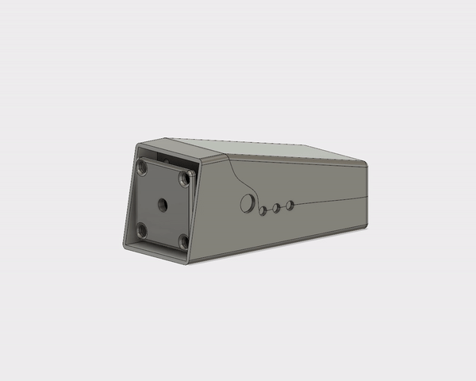
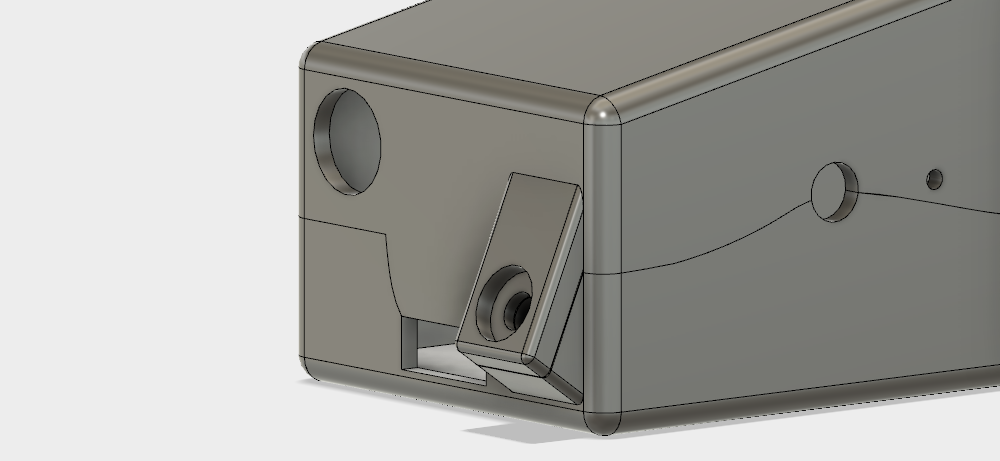
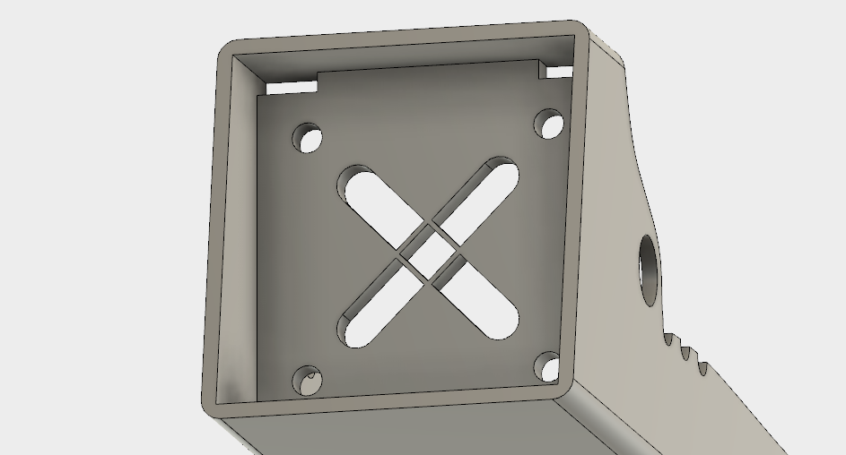
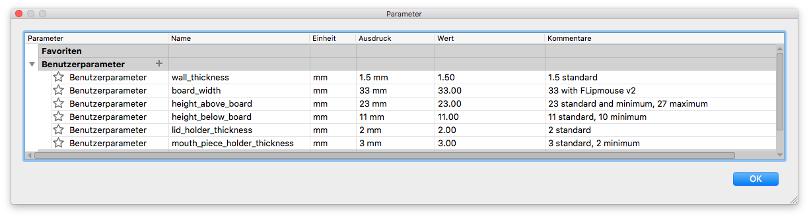

# 3D Printed Case

This case was designed with Fusion 360. If you want to edit the Fusion 360 file (.f3d) you need to be a student, buy it, or use the 30 day free trail.

### Assembly

This case consists of three parts. The main case where the PCB and sensors are located. A lid which closes everything up and a mouth piece holder.

You need these additinal things to have a fully functional case:

* 1x M3 screw nut (not needed but useful, RS component: 278-584)
* 1x M3 screw

The nut and screw are located in the back where the lid and main case meet.

Altough, there are no screw nuts intended in the front of the case which hold the mouth piece, this can be changed easily.

The front plate also contains a cross section which is just there to support the top part while printing. Without it the top part would not stick to the rest of the case and fall down. The cross parts should be removed after the print to ensure that the mouth piece can move.

### Parameters

The design has some parameters which can be changed under Modify -> Parameters.

* **wall_thickness**: Changes the thickness everywhere. This can be adjusted to fit the width of your printer nozzle.
* **board_width**: Width of the PCB.
* **height_above_board**: The distance from the board to the top of the case. This doesn´t need to be changed aslong as the PCB elements or the sensor carrier PCB do not change in height.
* **height_below_board**: The distance between board and the bottom layer. If your tripod holder is higher and touches the PCB you need to adjust this parameter to prevent a short.
* **lid_holder_thickness**: The lid has two thin plastic pieces to keep its positiion. If they are too thin you can change them here.
* **mouth_piece_holder_thickness**: The thickness of the plate holding the mouth piece. We noticed that the plate could bend with time if its too thin.

### Things to improve

* The IR LED is still inside the case and could be located like the other LEDs between the lid and main case
* More parameters to distiguish between usage with screw nuts or without
* Markers where the FSR sensors should be glued on.
