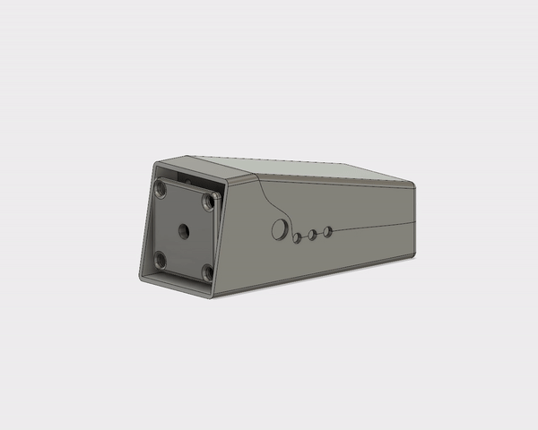
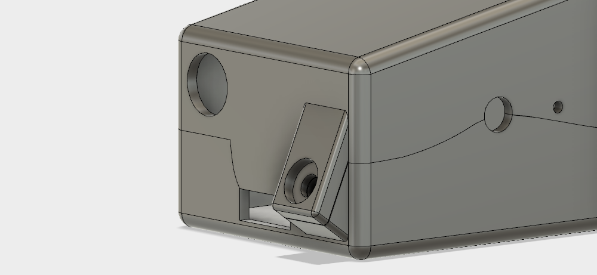
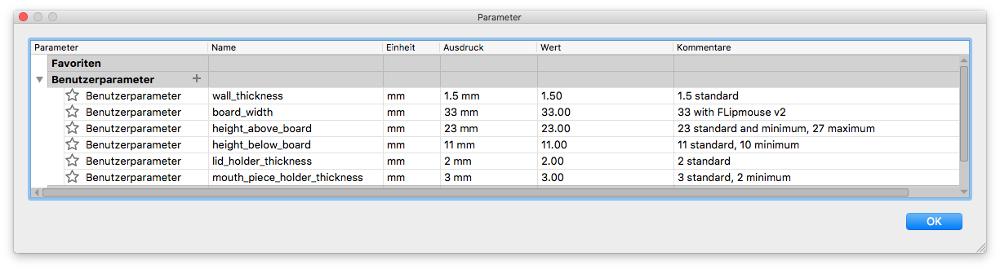

# 3D Printed Case

This case was designed with Fusion 360. If the design needs to be changed, Fusion 360 can be downloaded on the AutoDesk Website. It is free for students and private users. It is not recommended to edit the uploaded files is a different CAD software.

### Assembly

This case consists of three parts. The main case where the PCB and sensors are located. A lid which closes everything up and a mouth piece holder.

For this case you need one extra **M3-Screw - 6mm**.
The screw is located in the back where the lid and main case meet.

The construction manual can be found [here](https://github.com/asterics/FLipMouse/blob/master/ConstructionKit/ConstructionManual.pdf).

### Parameters

The design has some parameters which can be changed under Modify -> Parameters.

* **wall_thickness**: Changes the thickness everywhere. This can be adjusted to fit the width of your printer nozzle.
* **board_width**: Width of the PCB.
* **height_above_board**: The distance from the board to the top of the case. This doesn´t need to be changed aslong as the PCB elements or the sensor carrier PCB do not change in height.
* **height_below_board**: The distance between board and the bottom layer. If your tripod holder is higher and touches the PCB you need to adjust this parameter to prevent a short.
* **lid_holder_thickness**: The lid has two thin plastic pieces to keep its positiion. If they are too thin you can change them here.
* **mouth_piece_holder_thickness**: The thickness of the plate holding the mouth piece. We noticed that the plate could bend with time if its too thin.
